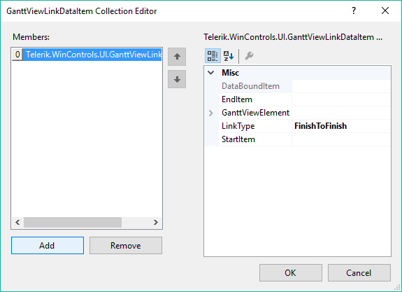

# Adding links

The __GanttViewLinkDataItem__ CollectionEditor allows you to add links (dependences) between the items in the gantt view at design time.
        

The more important properties of the links you need to set up are:

* __StartItem:__ Determines the item from which the link will start.
            

* __EndItem:__ Determines the item at which the link will end.
            

* __LinkType:__ Determines the type of the link (dependency) between the start and end items.
