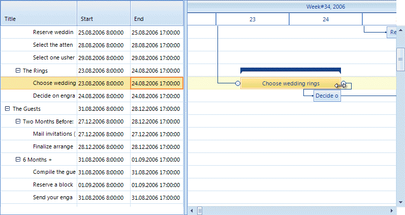
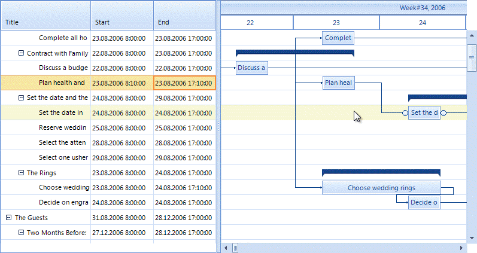
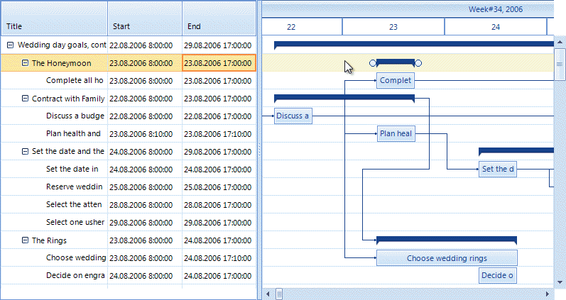

# Editing graphical view

The graphical view of __RadGanttView__ allows the users to modify several aspects of the tasks they are viewing.

## Resizing

Users can grab the edge of a summary task or a regular task and drag the edge with the mouse to effectively modify the start or end time of the tasks.
        

## Drag dropping

Users can drag the whole task by clicking anywhere on the task surface, without the edges, and drag the whole task back or forth in time. This way they modify both the start and the end time of the task.
        

## Creating links

Users can create links (dependences) by doing the following:

1. Hover over the item they want the link to start.

1. Two link handles will appear on both sides of the task.

1. Press the left mouse button and start dragging. A new link will appear.

1. Finally the user should release the mouse over a link handle of another item. The link type is determined by the link handle where the operation started and the link handle where it ended.
            

