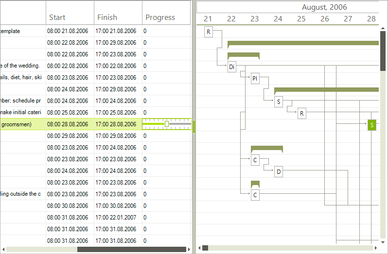

# Creating custom editor

## 

RadGanttView allows you to replace the standard editors with a custom editors. The following examples demonstrates how to replace
          the spin editor with a track bar editor. All editors inherit from __BaseInputEditor__. So, you have to inherit 
          from this class and override several methods:
        

#### __[C#] __

{{source=..\SamplesCS\GanttView\Editing\CustomEditor.cs region=CustomTrackBarEditor}}
	    public class GanttViewTrackBarEditor : BaseInputEditor
	    {
	        public override object Value
	        {
	            get
	            {
	                RadTrackBarElement editor = (RadTrackBarElement)this.EditorElement;
	                return editor.Value;
	            }
	            set
	            {
	                RadTrackBarElement editor = (RadTrackBarElement)this.EditorElement;
	                if (value != null && value != DBNull.Value)
	                {
	                    editor.Value = Convert.ToInt32(value);
	                }
	                else
	                {
	                    editor.Value = 0;
	                }
	            }
	        }
	
	        public override void BeginEdit()
	        {
	            base.BeginEdit();
	
	            this.EditorElement.Focus();
	            ((RadTrackBarElement)this.EditorElement).ValueChanged += new EventHandler(TrackBarEditor_ValueChanged);
	        }
	
	        void TrackBarEditor_ValueChanged(object sender, EventArgs e)
	        {
	            this.OnValueChanged();
	        }
	
	        public override bool EndEdit()
	        {
	            ((RadTrackBarElement)this.EditorElement).ValueChanged -= TrackBarEditor_ValueChanged;
	            return base.EndEdit();
	        }
	
	        protected override RadElement CreateEditorElement()
	        {
	            RadTrackBarElement element = new RadTrackBarElement();
	            element.Minimum = 0;
	            element.Maximum = 100;
	            element.TickStyle = Telerik.WinControls.Enumerations.TickStyles.Both;
	            element.SmallTickFrequency = 10;
	            element.LargeTickFrequency = 0;
	            element.BodyElement.ScaleContainerElement.TrackBarLineElement.Margin = new Padding(0, 3, 0, 3);
	            return element;
	        }
	
	        public override Type DataType
	        {
	            get { return typeof(int); }
	        }
	    }
	{{endregion}}

#### __[VB.NET] __

{{source=..\SamplesVB\GanttView\Editing\CustomEditor.vb region=CustomTrackBarEditor}}
	Public Class GanttViewTrackBarEditor
	    Inherits BaseInputEditor
	    Public Overrides Property Value() As Object
	        Get
	            Dim editor As RadTrackBarElement = DirectCast(Me.EditorElement, RadTrackBarElement)
	            Return editor.Value
	        End Get
	        Set(value As Object)
	            Dim editor As RadTrackBarElement = DirectCast(Me.EditorElement, RadTrackBarElement)
	            If value IsNot Nothing AndAlso value IsNot DBNull.Value Then
	                editor.Value = Convert.ToInt32(value)
	            Else
	                editor.Value = 0
	            End If
	        End Set
	    End Property
	
	    Public Overrides Sub BeginEdit()
	        MyBase.BeginEdit()
	
	        Me.EditorElement.Focus()
	        AddHandler DirectCast(Me.EditorElement, RadTrackBarElement).ValueChanged, AddressOf TrackBarEditor_ValueChanged
	    End Sub
	
	    Private Sub TrackBarEditor_ValueChanged(sender As Object, e As EventArgs)
	        Me.OnValueChanged()
	    End Sub
	
	    Public Overrides Function EndEdit() As Boolean
	        RemoveHandler DirectCast(Me.EditorElement, RadTrackBarElement).ValueChanged, AddressOf TrackBarEditor_ValueChanged
	        Return MyBase.EndEdit()
	    End Function
	
	    Protected Overrides Function CreateEditorElement() As RadElement
	        Dim element As New RadTrackBarElement()
	        element.Minimum = 0
	        element.Maximum = 100
	        element.TickStyle = Telerik.WinControls.Enumerations.TickStyles.Both
	        element.SmallTickFrequency = 10
	        element.LargeTickFrequency = 0
	        element.BodyElement.ScaleContainerElement.TrackBarLineElement.Margin = New Padding(0, 3, 0, 3)
	        Return element
	    End Function
	
	    Public Overrides ReadOnly Property DataType() As Type
	        Get
	            Return GetType(Integer)
	        End Get
	    End Property
	End Class
	{{endregion}}

In the __EditorRequired__ event we replace the default editor:
        

#### __[C#] __

{{source=..\SamplesCS\GanttView\Editing\CustomEditor.cs region=CustomEditorReplace}}
	        private void GanttViewElement_EditorRequired(object sender, GanttViewEditorRequiredEventArgs e)
	        {
	            if (e.EditorType == typeof(BaseSpinEditor))
	            {
	                e.EditorType = typeof(GanttViewTrackBarEditor);
	            }
	        }
	{{endregion}}

#### __[VB.NET] __

{{source=..\SamplesVB\GanttView\Editing\CustomEditor.vb region=CustomEditorReplace}}
	    Private Sub GanttViewElement_EditorRequired(sender As Object, e As GanttViewEditorRequiredEventArgs)
	        If (e.EditorType = GetType(BaseSpinEditor)) Then
	            e.EditorType = GetType(GanttViewTrackBarEditor)
	        End If
	    End Sub
	{{endregion}}

