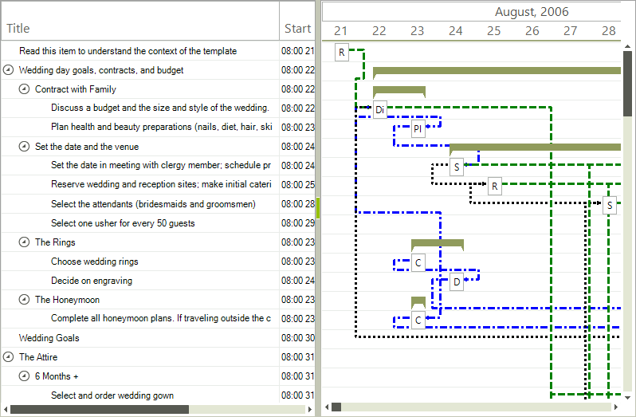

# GraphicalView Link Item formatting


__RadGanttView__ allows formatting of individual links through the __GraphicalViewLinkItemFormatting__ event. 
      The following example demonstrates how to format links based on their type.

## #_[C#] _

	


{{source=..\SamplesCS\GanttView\Formatting\GraphicalViewLinkItemFormatting.cs region=GraphicalViewLinkItemFormatting}} 
{{source=..\SamplesVB\GanttView\Formatting\GraphicalViewLinkItemFormatting.vb region=GraphicalViewLinkItemFormatting}} 

````C#
private void radGanttView1_GraphicalViewLinkItemFormatting(object sender, GanttViewLinkItemFormattingEventArgs e)
{
    Color color = Color.Black;
    DashStyle dash = DashStyle.Solid;
    switch (e.Link.LinkType)
    {
        case TasksLinkType.FinishToFinish:
            dash = DashStyle.DashDotDot;
            color = Color.Red;
            break;
        case TasksLinkType.FinishToStart:
            dash = DashStyle.Dash;
            color = Color.Green;
            break;
        case TasksLinkType.StartToFinish:
            dash = DashStyle.DashDot;
            color = Color.Blue;
            break;
        case TasksLinkType.StartToStart:
            dash = DashStyle.Dot;
            color = Color.Black;
            break;
    }
    Pen pen = new Pen(color);
    pen.DashStyle = dash;
    pen.Width = 3;
    pen.LineJoin = LineJoin.Bevel;
    pen.EndCap = LineCap.ArrowAnchor;
    e.Pen = pen;
}

````
````VB.NET
Private Sub RadGanttView1_GraphicalViewLinkItemFormatting(sender As Object, e As Telerik.WinControls.UI.GanttViewLinkItemFormattingEventArgs)
    Dim penColor As Color = Color.Black
    Dim dash As DashStyle = DashStyle.Solid
    Select Case e.Link.LinkType
        Case TasksLinkType.FinishToFinish
            dash = DashStyle.DashDotDot
            penColor = Color.Red
            Exit Select
        Case TasksLinkType.FinishToStart
            dash = DashStyle.Dash
            penColor = Color.Green
            Exit Select
        Case TasksLinkType.StartToFinish
            dash = DashStyle.DashDot
            penColor = Color.Blue
            Exit Select
        Case TasksLinkType.StartToStart
            dash = DashStyle.Dot
            penColor = Color.Black
            Exit Select
    End Select
    Dim pen As New Pen(penColor)
    pen.DashStyle = dash
    pen.Width = 3
    pen.LineJoin = LineJoin.Bevel
    pen.EndCap = LineCap.ArrowAnchor
    e.Pen = pen
End Sub

````

{{endregion}} 



