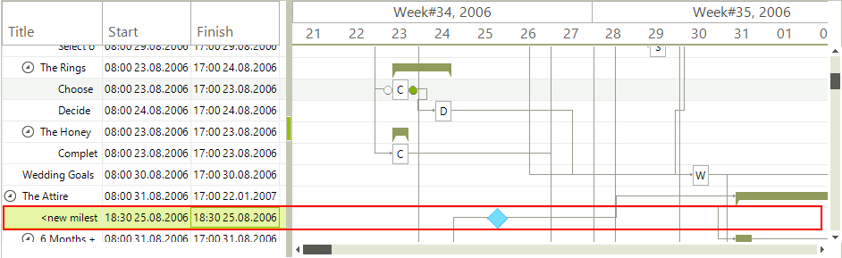
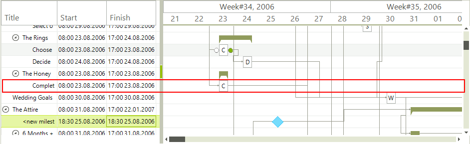

# Item types

There are total of three item types: summary item, task item and milestone item.

## Summary item

Summary items are defined as items that have sub tasks. Usually they start at the same 
          point in time as the earliest starting child task. Respectively the summary task ends where the latest ending child task ends.
        

## Milestone item

Milestone items are defined as items with identical start and end time. They are used as an indication for major events in the 
          timeline e.g. finishing of a module in a project or getting to a certain level of completion or phase.
        

## Task item

Common tasks are concrete tasks with defined start and end time.

## 

The following table demonstrates the similarities and differences between the item types:
        

| Item \ Function | Movable | Resizable | Shows progress | Shows text |
| ------ | ------ | ------ | ------ | ------ |
|Summary|True|True|True|False|
|Milestone|True|False|False|False|
|Task|True|True|True|True|
