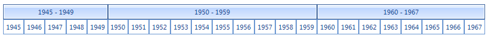

# Custom timeline
 

__RadGanttView__ offers a number of built-in *TimeRange* settings which allow users to display the timeline in different views. Although these settings would cover most cases the users might require a view that is not available out-of-the-box. In this case developers can build their own timeline views. This article demonstrates the process for creating a custom timeline view which displays items in decades (10-year time spans). The following image demonstrates the final goal:



## 

1. First you need to set the *TimelineRange* property of the gantt view graphical element to Custom. If you want you can override and modify the default views as well but for this example we will use the Custom value. 


{{source=..\SamplesCS\GanttView\CustomTimeline\DecadesTimeline.cs region=TimeRangeCustom}} 
{{source=..\SamplesVB\GanttView\CustomTimeline\DecadesTimeline.vb region=TimeRangeCustom}} 

````C#
this.radGanttView1.GanttViewElement.GraphicalViewElement.TimelineRange = TimeRange.Custom;

````
````VB.NET
Me.radGanttView1.GanttViewElement.GraphicalViewElement.TimelineRange = TimeRange.Custom

````

{{endregion}} 
 

1. Next you need to create a custom timeline behavior class and assign it to the graphical view. In this class you will add the logic for the new decades view. 

{{source=..\SamplesCS\GanttView\CustomTimeline\DecadesTimeline.cs region=CustomBehavior}} 
{{source=..\SamplesVB\GanttView\CustomTimeline\DecadesTimeline.vb region=CustomBehavior}} 

````C#
this.radGanttView1.GanttViewElement.GraphicalViewElement.TimelineBehavior = new DecadesGanttViewTimelineBehavior();

````
````VB.NET
Me.radGanttView1.GanttViewElement.GraphicalViewElement.TimelineBehavior = New DecadesGanttViewTimelineBehavior()

````

{{endregion}} 

 
1. Now you can fill the class with the code that will create the view. You should note that because we want to preserve the built-in views throughout the example we will check whether the time range is Custom and only handle this case.

* First you have to override the *AdjustedTimelineStart* and *AdjustedTimelineEnd* properties. What these properties do is to enlarge the timeline start and end to allow only whole timeline cells to be displayed. Here is an example. Imagine you use a view with quarters and your *TimelineStart* property is set to 15.05.2013. This date is somewhere in the middle of the year’s second quarter. The *AdjustedTimelineStart* property takes this date and the fact you use quarters and returns an adjusted date which is the actual start of the quarter. In this particular case the property will return 03.04.2013 which is the start date of the quarter that contains the *TimelineStart* date. The *AdjustedTimelineEnd* property does the same for the end of the timeline. For the decades view this properties will adjust the start and end dates to years: 

{{source=..\SamplesCS\GanttView\CustomTimeline\DecadesTimeline.cs region=AdjustedStartAndEnd}} 
{{source=..\SamplesVB\GanttView\CustomTimeline\DecadesTimeline.vb region=AdjustedStartAndEnd}} 

````C#
public override DateTime AdjustedTimelineStart
{
    get
    {
        if (this.GraphicalViewElement.TimelineRange != TimeRange.Custom)
        {
            return base.AdjustedTimelineStart;
        }
        return new DateTime(this.GraphicalViewElement.TimelineStart.Year, 1, 1);
    }
}
public override DateTime AdjustedTimelineEnd
{
    get
    {
        if (this.GraphicalViewElement.TimelineRange != TimeRange.Custom)
        {
            return base.AdjustedTimelineEnd;
        }
        return new DateTime(this.GraphicalViewElement.TimelineEnd.Year + 1, 1, 1);
    }
}

````
````VB.NET
Public Overrides ReadOnly Property AdjustedTimelineStart() As DateTime
    Get
        If Me.GraphicalViewElement.TimelineRange <> TimeRange.[Custom] Then
            Return MyBase.AdjustedTimelineStart
        End If
        Return New DateTime(Me.GraphicalViewElement.TimelineStart.Year, 1, 1)
    End Get
End Property
Public Overrides ReadOnly Property AdjustedTimelineEnd As DateTime
    Get
        If Me.GraphicalViewElement.TimelineRange <> TimeRange.[Custom] Then
            Return MyBase.AdjustedTimelineEnd
        End If
        Return New DateTime(Me.GraphicalViewElement.TimelineEnd.Year + 1, 1, 1)
    End Get
End Property

````

{{endregion}} 
 

* Next you should override the *BuildTimelineDataItems* method. The method returns a list of __GanttViewTimelineDataItems__. Each data item will represent a decade. 

{{source=..\SamplesCS\GanttView\CustomTimeline\DecadesTimeline.cs region=GanttViewTimelineDataItems}} 
{{source=..\SamplesVB\GanttView\CustomTimeline\DecadesTimeline.vb region=GanttViewTimelineDataItems}} 

````C#
public override IList<GanttViewTimelineDataItem> BuildTimelineDataItems(TimeRange range)
{
    if (range != TimeRange.Custom)
    {
        return base.BuildTimelineDataItems(range);
    }
    return this.BuildTimelineDataItemsForDecadesRange();
}
public IList<GanttViewTimelineDataItem> BuildTimelineDataItemsForDecadesRange()
{
    List<GanttViewTimelineDataItem> result = new List<GanttViewTimelineDataItem>();
    DateTime adjustedStart = this.AdjustedTimelineStart;
    DateTime adjustedEnd = this.AdjustedTimelineEnd;
    DateTime currentDate = adjustedStart.Date;
    int currentYearNumber = currentDate.Year;
    int newYearNumber = currentYearNumber;
    GanttViewTimelineDataItem item = new GanttViewTimelineDataItem(currentDate.Date, currentDate.AddYears(1), this.GraphicalViewElement.TimelineRange, this.GraphicalViewElement.OnePixelTime);
    result.Add(item);
    while (currentDate < adjustedEnd)
    {
        item.End = currentDate.AddYears(1);
        currentDate = currentDate.AddYears(1);
        newYearNumber = currentDate.Year;
        if (newYearNumber != currentYearNumber && newYearNumber % 10 == 0 && currentDate <= adjustedEnd)
        {
            currentYearNumber = newYearNumber;
            item = new GanttViewTimelineDataItem(currentDate, currentDate, this.GraphicalViewElement.TimelineRange, this.GraphicalViewElement.OnePixelTime);
            result.Add(item);
        }
    }
    return result;
}

````
````VB.NET
Public Overrides Function BuildTimelineDataItems(range As TimeRange) As IList(Of GanttViewTimelineDataItem)
If range <> TimeRange.[Custom] Then
    Return MyBase.BuildTimelineDataItems(range)
End If
Return Me.BuildTimelineDataItemsForDecadesRange()
End Function
Public Function BuildTimelineDataItemsForDecadesRange() As IList(Of GanttViewTimelineDataItem)
Dim result As New List(Of GanttViewTimelineDataItem)()
Dim adjustedStart As DateTime = Me.AdjustedTimelineStart
Dim adjustedEnd As DateTime = Me.AdjustedTimelineEnd
Dim currentDate As DateTime = adjustedStart.[Date]
Dim currentYearNumber As Integer = currentDate.Year
Dim newYearNumber As Integer = currentYearNumber
Dim item As New GanttViewTimelineDataItem(currentDate.[Date], currentDate.AddYears(1), Me.GraphicalViewElement.TimelineRange, Me.GraphicalViewElement.OnePixelTime)
result.Add(item)
While currentDate < adjustedEnd
    item.[End] = currentDate.AddYears(1)
    currentDate = currentDate.AddYears(1)
    newYearNumber = currentDate.Year
    If newYearNumber <> currentYearNumber AndAlso newYearNumber Mod 10 = 0 AndAlso currentDate <= adjustedEnd Then
        currentYearNumber = newYearNumber
        item = New GanttViewTimelineDataItem(currentDate, currentDate, Me.GraphicalViewElement.TimelineRange, Me.GraphicalViewElement.OnePixelTime)
        result.Add(item)
    End If
End While
Return result
End Function

````

{{endregion}} 
 

* Next we have to calculate the timeline cells for each timeline data item. To this we override the *GetTimelineCellInfoForItem* method. The method returns an instance of the __GanttTimelineCellsInfo__ struct. This struct contains two properties. The first one, *NumberOfcells*, indicates how many cells the given timeline data item will display. The second one, *StartIndex*, is useful in the case where you use repeatable cell items e.g. quarters, halves, thirds etc. The property is useful when the start of the timeline is not the first item in the repeatable values collection. Here is an example. Imagine the timeline starts is the third quarter of the year with this property you will later be able to set the proper text to the cell item. If you do not have this info your cells will always start at 0 or 1. Since in this example the start is the third quarter starting at 0 or 1 would be wrong. In our example we have continuous data so we will not use this property: 

{{source=..\SamplesCS\GanttView\CustomTimeline\DecadesTimeline.cs region=GanttTimelineCellsInfo}} 
{{source=..\SamplesVB\GanttView\CustomTimeline\DecadesTimeline.vb region=GanttTimelineCellsInfo}} 

````C#
public override GanttTimelineCellsInfo GetTimelineCellInfoForItem(GanttViewTimelineDataItem item, TimeRange timeRange)
{
    if (timeRange != TimeRange.Custom)
    {
        return base.GetTimelineCellInfoForItem(item, timeRange);
    }
    return this.GetTimelineCellInfoForDecadeRange(item);
}
public GanttTimelineCellsInfo GetTimelineCellInfoForDecadeRange(GanttViewTimelineDataItem item)
{
    int years = 10;
    if (item.Start == this.AdjustedTimelineStart)
    {
        if (item.Start.Year % 10 > 0)
        {
            years = 10 - (item.Start.Year % 10);
        }
    }
    if (item.End == this.AdjustedTimelineEnd)
    {
        if (item.End.Year % 10 > 0)
        {
            years = item.End.Year % 10;
        }
    }
    return new GanttTimelineCellsInfo(years);
}

````
````VB.NET
Public Overrides Function GetTimelineCellInfoForItem(item As GanttViewTimelineDataItem, range As TimeRange) As GanttTimelineCellsInfo
    If range <> TimeRange.[Custom] Then
        Return MyBase.GetTimelineCellInfoForItem(item, range)
    End If
    Return Me.GetTimelineCellInfoForDecadeRange(item)
End Function
Public Function GetTimelineCellInfoForDecadeRange(item As GanttViewTimelineDataItem) As GanttTimelineCellsInfo
    Dim years As Integer = 10
    If item.Start = Me.AdjustedTimelineStart Then
        If item.Start.Year Mod 10 > 0 Then
            years = 10 - (item.Start.Year Mod 10)
        End If
    End If
    If item.[End] = Me.AdjustedTimelineEnd Then
        If item.[End].Year Mod 10 > 0 Then
            years = item.[End].Year Mod 10
        End If
    End If
    Return New GanttTimelineCellsInfo(years)
End Function

````

{{endregion}} 
 
* Finally we want to have a proper text inside our decade timeline items. For this purpose we override the *GetTimelineTopElementText* and *GetTimelineBottomElementText* methods.
                 
{{source=..\SamplesCS\GanttView\CustomTimeline\DecadesTimeline.cs region=TimelineElementsText}} 
{{source=..\SamplesVB\GanttView\CustomTimeline\DecadesTimeline.vb region=TimelineElementsText}} 

````C#
public override string GetTimelineTopElementText(GanttViewTimelineDataItem item)
{
    if (item.Range != TimeRange.Custom)
    {
        return base.GetTimelineTopElementText(item);
    }
    string format = "{0:yyyy} - {1:yyyy}";
    return string.Format(System.Threading.Thread.CurrentThread.CurrentUICulture, format, item.Start, item.End.AddYears(-1));
}
public override string GetTimelineBottomElementText(GanttViewTimelineDataItem item, int index)
{
    if (item.Range != TimeRange.Custom)
    {
        return base.GetTimelineBottomElementText(item, index);
    }
    string format = "{0:yyyy}";
    return string.Format(System.Threading.Thread.CurrentThread.CurrentCulture, format, new DateTime(item.Start.Year + index, 1, 1));
}

````
````VB.NET
  Public Overrides Function GetTimelineTopElementText(item As GanttViewTimelineDataItem) As String
    If item.Range <> TimeRange.[Custom] Then
        Return MyBase.GetTimelineTopElementText(item)
    End If
    Dim format As String = "{0:yyyy} - {1:yyyy}"
    Return String.Format(System.Threading.Thread.CurrentThread.CurrentUICulture, format, item.Start, item.[End].AddYears(-1))
End Function
Public Overrides Function GetTimelineBottomElementText(item As GanttViewTimelineDataItem, index As Integer) As String
    If item.Range <> TimeRange.[Custom] Then
        Return MyBase.GetTimelineBottomElementText(item, index)
    End If
    Dim format As String = "{0:yyyy}"
    Return String.Format(System.Threading.Thread.CurrentThread.CurrentCulture, format, New DateTime(item.Start.Year + index, 1, 1))
End Function

````

{{endregion}} 


