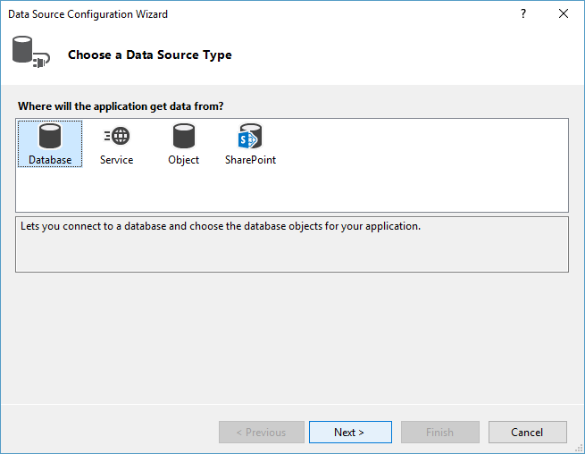
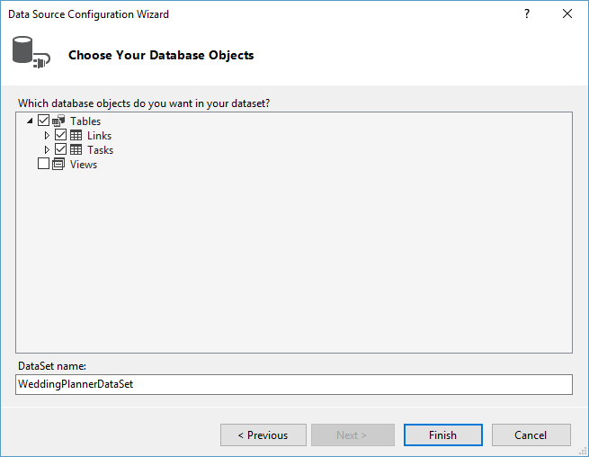
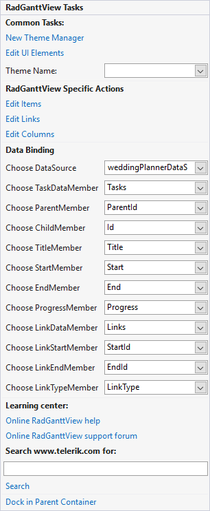
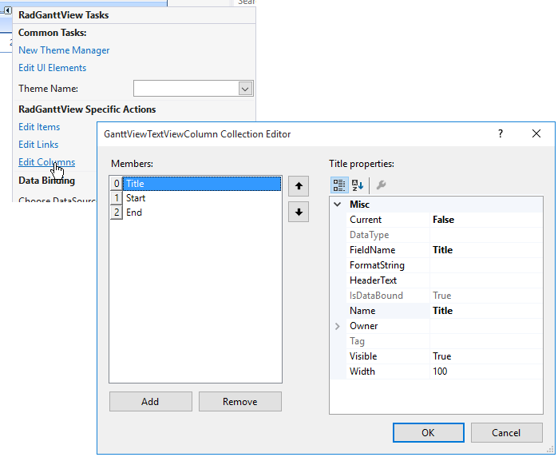

# Binding to database


## 

RadGanttView supports binding to Database data. Levels are created using the Parent and Child members’ values. You can read more on the data binding properties of RadGanttView in the [binding basics article.]()

1. In a new Windows project drop a RadGanttView control on the form.
            

1. In the __DataSource__ property drop down in the Properties Window of from the smart tag of the control select the __Add Project Data Source__ link.
            

1. In the __Choose a Data Source Type__ page select the __Database__ icon, then click the __Next__ button.
            
	

1. In the __Choose Your Data Connection__ page of the wizard click the __New Connection__ button.
            

1. In the __Add Connection__ dialog click the __Change__ button, select "Microsoft Access Database File" and click the __OK__ button. In the __Database file name__ entry click the __Browse__ button and locate the WeddingPlanner.mdb file in the installation directory under *\Examples\DataSources*. Click the __OK__ button. When prompted if you would like to copy the local data file to your project click the __Yes__ button.
            
	

1. In the Choose Your Database Objects page of the wizard check the "Tasks" and "Links" tables checkboxes. Click the Finish button.
            
	

1. Set the DataSource property first to Tasks, then to Links datatable. This will create the necessary data-binding components in the component tray - a DataSet, BindingSources and TableAdapters. The DataSet is the container for the data, the TableAdapters are used to fill the DataSet.
            

1. In the smart tag or in the properties window set the member properties in the following way.
            
	

1. Finally add this code to the form load event handler to specify the timeline range:
            
{{source=..\SamplesCS\GanttView\WorkingWithData\BindingToDatabase.cs region=BindingToDatabase}} 
{{source=..\SamplesVB\GanttView\WorkingWithData\BindingToDatabase.vb region=BindingToDatabase}} 

````C#
this.radGanttView1.GanttViewElement.GraphicalViewElement.TimelineStart = new DateTime(2006, 8, 2);
this.radGanttView1.GanttViewElement.GraphicalViewElement.TimelineEnd = new DateTime(2007, 4, 2);

````
````VB.NET
Me.radGanttView1.GanttViewElement.GraphicalViewElement.TimelineStart = New DateTime(2006, 8, 2)
Me.radGanttView1.GanttViewElement.GraphicalViewElement.TimelineEnd = New DateTime(2007, 4, 2)

````

{{endregion}} 



