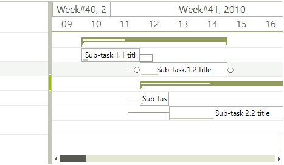
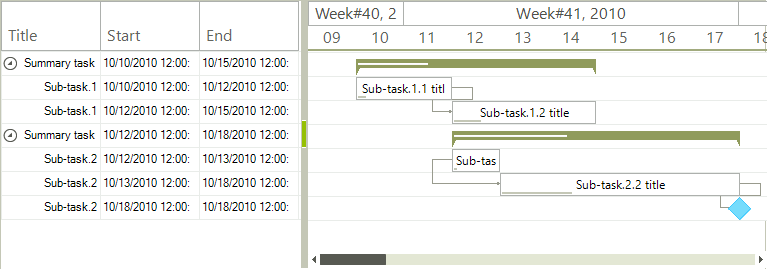

# Populating with Data Programmatically

__RadGanttview__ supports unbound mode as well, which means that you can manually populate it with the summary items, task items and milestone items (if needed). Then just set up the links between tasks and you have your gantt setup. The following example starts by setting the desired start and end range of the graphical element and then we are adding a few task items with sub items. At the end we are adding the links between the items.
        

{{source=..\SamplesCS\GanttView\WorkingWithData\PopulatingWithDataProgrammatically.cs region=PopulateData}} 
{{source=..\SamplesVB\GanttView\WorkingWithData\PopulatingWithDataProgrammatically.vb region=PopulateData}} 

````C#
            
this.radGanttView1.GanttViewElement.GraphicalViewElement.TimelineStart = new DateTime(2010, 10, 9);
this.radGanttView1.GanttViewElement.GraphicalViewElement.TimelineEnd = new DateTime(2010, 12, 10);
            
//setup data items
GanttViewDataItem item1 = new GanttViewDataItem();
item1.Start = new DateTime(2010, 10, 10);
item1.End = new DateTime(2010, 10, 15);
item1.Progress = 30m;
item1.Title = "Summary task.1. title";
            
GanttViewDataItem subitem11 = new GanttViewDataItem();
subitem11.Start = new DateTime(2010, 10, 10);
subitem11.End = new DateTime(2010, 10, 12);
subitem11.Progress = 10m;
subitem11.Title = "Sub-task.1.1 title";
            
GanttViewDataItem subitem12 = new GanttViewDataItem();
subitem12.Start = new DateTime(2010, 10, 12);
subitem12.End = new DateTime(2010, 10, 15);
subitem12.Progress = 20m;
subitem12.Title = "Sub-task.1.2 title";
            
//add subitems
item1.Items.Add(subitem11);
item1.Items.Add(subitem12);
            
this.radGanttView1.Items.Add(item1);
            
GanttViewDataItem item2 = new GanttViewDataItem();
item2.Start = new DateTime(2010, 10, 12);
item2.End = new DateTime(2010, 10, 18);
item2.Progress = 40m;
item2.Title = "Summary task.2. title";
            
GanttViewDataItem subitem21 = new GanttViewDataItem();
subitem21.Start = new DateTime(2010, 10, 12);
subitem21.End = new DateTime(2010, 10, 13);
subitem21.Progress = 10m;
subitem21.Title = "Sub-task.2.1 title";
            
GanttViewDataItem subitem22 = new GanttViewDataItem();
subitem22.Start = new DateTime(2010, 10, 13);
subitem22.End = new DateTime(2010, 10, 18);
subitem22.Progress = 30m;
subitem22.Title = "Sub-task.2.2 title";
            
GanttViewDataItem subitem23 = new GanttViewDataItem();
subitem23.Start = new DateTime(2010, 10, 18);
subitem23.End = new DateTime(2010, 10, 18);
subitem23.Title = "Sub-task.2.3 title";
            
//add subitems
item2.Items.Add(subitem21);
item2.Items.Add(subitem22);
item2.Items.Add(subitem23);
            
this.radGanttView1.Items.Add(item2);
            
//add links between items
GanttViewLinkDataItem link1 = new GanttViewLinkDataItem();
link1.StartItem = subitem11;
link1.EndItem = subitem12;
link1.LinkType = TasksLinkType.FinishToStart;
this.radGanttView1.Links.Add(link1);
            
GanttViewLinkDataItem link2 = new GanttViewLinkDataItem();
link2.StartItem = subitem21;
link2.EndItem = subitem22;
link2.LinkType = TasksLinkType.StartToStart;
this.radGanttView1.Links.Add(link2);
            
GanttViewLinkDataItem link3 = new GanttViewLinkDataItem();
link3.StartItem = subitem22;
link3.EndItem = subitem23;
link3.LinkType = TasksLinkType.FinishToStart;
this.radGanttView1.Links.Add(link3);

````
````VB.NET
Me.RadGanttView1.GanttViewElement.GraphicalViewElement.TimelineStart = New DateTime(2010, 10, 9)
Me.RadGanttView1.GanttViewElement.GraphicalViewElement.TimelineEnd = New DateTime(2010, 12, 10)
'setup data items
Dim item1 As New GanttViewDataItem()
item1.Start = New DateTime(2010, 10, 10)
item1.[End] = New DateTime(2010, 10, 15)
item1.Progress = 30D
item1.Title = "Summary task.1. title"
Dim subitem11 As New GanttViewDataItem()
subitem11.Start = New DateTime(2010, 10, 10)
subitem11.[End] = New DateTime(2010, 10, 12)
subitem11.Progress = 10D
subitem11.Title = "Sub-task.1.1 title"
Dim subitem12 As New GanttViewDataItem()
subitem12.Start = New DateTime(2010, 10, 12)
subitem12.[End] = New DateTime(2010, 10, 15)
subitem12.Progress = 20D
subitem12.Title = "Sub-task.1.2 title"
'add subitems
item1.Items.Add(subitem11)
item1.Items.Add(subitem12)
Me.RadGanttView1.Items.Add(item1)
Dim item2 As New GanttViewDataItem()
item2.Start = New DateTime(2010, 10, 12)
item2.[End] = New DateTime(2010, 10, 18)
item2.Progress = 40D
item2.Title = "Summary task.2. title"
Dim subitem21 As New GanttViewDataItem()
subitem21.Start = New DateTime(2010, 10, 12)
subitem21.[End] = New DateTime(2010, 10, 13)
subitem21.Progress = 10D
subitem21.Title = "Sub-task.2.1 title"
Dim subitem22 As New GanttViewDataItem()
subitem22.Start = New DateTime(2010, 10, 13)
subitem22.[End] = New DateTime(2010, 10, 18)
subitem22.Progress = 30D
subitem22.Title = "Sub-task.2.2 title"
Dim subitem23 As New GanttViewDataItem()
subitem23.Start = New DateTime(2010, 10, 18)
subitem23.[End] = New DateTime(2010, 10, 18)
subitem23.Title = "Sub-task.2.3 title"
'add subitems
item2.Items.Add(subitem21)
item2.Items.Add(subitem22)
item2.Items.Add(subitem23)
Me.RadGanttView1.Items.Add(item2)
'add links between items
Dim link1 As New GanttViewLinkDataItem()
link1.StartItem = subitem11
link1.EndItem = subitem12
link1.LinkType = TasksLinkType.FinishToStart
Me.RadGanttView1.Links.Add(link1)
Dim link2 As New GanttViewLinkDataItem()
link2.StartItem = subitem21
link2.EndItem = subitem22
link2.LinkType = TasksLinkType.StartToStart
Me.RadGanttView1.Links.Add(link2)
Dim link3 As New GanttViewLinkDataItem()
link3.StartItem = subitem22
link3.EndItem = subitem23
link3.LinkType = TasksLinkType.FinishToStart
Me.RadGanttView1.Links.Add(link3)

````

{{endregion}} 




Now we can just add the desired columns to be displayed in __GanttViewTextViewElement__. During the column initialization we will pass a string to specify the __FieldName__ so the column will know which fields of the tasks to display. In addition this string will also be used as header text.

{{source=..\SamplesCS\GanttView\WorkingWithData\PopulatingWithDataProgrammatically.cs region=AddColumns}} 
{{source=..\SamplesVB\GanttView\WorkingWithData\PopulatingWithDataProgrammatically.vb region=AddColumns}} 

````C#
            
GanttViewTextViewColumn titleColumn = new GanttViewTextViewColumn("Title");
GanttViewTextViewColumn startColumn = new GanttViewTextViewColumn("Start");
GanttViewTextViewColumn endColumn = new GanttViewTextViewColumn("End");
            
this.radGanttView1.GanttViewElement.Columns.Add(titleColumn);
this.radGanttView1.GanttViewElement.Columns.Add(startColumn);
this.radGanttView1.GanttViewElement.Columns.Add(endColumn);

````
````VB.NET
Dim titleColumn As New GanttViewTextViewColumn("Title")
Dim startColumn As New GanttViewTextViewColumn("Start")
Dim endColumn As New GanttViewTextViewColumn("End")
Me.RadGanttView1.GanttViewElement.Columns.Add(titleColumn)
Me.RadGanttView1.GanttViewElement.Columns.Add(startColumn)
Me.RadGanttView1.GanttViewElement.Columns.Add(endColumn)

````

{{endregion}} 



# See Also  

* [Binding to Database]()
* [Data Binding Basics]()
* [Importing XML from MS Project]()
* [Link Type Converter]()
* [Adding new items]()