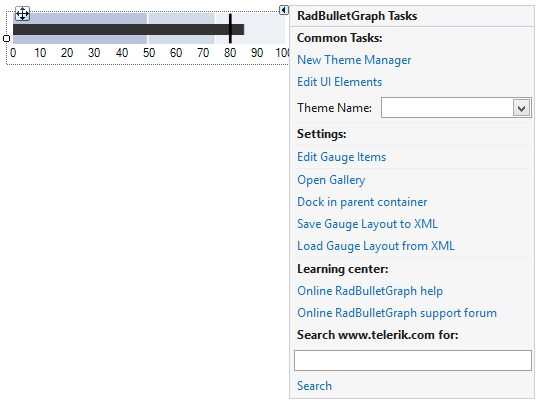

# Smart Tag

In this article we will describe the design time abilities of __RadBulletGrpaph__ provided by its Smart Tag. 

Here is how the control's Smart Tag looks like:

>caption Figure 1: Smart Tag

* __Common Tasks__

	* __New Theme Manager__: Adds a new __RadThemeManager__ component to the form.

	* __Edit UI elements__: Opens a dialog that displays the *Element Hierarchy Editor*. This editor lets you browse all the elements in the control.

	* __Theme Name__: Select a theme name from the drop down list of themes available for that control. Selecting a theme allows you to change all aspects of the controls visual style at one time.

* __RadBulletGraph Specific Actions__:

	* __Edit Gauge Items__: Opens the RadItem Collection Editor populated with each of the [bullet grаph items]().
	
	* __Open Gallary__: Opens the [gallery]() with available graph designs.
	
	* __Dock in Parent Container__: Docks the control to its parent.
	
	* __Save Gauge Layout to XML__: Saves the control`s layout to XML.

	* __Load Gauge Layout to XML__: Loads the control`s layout from XML.
	
* __Learning Center__: Navigate to the Telerik help, code library projects or support forum.

* __Search__: Search the Telerik website for a given string.

# See Also

* [Structure]()
* [Getting Started]()
* [Element Hierarchy Editor]()