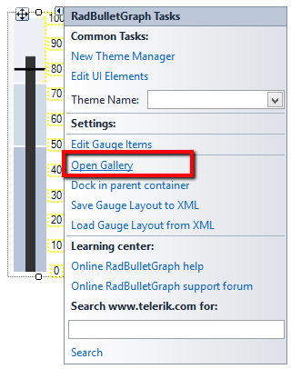

# Getting Started

When you drag a __RadBulletGraph__ from the Toolbox and drop it onto the form, the gauge gallery will offer you to pick up the desired type:

>caption Figure 1: Gallery Types


>note If you do not choose a gauge's style and just close the gallery, an empty __RadBulletGraph__ will be created.
>

You can change the gauge's style via the Smart tag's option Open Gallery as well.

>caption Figure 2: Smart Tag Gallery Options


Once the control is added to the form you just need to synchronize the __FeaturedMeasure__ and __ComparativeMeasure__ values with your business logic values. For example you can see how the controls work with the following code:      

>caption Figure 3: Update Properties


#### Update Properties

{{source=..\SamplesCS\Gauges\BulletGraphCode.cs region=test}} 
{{source=..\SamplesVB\Gauges\BulletGraphCode.vb region=test}}
````C#
Timer timer;
Random rand;
        
public BulletGraphCode()
{
    InitializeComponent();
    timer = new Timer();
    rand = new Random();
    timer.Interval = 1000;
    timer.Tick += timer_Tick;
    timer.Start();
}
     
void timer_Tick(object sender, EventArgs e)
{
    this.radBulletGraph1.FeaturedMeasure = rand.Next(100);
    this.radBulletGraph1.ComparativeMeasure = rand.Next(100);
}

````
````VB.NET
Private timer As Timer
Private rand As Random
Public Sub New()
    InitializeComponent()
    timer = New Timer()
    rand = New Random()
    timer.Interval = 1000
    AddHandler timer.Tick, AddressOf timer_Tick
    timer.Start()
End Sub
Private Sub timer_Tick(ByVal sender As Object, ByVal e As EventArgs)
    radBulletGraph1.FeaturedMeasure = rand.Next(100)
    radBulletGraph1.ComparativeMeasure = rand.Next(100)
End Sub

```` 


{{endregion}}  

>important Please note that when you select the style all elements will be automatically created and you can directly access them. You can create the control in code as well. More information is available in the following article:[Getting Started]()
>

# See Also

* [Structure]()
* [Smart Tag]()
