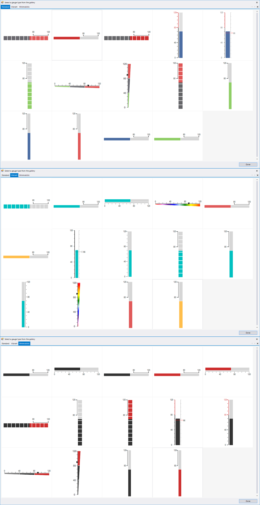

# Design Time

When you drag a RadLinearGauge from the Toolbox and drop it onto the form, the gauge gallery will offer you to pick up the desired type:

## Smart Tag

The smart tag allows you to change the control styles, save/load its layout and edit its items.

## Elements Selection

The __RadLinearGauge__ control supports precise design time selection of the gauge elements. This allows you to customize the selected element.
