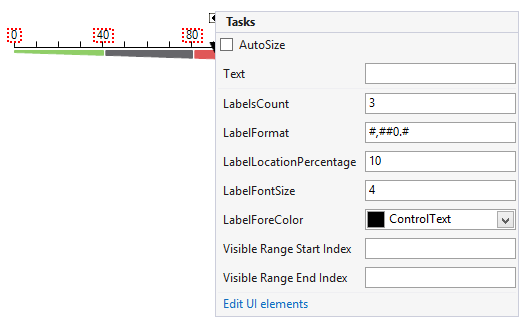

# Working with Labels

__LinearGaugeLabels__ element represents the scale labels displayed next to the ticks.

## Design Time

The smart tag allows you to configure the most commonly used properties.

>caption Figure 1: Design Time

## Properties

* __LabelsCount:__ Controls the number of displayed labels.

* __LabelFormat:__ Allows you to format the labels text.

* __LabelLocationPercentage:__ Controls the labels location. The property controls how far down/left the labels must be shifted. The offset is calculated according to the labels center. This means that if the property value is 0 only the half of the labels will be visible because the center of the labels will be at control border.

* __LabelFontSize:__ Controls the size of the labels' text.

* __ForeColor:__ Controls the fore color of the labels.

* __LabelStartVisibleRange:__ Indicates at which value the labels start. The LinarGauge control has a start and end value. The LabelStartVisibleRange value must be set within this range and the first label will be shown at this value.

* __LabelEndVisibleRange:__ Indicates at which value the labels end. The LinarGauge control has a start and end value. The LabelEndVisibleRange value must be set within this range and the last label will be shown at this value.

# See Also

* [Structure]()
* [Design Time]()
* [Properties and Events]()
