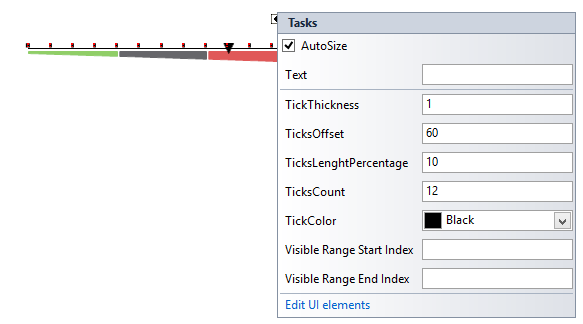

# Working with Ticks

The __RadLienarGaugeTicks__ element gives you the ability to easily show a scale.
     

## Design Time

The properties can be set directly in the smart tag window.

## Properties

* __ThickThickness:__ Specifies how thick the ticks will be rendered.
            

* __TicksCount:__ Specifies how many ticks will be displayed
            

* __ThicksLengthPercentage:__ Controls the tick’s length.
            

* __ThickColor:__ Specifies the color of the ticks.
            

* __TicksOffset:__ Specifies how far to the left/bottom the control will be shifted.
            
