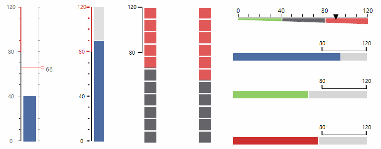

# LinearGauge
 

## 

__RadLinearGauge__  displays simple value within a specific range. The range is displayed in a rectangle, this rectangle can contain scale with or without ticks, labels and a scale bar. This control can be very useful when you need to build business dashboards or you just need graphical indicators.
        

__Key Features__

1. Fully customizable elements.

1. Precise design time selection of the gauge elements.

1. Plenty of gauge styles.
