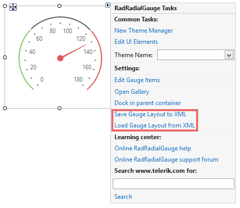

# Save and Load layout
 

__RadRadialGauge__ supports Save/Load layout functionality which gives you the opportunity to preserve user gauge elements' settings and restore them later. Those layout settings are written in a xml file.
      

## Save layout

You can perform some modifications to the gauge elements at design time and save the constructed layout via the *Save Gauge Layout to XML* option in the Smart tag.

Additionally, you can save the layout at run time by using the RadRadialGauge.__SaveLayout__ method.

## Load layout

You can load the preserved layout to a random __RadRadialGauge__ at design time by the *Load Gauge Layout from XML* option in the Smart tag.
        

Additionally, you can load the layout at run time by using the RadRadialGauge.__LoadLayout__ method.
        
