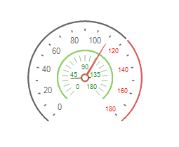
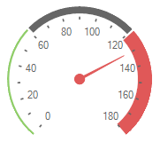

# Working with arcs

__RadialGaugeArc__ is rendered as a continuous band spanning the entire sweep angle. The arc is also used as a basis for the placement of child elements,
          such as the tick marks and labels.
        

## 

* __Radius__ - controls the radius of the arc. In the image below, the green arc has a smaller radius than the dark gray one.
              This allows several arcs to be defined and positioned as desired.
            

* 

* __RangeStart__ - specifies the start value of the arc and moves clock-wise to the __RangeEnd__ value. On the above picture the dark
              gray arc starts from 0, but the red one starts from 121.
            

* __RangeEnd__ - specifies the end value of the arc. On the above picture the dark gray arc ends with 120, but the red one ends with 180.
            

* __Width__ - controls how thick the arc will be rendered.
            

* __BackColor__ and __BackColor2__ - specifies the fill colors for the arc.
            

* __BindStartRange__ - indicates whether the __RangeStart__ property is bound to the gauge's __Value__.
              Changing the gauge's value will change the start range of the arc respectively.
            

* __BindEndRange__ - indicates whether the __RangeEnd__ property is bound to the gauge's __Value__.
              Changing the gauge's value will change the end range of the arc respectively.
            

* __BindStartRangeOffset__ - specifies the start range offset of the arc according to the gauge's value.
            

* __BindEndRangeOffset__ - specifies the end range offset of the arc according to the gauge's value.
            
