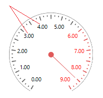
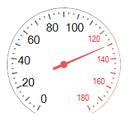
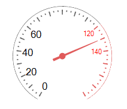
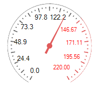

# Working with labels

__RadialGaugeLabels__ class represents the scale labels displayed next to the ticks.
      

## 

The following properties allow you to modify the labels' look:

* __LabelFontSize__ - specifies the font size. On the following picture the black labels font size is *8* but the red labels font size is *5*.
            

* __LabelStartVisibleRange__ - specifies the start value from which the labels are displayed. On the following picture the black labels starts from value *40* but the red labels start from value *140*.
            

* __LabelEndVisibleRange__ - specifies the end value to which the labels are displayed. On the following picture the black labels ends with value *60* but the red labels ends with value *140*.
            

* __LabelRadiusPercentage__ - controls how far according to the gauge's arc the labels are rendered. If the __LabelRadiusPercentage__ is greater than *100*, the labels will be displayed outside the gauge. The smaller the value is, the closer to the center the label gets.
            

* __LabelFormat__ - specifies the format of the label's value. You can display labels with one digit after the decimal place, e.g. refer to the black labels below. The red ones show two digits after the decimal place.
            

* __LabelsCount__ - controls how many labels will be displayed next ticks for the specified range.
            

>note  __RadRadialGauge__ always displays one additional label to the __LabelsCount__ in order to distribute the labels correctly on the arc.
>

