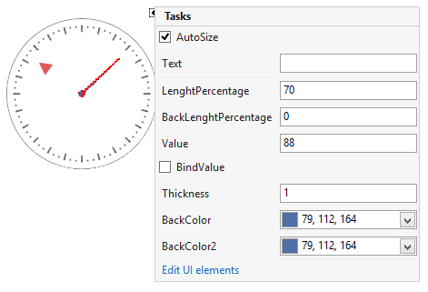

# Working with needles

__RadialGaugeNeedle__ is a scale indicator that points to a value. To add a needle to the gauge, you should add it via the RadradialGauge. __Items__ collection. 

## Properties

* __Value__ - specifies the needle's value.
            

* __Thickness__ - controls how thick the needle will be rendered.
            

* __PointRadiusPercentage__ - specifies the outer radius of the needle's start point.
            

* __InnerPointRadiusPercentage__ - specifies the inner radius of the needle's start point.
            

* __LenghtPercentage__ - controls how long the needle will be rendered.
            

* __BackLenghtPercentage__ - the value with which the needle juts out from the center point.
            

* __BindValue__ - indicates whether the needle's value is bound to the gauge's __Value__.
            

* __BindOffset__ - specifies the value offset of the needle according to the gauge's value.
            

## Events

The __ValueChanged__ event fires when the needle's value is modified.
      
