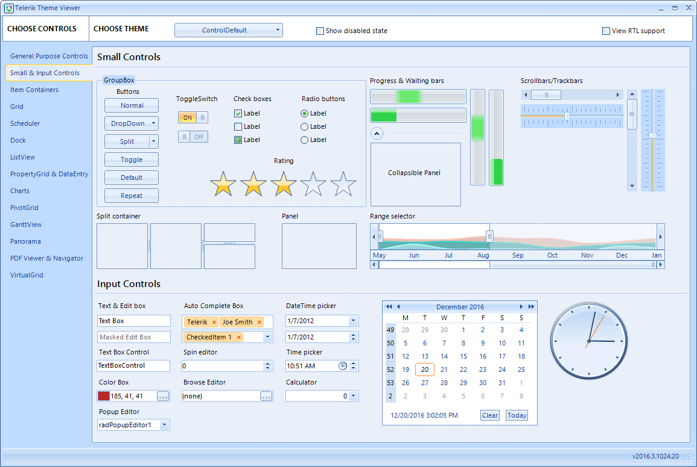

# Change Control Appearance

[Visual Style Builder]() is a stand alone application that allows you to create custom or edit predefined themes. Using Visual Style Builder you can alter, at design-time or run time, a predefined set of properties of a control. Because all Telerik controls are composed of primitives, this customization can be applied at a very fine level of detail.
>caption Figure 1: Visual Style Builder Tool

## Custom Shapes

The [Custom Shape Editor]() provides an easy way for creating all kinds of custom shapes only by adding, removing and dragging the points which represent the shape.
>caption Figure 2: Custom Shape Editor

## Preview Custom Theme

[ThemeViewer]() is a tool that gives you the ability to preview a custom or a predefined theme for all controls of the suite.
>caption Figure 3: ThemeViewer

## Next Steps

* [Further information]()

## See Also

* [Visual Style Builder]()
* [ThemeViewer]()
* [Custom Shape Editor]()
* [Predefined Template Applications](https://www.telerik.com/winforms/winforms-guide)
