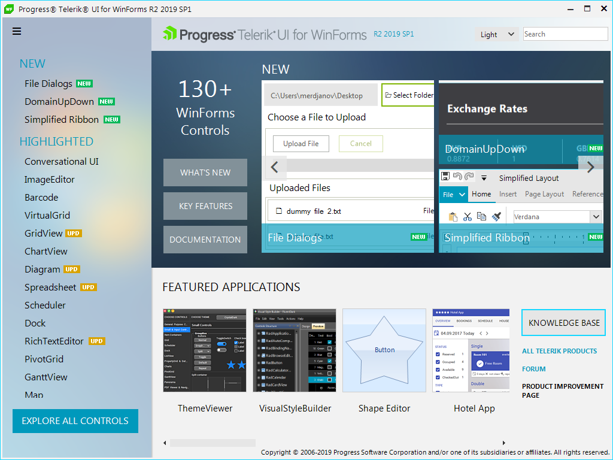
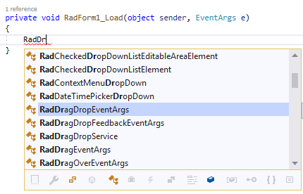

# Explore UI for WinForms Control Features
Once you have the controls [working in your project] (), it's time to see what they can do. This article provides a short overview of how to get started with finding control functionality and use them.

## Demos
To access the **Live Demo** simply click on the Windows Start button and type WinForms Demo.
If you are not able to find the Live Demos using that approach you can also download it directly from [here](https://telerik-winforms-demos.s3.amazonaws.com/TelerikWinFormsExamplesLauncher.exe).

## Explore properties and tags
You can **explore** the available properties, events and inner tags of any control through the VS **intellisense** to get a quick glimpse of their concepts and availability.
>caption Figure 1: Explore Control Properties in Form Designer
If you do not see the Property window, go to **View > Properties Windows**

>caption Figure 2: Explore Control Properties in Code-Behind

		
## Documentation
In addition to that, the **documentation** provides a section for each control that contains help articles **on distinct features and API reference**.

>caption Figure 3: Typical control documentation structure

## Design-time

Last, but not least, some most common tasks and configuration options are available under the [**Design Time**] () folder of each control.

>caption Figure 4: Smart Tag features

## Next Steps

Below you can find guidance on changing the control appearance as well as next steps:

* [Preview and Change control appearance]()
* [Further information]()

## See Also

* [First Steps]()
* [Predefined Template Applications](https://www.telerik.com/winforms/winforms-guide)
* [Progress Virtual Classroom](https://www.telerik.com/account/support/virtual-classroom)
