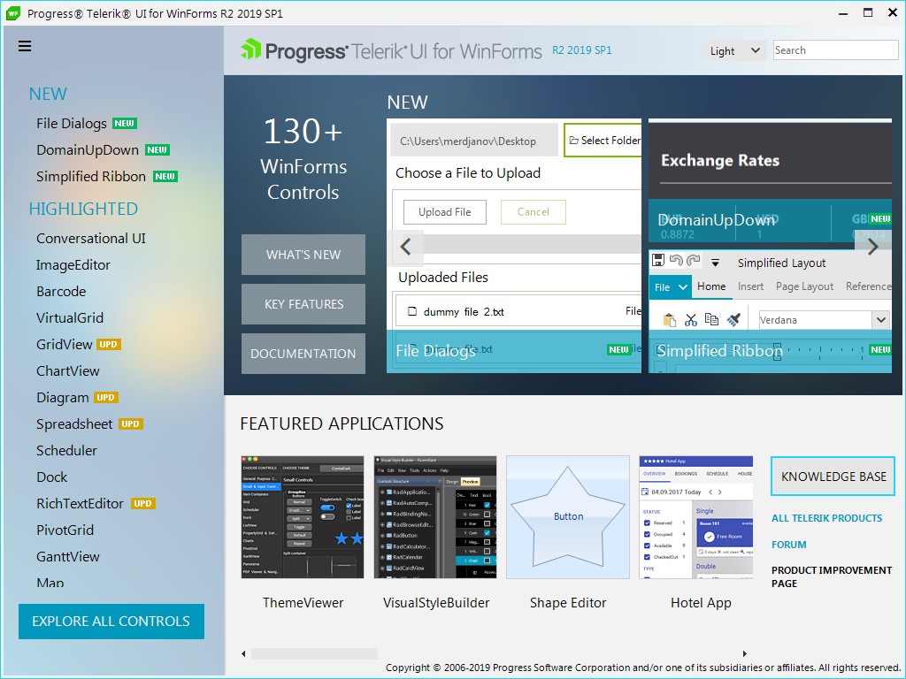
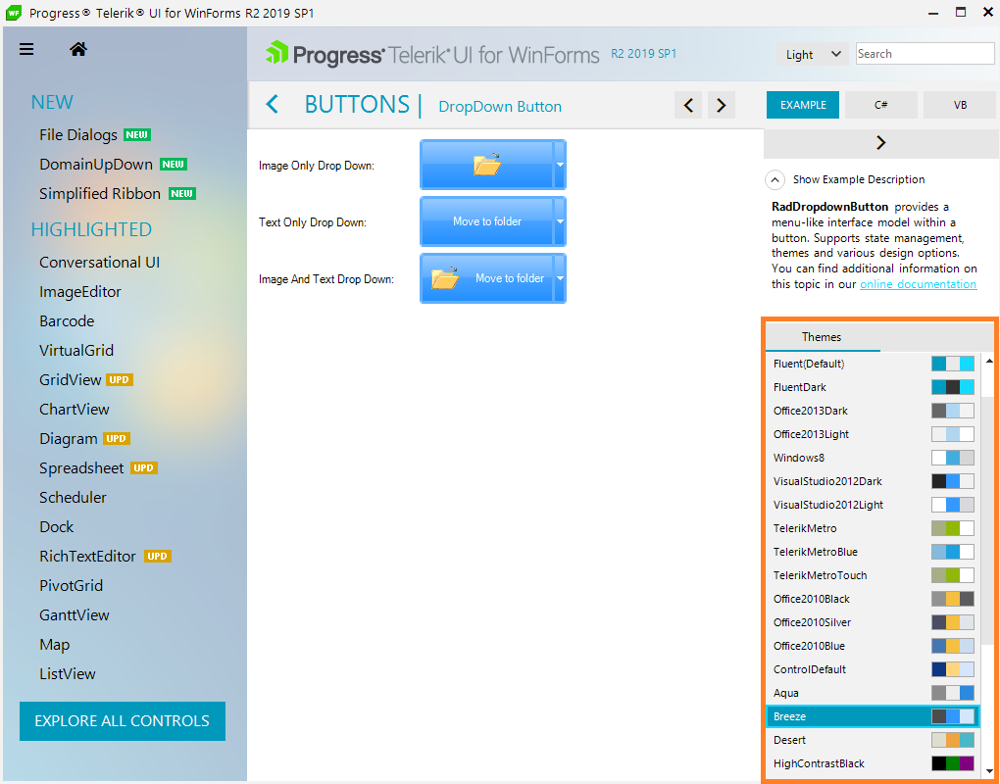
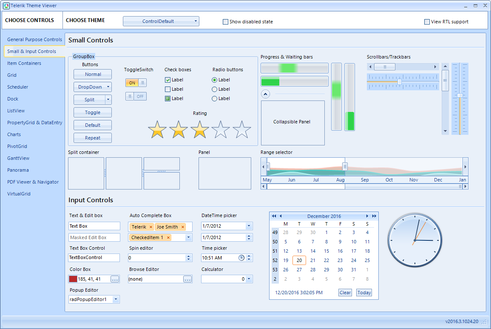
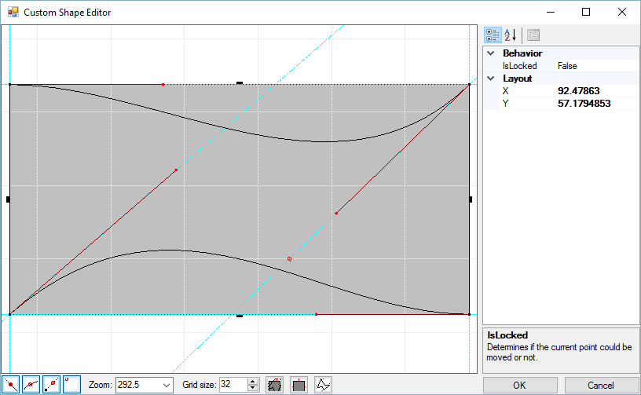
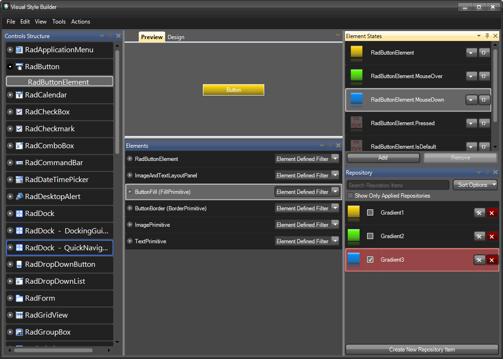
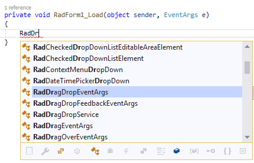

# Explore Telerik UI for WinForms Tools and Features

Once you have Telerik UI for WinForms [working in your project](), explore the tools and design-time features that help you discover, preview, and customize the available controls.

## Demos
To access the **Live Demo** simply click on the Windows Start button and type WinForms Demo.
If you are not able to find the Live Demos using that approach you can also [download the WinForms Live Demos installer](https://telerik-winforms-demos.s3.amazonaws.com/TelerikWinFormsExamplesLauncher.exe) directly.

### Preview Custom Theme
Using the Live Demo is an easy and fast way to preview different Telerik WinForms control themes.
>caption Figure 1: Live Demo

## ThemeViewer
[ThemeViewer]() is a tool that gives you the ability to preview a custom or a predefined theme for all controls of the suite. It can be started from the Live Demo under Featured Applications.
>caption Figure 2: ThemeViewer

## Custom Shapes

The [Custom Shape Editor]() provides an easy way for creating all kinds of custom shapes only by adding, removing and dragging the points which represent the shape.
>caption Figure 3: Custom Shape Editor

## Change Control Appearance

[Visual Style Builder]() is a stand alone application that allows you to create custom or edit predefined themes. Using Visual Style Builder you can alter, at design-time or run time, a predefined set of properties of a control. Because all Telerik controls are composed of primitives, this customization can be applied at a very fine level of detail.
>caption Figure 4: Visual Style Builder Tool

## Design Time Support

You can explore the properties, events, and inner tags exposed by a control directly in Visual Studio through the **Properties** window and IntelliSense. This gives you a quick overview of each control's capabilities.

>caption Figure 1: Explore Control Properties in Form Designer

## See Also

* [First Steps]()
* [Predefined Template Applications](https://www.telerik.com/winforms/winforms-guide)