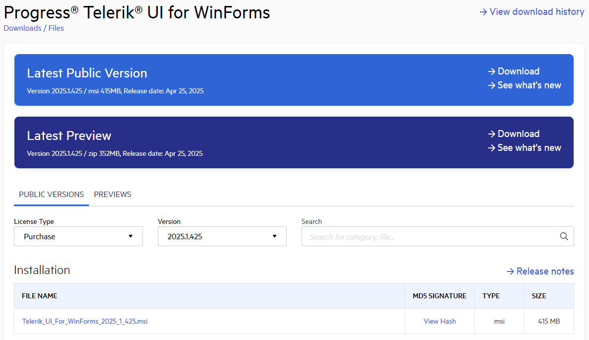
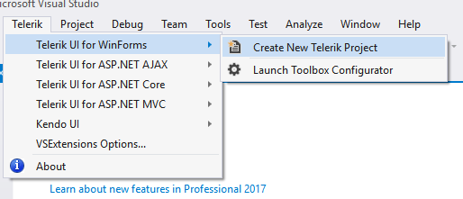
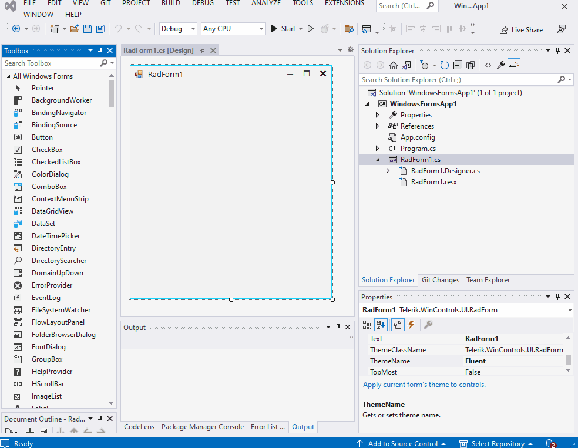
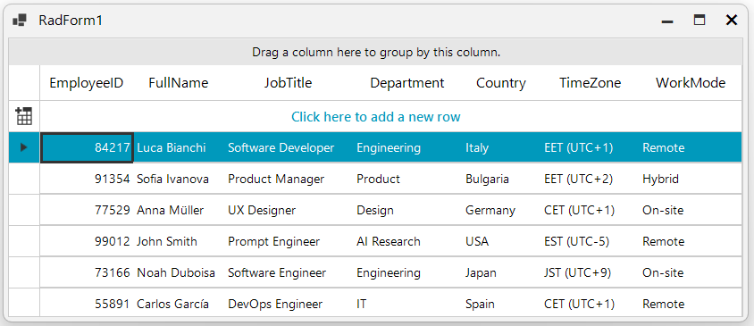

# First Steps
This article explains how to get the Telerik UI for WinForms controls in your project and start using them quickly.
The process consists of the following steps:

- [First Steps](#first-steps)
  - [Download the Controls](#download-the-controls)
  - [Create a new WinForms Telerik Project](#create-a-new-winforms-telerik-project)
  - [Add Telerik Control to a Form](#add-telerik-control-to-a-form)
      - [Binding to Lists of Objects](#binding-to-lists-of-objects)
  - [Next Steps](#next-steps)
  - [See Also](#see-also)

Once you have your first simple control up and running, take a look at the [next steps](#next-steps) section to start exploring the control functionality in more detail.

## Download the Controls
The easiest way to get the controls to your development machine is to use the [Progress Control Panel](https://www.telerik.com/download-trial-file/v2/control-panel) or to download the automated MSI installer from [your telerik.com account](https://www.telerik.com/account/product-download?product=RCWF). 

>caption Figure 1: Download automated (.msi) installer



> If you are not a customer, you can [download a free, fully functional trial](https://www.telerik.com/download-trial-file/v2-b/ui-for-winforms) and the same options will apply to you as well.

>tip The following article provides step-by-step instructions how to install Telerik UI for WinForms on your computer: [Installing UI for WinForms](http://docs.telerik.com/devtools/winforms/installation-deployment-and-distribution/installing-on-your-computer)

## Create a new WinForms Telerik Project
If you **do not have a project**, run the [Create Project Wizard]()

>caption Figure 2: Go to Telerik > UI for WinForms > Create new Telerik project



This will also automatically add 3 of the most common Telerik dll references - **Telerik.WinControls, Telerik.WinControls.UI and Telerik.Common**.
		
## Add Telerik Control to a Form

The final step is to add a Telerik control to your application. As an example we will use a [RadGridView]() control with auto generated coumns.

We will add the __RadGridView__ control from the Toolbox. To do that simply search for __RadGridView__ in the __Toolbox__ and drag it to the surface of the form designer. If you do not see the Toolbox, go to View > Toolbox. Using this method will also automatically add any missing dlls to your project.

>caption Figure 3: Add RadGridView from the Toolbox



#### Binding to Lists of Objects
The example below defines a MyObject class containing one integer and two string properties. The next set of code snippets "Creating an List of Objects" creates an array of MyObjects, initializes the array and assigns the array to the DataSource. The MyObject class would typically be placed in its own separate class file and the List creation, initialization and assignment code might be placed at the bottom of the form's Load event handler. 

````C#
public class MyObject
    {
        private int id;
        private string items;
        private string serial;
        
		public int ID
        {
            get { return id; }
            set { id = value; }
        }
        public string Items
        {
            get { return items; }
            set { items = value; }
        }
        public string Serial
        {
            get { return serial; }
            set { serial = value; }
        }
        public MyObject()
        {

        }
    }

````
````VB.NET
Public Class MyObject
    Private id As Integer
    Private items As String
    Private serial As String

    Public Property ID As Integer
        Get
            Return id
        End Get
        Set(ByVal value As Integer)
            id = value
        End Set
    End Property

    Public Property Items As String
        Get
            Return items
        End Get
        Set(ByVal value As String)
            items = value
        End Set
    End Property

    Public Property Serial As String
        Get
            Return serial
        End Get
        Set(ByVal value As String)
            serial = value
        End Set
    End Property

    Public Sub New()
    End Sub
End Class

````


````C#
List<MyObject> myList = new List<MyObject>();
myList.Add(new MyObject() { ID = 1, Items = "Monitor", Serial = Guid.NewGuid().ToString() });
myList.Add(new MyObject() { ID = 2, Items = "Keyboard", Serial = Guid.NewGuid().ToString() });
myList.Add(new MyObject() { ID = 3, Items = "Mouse", Serial = Guid.NewGuid().ToString() });
myList.Add(new MyObject() { ID = 4, Items = "System Unit", Serial = Guid.NewGuid().ToString() });
radGridView1.DataSource = myList;
radGridView1.AutoSizeColumnsMode = GridViewAutoSizeColumnsMode.Fill;

````
````VB.NET
Dim myList As List(Of MyObject) = New List(Of MyObject)()
myList.Add(New MyObject() With {
        .ID = 1,
        .Items = "Monitor",
        .Serial = Guid.NewGuid().ToString()
})
myList.Add(New MyObject() With {
        .ID = 2,
        .Items = "Keyboard",
        .Serial = Guid.NewGuid().ToString()
})
myList.Add(New MyObject() With {
        .ID = 3,
        .Items = "Mouse",
        .Serial = Guid.NewGuid().ToString()
})
myList.Add(New MyObject() With {
        .ID = 4,
        .Items = "System Unit",
        .Serial = Guid.NewGuid().ToString()
})
radGridView1.DataSource = myList
radGridView1.AutoSizeColumnsMode = GridViewAutoSizeColumnsMode.Fill
````

> For this example we also need to ensure we have reference for __System__; __System.Collections.Generic__ and __Telerik.WinControls.UI__ dlls in the RadForm1.Designer.cs.

>caption Figure 4: Final result should look like this:



## Next Steps

Now that you have the Telerik UI for WinForms controls running in your project, you may want to explore their features, customize their behavior or change their appearance. Below you can find guidance on getting started with such tasks:

* [Explore control features]()
* [Preview and Change control appearance]()
* [Further information]()

## See Also

* [System Requirements](https://www.telerik.com/winforms/tech-sheets/system-requirements)
* [Download Product Files]()
* [Predefined Template Applications](https://www.telerik.com/winforms/winforms-guide)
* [Progress Virtual Classroom](https://www.telerik.com/account/support/virtual-classroom)

