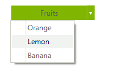

# First Steps
This article explains how to get the Telerik UI for WinForms controls in your project and start using them quickly.
The process consists of the following steps:

1. [Download the Controls](#download-the-controls)
1. [Create a new WinForms Telerik Project](#create-a-new-winforms-telerik-project)
1. [Add Telerik Control to a Form](#add-telerik-control-to-a-form)

Once you have your first simple control up and running, take a look at the [next steps](#next-steps) section to start exploring the control functionality in more detail.

## Download the Controls
The easiest way to get the controls to your development machine is to use the [Progress Control Panel](https://www.telerik.com/download-trial-file/v2/control-panel) or to download the automated MSI installer from [your telerik.com account](https://www.telerik.com/account/product-download?product=RCWF).

>caption Figure 1: Download automated (.msi) installer


> If you are not a customer, you can [download a free, fully functional trial](https://www.telerik.com/download-trial-file/v2-b/ui-for-winforms) and the same options will apply to you as well.

>tip The following article provides step-by-step instructions how to install Telerik UI for WinForms on your computer: [Installing UI for WinForms](http://docs.telerik.com/devtools/winforms/installation-deployment-and-distribution/installing-on-your-computer)

## Create a new WinForms Telerik Project
If you **do not have a project**, run the [Create Project Wizard]().

>caption Figure 2: Go to Telerik > UI for WinForms > Create new Telerik Project


This will also automatically add 3 of the most common Telerik dll references - **Telerik.WinControls, Telerik.WinControls.UI and Telerik.Common**.
		
## Add Telerik Control to a Form
The final step is to add a Telerik control to your application.

1. **Add a Telerik control** to a form. As an example we will use a [RadDropDownButton]() control.

To programmatically add a __RadDropDownButton__ to a form, create a new instance of a __RadDropDownButton__, and add it to the form __Controls__ collection.

#### Adding a RadDropDownButton at runtime 

````C#
RadDropDownButton radDropDownButton = new RadDropDownButton();
radDropDownButton.Text = "Fruits";
RadMenuItem item1 = new RadMenuItem("Orange");
radDropDownButton.Items.Add(item1);
RadMenuItem item2 = new RadMenuItem("Lemon");
radDropDownButton.Items.Add(item2);
RadMenuItem item3 = new RadMenuItem("Banana");
radDropDownButton.Items.Add(item3);
this.Controls.Add(radDropDownButton);

````
````VB.NET
Dim radDropDownButton As New RadDropDownButton()
radDropDownButton.Text = "Fruits"
Dim item1 As New RadMenuItem("Orange")
radDropDownButton.Items.Add(item1)
Dim item2 As New RadMenuItem("Lemon")
radDropDownButton.Items.Add(item2)
Dim item3 As New RadMenuItem("Banana")
radDropDownButton.Items.Add(item3)
Me.Controls.Add(radDropDownButton)

````



> You can also add a __RadDropDownButton__ control from the Toolbox. To do that simply drag it from the toolbox to the surface of the form designer. If you do not see the Toolbox, go to **View** > **Toolbox**.
Using this method will also add automatically any missing dlls to your project.

## Next Steps

Now that you have the Telerik UI for WinForms controls running in your project, you may want to explore their features, customize their behavior or change their appearance. Below you can find guidance on getting started with such tasks:

* [Explore control features]()
* [Preview and Change control appearance]()
* [Further information]()

## See Also

* [System Requirements](https://www.telerik.com/winforms/tech-sheets/system-requirements)
* [Download Product Files]()
* [Predefined Template Applications](https://www.telerik.com/winforms/winforms-guide)
* [Progress Virtual Classroom](https://www.telerik.com/account/support/virtual-classroom)

