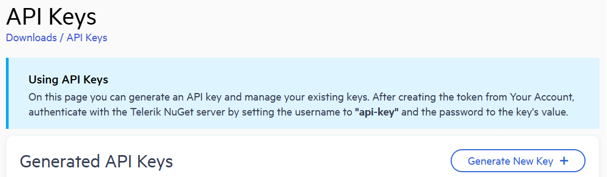

# First Steps with Telerik UI for WinForms
This article explains how to get the Telerik UI for WinForms controls in your project and start using them quickly.
The process consists of the following steps:

- [Start Your Free Trial](#first-steps)
- [Download the Controls](#download-the-controls)
- [Create a new WinForms Telerik Project](#create-a-new-winforms-telerik-project)
- [Add Telerik Control to a Form](#add-telerik-control-to-a-form)
- [Next Steps](#next-steps)

## Start Your Free Trial

* If you already have an [active license](https://www.telerik.com/account/your-licenses) for Telerik UI for WinForms, skip this step and continue with the next step.
* If you don't have an active license, follow the steps below to activate your free trial:

    1. [Download](https://www.telerik.com/try/ui-for-winforms) the WinForms Installer and start the installation.

    1. Make sure that **Telerik UI for WinForms** is selected and continue with the setup.

    1. Log in with your Telerik account and complete the installation.

    After the successful installation of Telerik UI for Winforms, the Installer activates your 30 day free trial. The installer also downloads your license key file, so you can skip the next step and continue with [Create a new WinForms Telerik Project](#create-a-new-winforms-telerik-project).
	
## Download Your License Key File

To download and install your Telerik [license key file]():

1. Go to the <a href="https://www.telerik.com/account/your-licenses/license-keys" target="_blank">License Keys page</a> in your Telerik account.
1. Click the **Download License Key** button.
1. Save the `telerik-license.txt` file to `%AppData%\Telerik\telerik-license.txt`.

This will make the license key available to all Telerik .NET apps that you develop on your local machine.

## Download the Controls

The easiest way to get the controls to your development machine is to use the [Progress Control Panel](https://www.telerik.com/download-trial-file/v2/control-panel) or to download the automated MSI installer from [your telerik.com account](https://www.telerik.com/account/product-download?product=RCWF). 

>caption Figure 1: Download automated (.msi) installer


> If you are not a customer, you can [download a free, fully functional trial](https://www.telerik.com/download-trial-file/v2-b/ui-for-winforms) and the same options will apply to you as well.

>tip The following article provides step-by-step instructions how to install Telerik UI for WinForms on your computer: [Installing UI for WinForms](http://docs.telerik.com/devtools/winforms/installation-deployment-and-distribution/installing-on-your-computer)

## Add the Telerik NuGet Server

Telerik maintains a NuGet feed with official UI for Telerik UI for WinForms releases. These packages are available for registered users with an active trial or commercial license. Adding the Telerik NuGet server as a source in Visual Studio lets you download and install Telerik packages containing controls and utilities.

As the Telerik NuGet server requires authentication, the first step is to obtain an API key that you will use instead of a password. Using an API key instead of a password is a more secure approach, especially when working with the NuGet.Config file.

1. Go to the [API Keys](https://www.telerik.com/account/downloads/api-keys) page in your Telerik account.

1. Click **Generate New Key +**.

    

1. In the **Key Note** field, add a note that describes the API key.

1. When ready, click **Generate Key**.

1. Select **Copy and Close**. Once you close the window, you can no longer copy the generated key. For security reasons, the API Keys page displays only a portion of the key.

1. Store the generated NuGet API key as you will need it in the next steps. Whenever you need to authenticate your system with the Telerik NuGet server, use api-key as the username and your generated API key as the password.

>API keys expire after two years. Telerik will send you an email when a key is about to expire, but we recommend that you set your own calendar reminder with information about where you used that key: file paths, project links, AzDO and GitHub Action variable names, and so on.

Next, add the Telerik NuGet feed to Visual Studio:

1. In Visual Studio and go to **Tools > NuGet Package Manager > Package Manager Settings**.

1. Select **Package Sources** and then click the + button to add a new package source.

1. Enter a **Name** for the new package source, for example, `telerik.com`.

1. Add the `https://nuget.telerik.com/v3/index.json` URL as a **Source**. Click **OK**.

1. Whenever Visual Studio displays a dialog to enter credentials for `nuget.telerik.com`, use `api-key` as the username and your NuGet API key as the password.

    

## Create a new WinForms Telerik Project
If you **do not have a project**, run the [Create Project Wizard]()

>caption Figure 2: Go to Telerik > UI for WinForms > Create new Telerik project


This will also automatically add 3 of the most common Telerik dll references - **Telerik.WinControls, Telerik.WinControls.UI and Telerik.Common**.
		
## Add Telerik Control to a Form

The final step is to add a Telerik control to your application. As an example we will use a [RadGridView]() control with auto generated coumns.

We will add the __RadGridView__ control from the Toolbox. To do that simply search for __RadGridView__ in the __Toolbox__ and drag it to the surface of the form designer. If you do not see the Toolbox, go to View > Toolbox. Using this method will also automatically add any missing dlls to your project.

>caption Figure 3: Add RadGridView from the Toolbox


#### Binding to Lists of Objects
The example below defines a MyObject class containing one integer and two string properties. The next set of code snippets "Creating an List of Objects" creates an array of MyObjects, initializes the array and assigns the array to the DataSource. The MyObject class would typically be placed in its own separate class file and the List creation, initialization and assignment code might be placed at the bottom of the form's Load event handler. 

````C#
public class MyObject
    {
        private int id;
        private string items;
        private string serial;
        
		public int ID
        {
            get { return id; }
            set { id = value; }
        }
        public string Items
        {
            get { return items; }
            set { items = value; }
        }
        public string Serial
        {
            get { return serial; }
            set { serial = value; }
        }
        public MyObject()
        {

        }
    }

````
````VB.NET
Public Class MyObject
    Private id As Integer
    Private items As String
    Private serial As String

    Public Property ID As Integer
        Get
            Return id
        End Get
        Set(ByVal value As Integer)
            id = value
        End Set
    End Property

    Public Property Items As String
        Get
            Return items
        End Get
        Set(ByVal value As String)
            items = value
        End Set
    End Property

    Public Property Serial As String
        Get
            Return serial
        End Get
        Set(ByVal value As String)
            serial = value
        End Set
    End Property

    Public Sub New()
    End Sub
End Class

````


````C#
List<MyObject> myList = new List<MyObject>();
myList.Add(new MyObject() { ID = 1, Items = "Monitor", Serial = Guid.NewGuid().ToString() });
myList.Add(new MyObject() { ID = 2, Items = "Keyboard", Serial = Guid.NewGuid().ToString() });
myList.Add(new MyObject() { ID = 3, Items = "Mouse", Serial = Guid.NewGuid().ToString() });
myList.Add(new MyObject() { ID = 4, Items = "System Unit", Serial = Guid.NewGuid().ToString() });
radGridView1.DataSource = myList;
radGridView1.AutoSizeColumnsMode = GridViewAutoSizeColumnsMode.Fill;

````
````VB.NET
Dim myList As List(Of MyObject) = New List(Of MyObject)()
myList.Add(New MyObject() With {
        .ID = 1,
        .Items = "Monitor",
        .Serial = Guid.NewGuid().ToString()
})
myList.Add(New MyObject() With {
        .ID = 2,
        .Items = "Keyboard",
        .Serial = Guid.NewGuid().ToString()
})
myList.Add(New MyObject() With {
        .ID = 3,
        .Items = "Mouse",
        .Serial = Guid.NewGuid().ToString()
})
myList.Add(New MyObject() With {
        .ID = 4,
        .Items = "System Unit",
        .Serial = Guid.NewGuid().ToString()
})
radGridView1.DataSource = myList
radGridView1.AutoSizeColumnsMode = GridViewAutoSizeColumnsMode.Fill
````

> For this example we also need to ensure we have reference for __System__; __System.Collections.Generic__ and __Telerik.WinControls.UI__ dlls in the RadForm1.Designer.cs.

>caption Figure 4: Final result should look like this:


## Next Steps

Now that you have the Telerik UI for WinForms controls running in your project, you may want to explore their features, customize their behavior or change their appearance. Below you can find guidance on getting started with such tasks:

* [Explore control features]()
* [Preview and Change control appearance]()
* [Further information]()

## See Also

* [System Requirements](https://www.telerik.com/winforms/tech-sheets/system-requirements)
* [Download Product Files]()
* [Predefined Template Applications](https://www.telerik.com/winforms/winforms-guide)
* [Progress Virtual Classroom](https://www.telerik.com/account/support/virtual-classroom)

