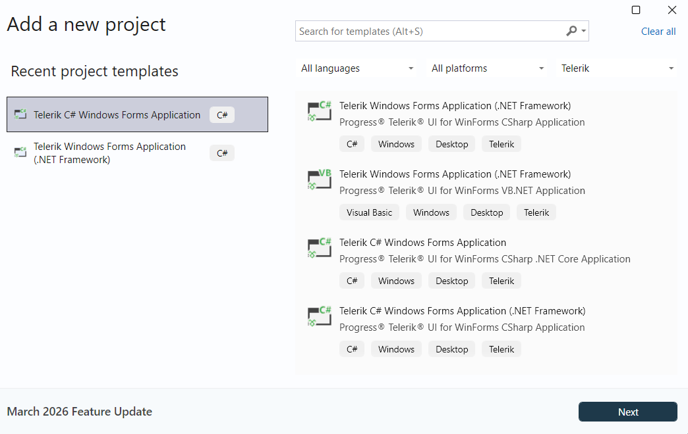
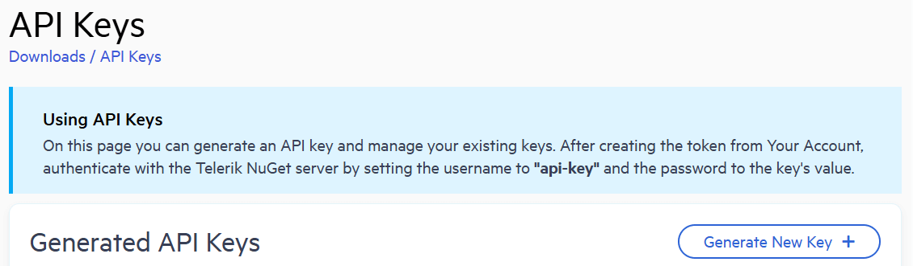
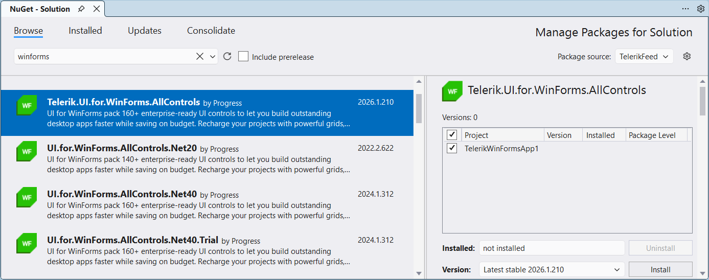
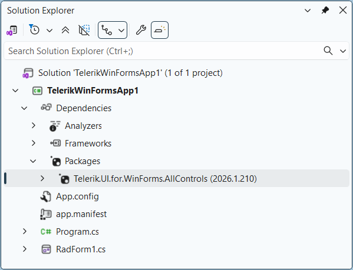
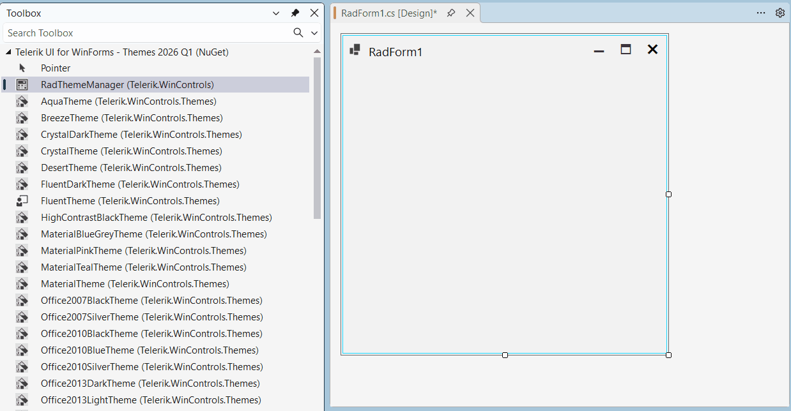
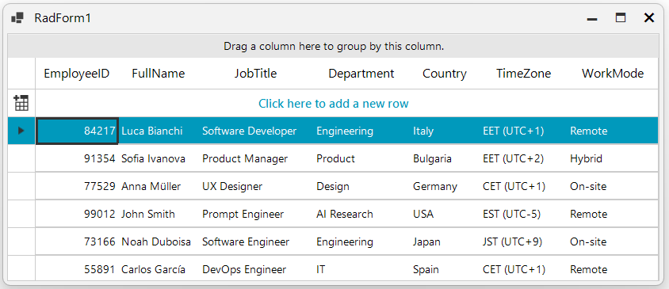

# First Steps with Telerik UI for WinForms

This tutorial explains how to use the Telerik UI for WinForms components in a WinForms desktop project. You will create a new application from scratch, learn how to add the UI for WinForms components in Visual Studio, and utilize the Telerik NuGet source that lets you download and install all Telerik controls automatically. 

## Prerequisites

* To download Telerik UI for WinForms packages, you need a [Telerik account](https://www.telerik.com/account/). If you do not have an account, you can [create one](https://www.telerik.com/account/) for free.
* To build an application, you need an up-to-date [Visual Studio IDE](https://visualstudio.microsoft.com/vs/) installation with a [compatible .NET version]() and the Telerik UI for WinForms workload installed.

## Step 0: Start Your Free Trial

* If you already have an [active license](https://www.telerik.com/account/your-licenses) for Telerik UI for WinForms, skip this step and continue with the next step.
* If you don't have an active license, follow the steps below to activate your free trial:

    1. [Download](https://www.telerik.com/try/ui-for-winforms) the WinForms Installer and start the installation.

    1. Make sure that **Telerik UI for WinForms** is selected and continue with the setup.

    1. Log in with your Telerik account and complete the installation.

    After the successful installation of Telerik UI for WinForms, the Installer activates your 30-day free trial. The installer also downloads your license key file, so you can skip the next step and continue with [Step 2: Create a new WinForms Telerik Project](#step-2-create-a-new-winforms-telerik-project).

## Step 1: Download Your License Key File

Telerik UI for WinForms suite requires license activation through a license key (trial or commercial). To download and install your Telerik [license key file]():

1. Go to the <a href="https://www.telerik.com/account/your-licenses/license-keys" target="_blank">License Keys page</a> in your Telerik account.
1. Click the **Download License Key** button.
1. Save the `telerik-license.txt` file to `%AppData%\Telerik\telerik-license.txt`.

This will make the license key available to all Telerik apps that you develop on your local machine.

>note To download automatically Telerik license key, use [Telerik Visual Studio Extensions](#automatic-license-key-installation).


## Step 2: Create a new WinForms Telerik Project

In this step, we will create a basic Telerik WinForms project as a starting point for your application development:

1. Open Visual Studio and select **Create a new project** in the start window.

1. Select the **Telerik C# Windows Forms Application** template, and click the **Next** button. This template should create .NET project. If you want to create .NET Framework project, then choose **Telerik C# Windows Forms Application (Net Framework)** project template.

#### Figure 1: Create a new Telerik WinForms project



> Telerik project templates are available in C# and VB for .NET/.NET Framework. 

## Step 3: Add the Telerik NuGet Server

Telerik maintains a NuGet feed with official UI for Telerik UI for WinForms releases. These packages are available for registered users with an active trial or commercial license. Adding the Telerik NuGet server as a source in Visual Studio lets you download and install Telerik packages containing controls and utilities.

As the Telerik NuGet server requires authentication, the first step is to obtain an API key that you will use instead of a password. Using an API key instead of a password is a more secure approach, especially when working with the NuGet.Config file.

1. Go to the [API Keys](https://www.telerik.com/account/downloads/api-keys) page in your Telerik account.

1. Click **Generate New Key +**.

    

1. In the **Key Note** field, add a note that describes the API key.

1. When ready, click **Generate Key**.

1. Select **Copy and Close**. Once you close the window, you can no longer copy the generated key. For security reasons, the API Keys page displays only a portion of the key.

1. Store the generated NuGet API key, as you will need it in the next steps. Whenever you need to authenticate your system with the Telerik NuGet server, use api-key as the username and your generated API key as the password.

>Telerik API keys expire after two years. Telerik will send you an email when a key is about to expire, but we recommend that you set your own calendar reminder with information about where you used that key: file paths, project links, AzDO and GitHub Action variable names, and so on.

Next, add the Telerik NuGet feed to Visual Studio:

1. In Visual Studio and go to **Tools > NuGet Package Manager > Package Manager Settings**.

1. Select **Package Sources** and then click the + button to add a new package source.

1. Enter a **Name** for the new package source, for example, `telerik.com`.

1. Add the `https://nuget.telerik.com/v3/index.json` URL as a **Source**. Click **OK**.

1. Whenever Visual Studio displays a dialog to enter credentials for `nuget.telerik.com`, use `api-key` as the username and your NuGet API key as the password.

    

## Step 4: Download Telerik UI for WinForms Controls

The easiest way to get the Telerik UI for WinForms controls to your development machine is to [install them by using nuget package]() direktly from **NuGet Package Manager** in Visual Studio.

1. In Visual Studio and go to **Tools** > **NuGet Package Manager** > **Manage NuGet Packages for Solution...**.

2. Install the **UI.for.WinForms.AllControls** package:



>note You can include prerelease versions by selecting the **Include prerelease** checkbox.

After installation, the `UI.for.WinForms.AllControls` package appears under **Packages** in Solution Explorer:



		
## Step 5: Add a Telerik UI for WinForms Control to the RadForm

After installing Telerik UI for WinForms, the controls get populated in the Visual Studio Toolbox. To add a Telerik component, just drag it from the Toolbox and drop it onto the form.

### 5.1 Add RadGridView to the RadForm
    
Let's add the [RadGridView]() control. Search for **RadGridView** in the toolbox, then drag it onto the form designer surface.

>caption Figure 3: Add RadGridView from the Toolbox



That's it - RadGridView control is now added to the form. Next, let's populate the grid with data to display meaningful information.

### 5.2 Bind to BindingList of Custom Object

The example below defines an `Employee` class with several properties and binds a `BindingList<Employee>` to the RadGridView.  

````C#
public class Employee
{
    public int EmployeeID { get; set; }
    public string FullName { get; set; }
    public string JobTitle { get; set; }
    public string Department { get; set; }
    public string Country { get; set; }
    public string TimeZone { get; set; }
    public string WorkMode { get; set; }
}

````
````VB.NET
Public Class Employee
    Public Property EmployeeID As Integer
    Public Property FullName As String
    Public Property JobTitle As String
    Public Property Department As String
    Public Property Country As String
    Public Property TimeZone As String
    Public Property WorkMode As String
End Class

````

Create a `BindingList<Employee>` and assign it to the RadGridView `DataSource` property. Thus, RadGridView will automatically generate columns and populate them with the corresponding data from the data object `Employee`.

````C#
public partial class RadForm1 : Telerik.WinControls.UI.RadForm
{
    private BindingList<Employee> employees;
    public RadForm1()
    {
        InitializeComponent();

        employees = new BindingList<Employee>
        {
            new Employee
            {
                EmployeeID = 84217,
                FullName = "Luca Bianchi",
                JobTitle = "Software Developer",
                Department = "Engineering",
                Country = "Italy",
                TimeZone = "EET (UTC+1)",
                WorkMode = "Remote"
            },
             new Employee
        {
            EmployeeID = 91354,
            FullName = "Sofia Ivanova",
            JobTitle = "Product Manager",
            Department = "Product",
            Country = "Bulgaria",
            TimeZone = "EET (UTC+2)",
            WorkMode = "Hybrid"
        },
            new Employee
            {
                EmployeeID = 77529,
                FullName = "Anna Müller",
                JobTitle = "UX Designer",
                Department = "Design",
                Country = "Germany",
                TimeZone = "CET (UTC+1)",
                WorkMode = "On-site"
            },
            new Employee
            {
                EmployeeID = 99012,
                FullName = "John Smith",
                JobTitle = "Prompt Engineer",
                Department = "AI Research",
                Country = "USA",
                TimeZone = "EST (UTC-5)",
                WorkMode = "Remote"
            },
            new Employee
            {
                EmployeeID = 73166,
                FullName = "Noah Duboisa",
                JobTitle = "Software Engineer",
                Department = "Engineering",
                Country = "Japan",
                TimeZone = "JST (UTC+9)",
                WorkMode = "On-site"
            },
            new Employee
            {
                EmployeeID = 55891,
                FullName = "Carlos García",
                JobTitle = "DevOps Engineer",
                Department = "IT",
                Country = "Spain",
                TimeZone = "CET (UTC+1)",
                WorkMode = "Remote"
            }
        };
        this.radGridView1.DataSource = employees;
        this.radGridView1.AutoSizeColumnsMode = GridViewAutoSizeColumnsMode.Fill;
    }
}
````
````VB.NET
Partial Public Class RadForm1
    Inherits Telerik.WinControls.UI.RadForm

    Private employees As BindingList(Of Employee)

    Public Sub New()
        InitializeComponent()

        employees = New BindingList(Of Employee) From {
            New Employee With {
                .EmployeeID = 84217,
                .FullName = "Luca Bianchi",
                .JobTitle = "Software Developer",
                .Department = "Engineering",
                .Country = "Italy",
                .TimeZone = "EET (UTC+1)",
                .WorkMode = "Remote"
            },
            New Employee With {
                .EmployeeID = 91354,
                .FullName = "Sofia Ivanova",
                .JobTitle = "Product Manager",
                .Department = "Product",
                .Country = "Bulgaria",
                .TimeZone = "EET (UTC+2)",
                .WorkMode = "Hybrid"
            },
            New Employee With {
                .EmployeeID = 77529,
                .FullName = "Anna Müller",
                .JobTitle = "UX Designer",
                .Department = "Design",
                .Country = "Germany",
                .TimeZone = "CET (UTC+1)",
                .WorkMode = "On-site"
            },
            New Employee With {
                .EmployeeID = 99012,
                .FullName = "John Smith",
                .JobTitle = "Prompt Engineer",
                .Department = "AI Research",
                .Country = "USA",
                .TimeZone = "EST (UTC-5)",
                .WorkMode = "Remote"
            },
            New Employee With {
                .EmployeeID = 73166,
                .FullName = "Noah Duboisa",
                .JobTitle = "Software Engineer",
                .Department = "Engineering",
                .Country = "Japan",
                .TimeZone = "JST (UTC+9)",
                .WorkMode = "On-site"
            },
            New Employee With {
                .EmployeeID = 55891,
                .FullName = "Carlos García",
                .JobTitle = "DevOps Engineer",
                .Department = "IT",
                .Country = "Spain",
                .TimeZone = "CET (UTC+1)",
                .WorkMode = "Remote"
            }
        }

        Me.radGridView1.DataSource = employees
        Me.radGridView1.AutoSizeColumnsMode = GridViewAutoSizeColumnsMode.Fill
    End Sub
End Class
````

To run the application, press `F5`. Congratulations, you created your first application with a Telerik UI for WinForms control!

>caption Figure 2: Here is the final result:



## Next Steps

Now that you have the Telerik UI for WinForms controls running in your project, you may want to explore their features, customize their behavior or change their appearance. Below you can find guidance on getting started with such tasks:

* [Explore control features]()
* [Preview and Change control appearance]()
* [Further information]()

## Utilizing the Telerik AI Tools

Telerik UI for WinForms offers AI-powered development assistance through a unified [MCP (Model Context Protocol) server](). It delivers intelligent, context-aware guidance directly in your IDE. The unified MCP server integrates with your IDE to provide contextual help and automate repetitive tasks, so you can explore the library more easily and build feature-rich applications faster.

If you are interested in getting started with the Telerik AI tool, follow this guide: [Getting Started with the Telerik UI for WinForms AI Coding Assistant]()

## See Also

* [System Requirements](https://www.telerik.com/winforms/tech-sheets/system-requirements)
* [Download Product Files]()
* [Predefined Template Applications](https://www.telerik.com/winforms/winforms-guide)
* [Progress Virtual Classroom](https://www.telerik.com/account/support/virtual-classroom)
