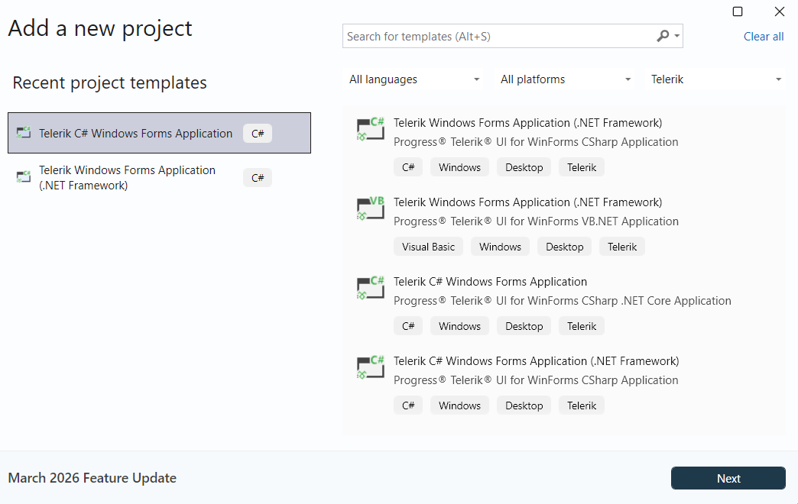
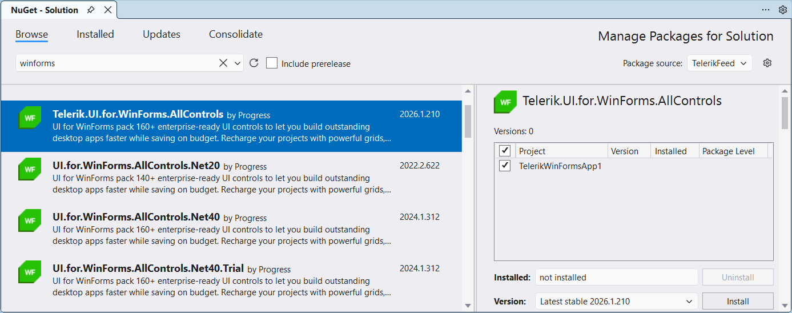
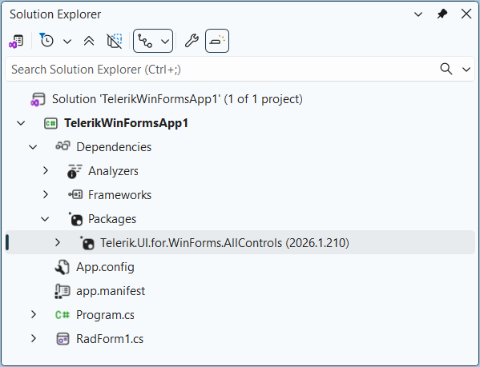
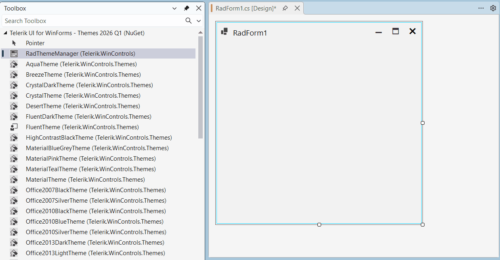

# First Steps with Telerik UI for WinForms

This tutorial shows how to create your first Telerik UI for WinForms desktop application.

## Prerequisites

- To download Telerik UI for WinForms packages, you need a [Telerik account](https://www.telerik.com/account/). If you do not have, you can [create one for free](https://www.telerik.com/account/).
- Install [Visual Studio IDE](https://visualstudio.microsoft.com/vs/) with `.NET desktop development` workload.

## Set Up Telerik Development Environment

The fastest way to set up your Telerik development environment is to use the [Telerik CLI]() .NET tool. Run the following commands in your preferred command shell (Visual Studio Terminal, cmd, PowerShell, or other).

>tip If you have already set up your Telerik development environment and it doesn't need updating, skip to [Create a new WinForms Telerik Project](#create-new-winforms-telerik-project).

1. Install Telerik CLI

	```
	dotnet tool install -g Telerik.CLI
	```

1. Run the `telerik setup winforms` command

	```
	telerik setup winforms
	```

The `telerik setup winforms` command performs [multiple Telerik CLI setup steps at once]() to configure your Telerik development environment automatically:

&#10003; Creates your Telerik account or log in if you already have one.

&#10003; Activates a Telerik UI for WinForms trial if you don't have an active license.

&#10003; Downloads your Telerik license key file and saves `telerik-license.txt` to your operating system user's folder, making it available to all Telerik .NET apps on your machine.

&#10003; Configures the Telerik NuGet package source.

&#10003; Installs the Telerik MCP server for AI-powered coding assistance.

Now, your Telerik development environment is configured and ready to use!

## Create new WinForms Telerik Project

In this step, create a basic Telerik WinForms project that you can use as a starting point for your application:

1. Open Visual Studio and select **Create a new project** in the start window.

1. Select the **Telerik C# Windows Forms Application** template, and click **Next**. This template creates a .NET project. If you want to create a .NET Framework project, select the **Telerik C# Windows Forms Application (Net Framework)** template instead.

>caption Figure 1: Create a new Telerik WinForms project



>note Telerik project templates are available in C# and VB for .NET and .NET Framework.

## Download Telerik UI for WinForms Controls

>important Starting with **Q3 2026**, all Telerik UI for WPF NuGet packages will be available on [NuGet.org](https://www.nuget.org/). If you install packages from NuGet.org, you do not need to configure the Telerik NuGet server.

The easiest way to get Telerik UI for WinForms controls on your development machine is to [install them with NuGet packages]() directly from **NuGet Package Manager** in Visual Studio.

1. In Visual Studio, go to **Tools > NuGet Package Manager > Manage NuGet Packages for Solution**.

1. Select the Telerik package source that you added in Step 3.

1. Search for `Telerik.UI.for.WinForms.AllControls`, and install the **Telerik.UI.for.WinForms.AllControls** package.

>caption Figure 3: Install the Telerik.UI.for.WinForms.AllControls package



>note You can include prerelease versions by selecting the **Include prerelease** checkbox.

After installation, the `Telerik.UI.for.WinForms.AllControls` package appears under **Packages** in Solution Explorer:

>caption Figure 4: Verify the installed Telerik package



		
## Add a Telerik UI for WinForms Control to the RadForm

After you install Telerik UI for WinForms, the controls appear in the Visual Studio Toolbox. To add a Telerik component, drag it from the Toolbox and drop it onto the form designer surface.

1. Add RadGridView to the RadForm
    
For this example, let's add the [RadGridView]() control. Search for **RadGridView** in the Toolbox, and then drag it to the form designer surface.

>caption Figure 5: Add RadGridView from the Toolbox



You can also add components programmatically:

```C#
RadGridView radGridView1 = new RadGridView();
radGridView1.Columns.Add("Column1");
radGridView1.Columns.Add("Column2");
this.Controls.Add(radGridView1);
```
```VB
Dim radGridView1 As New RadGridView()
radGridView1.Columns.Add("Column1")
radGridView1.Columns.Add("Column2")
Me.Controls.Add(radGridView1)
```

2. Next, bind the control to sample data. 
3. Press `F5` to build and run the application. 

## Next Steps

<article-card-container>
    <article-card
        href=""
        src="images/chat_light_large.svg"
        darkSrc="images/chat_dark_large.svg"
        title="Telerik AI Coding Assistant"
        description="Telerik UI for WinForms AI-powered development assistance through a unified MCP server that delivers intelligent, context-aware help directly in your IDE.">
    </article-card>
    <article-card
        href=""
        src="images/chat_light_large.svg"
        darkSrc="images/chat_dark_large.svg"
        title="Telerik Converter"
        description="Automatically migrate existing Microsoft WinForms applications to use Telerik RadControls.">
    </article-card>
    <article-card
        href="#list-of-controls"
        src="images/editor_ai_integration_light_large.svg"
        darkSrc="images/editor_ai_integration_dark_large.svg"
        title="Use Components"
        description="Check the list of available Telerik WinForms components.">
    </article-card>
    <article-card
        href="https://demos.telerik.com/winforms/"
        src="images/grid_ai_chat_integration_light_large.svg"
        darkSrc="images/grid_ai_chat_integration_dark_large.svg"
        title="Browse WinForms Demos"
        description="Explore the examples via the Telerik UI for WinForms Desktop Examples application.">
    </article-card>
    <article-card
        href=""
        src="images/data_highlight_light_large.svg"
        darkSrc="images/data_highlight_dark_large.svg"
        title="Get Started with RadGridView"
        description="Bind the Telerik WinForms Data Grid to data and choose from the variety of built-in features.">
    </article-card>
    <article-card
        href=""
        src="images/themingt_light_large.svg"
        darkSrc="images/theming_dark_large.svg"
        title="Theming"
        description="Review the built-in themes.">
    </article-card>
</article-card-container>

## See Also

- [System requirements](https://www.telerik.com/winforms/tech-sheets/system-requirements)
- [Download product files]()
- [Predefined template applications](https://www.telerik.com/winforms/winforms-guide)
- [Progress Virtual Classroom](https://www.telerik.com/account/support/virtual-classroom)
