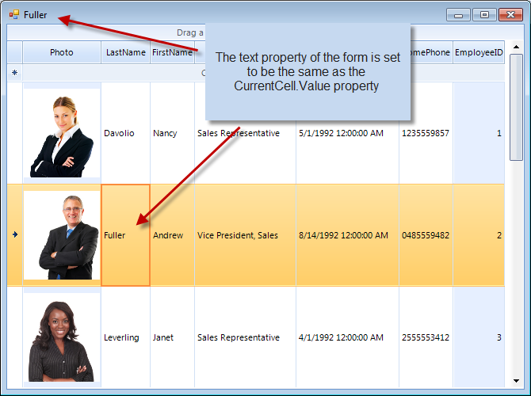

# Accessing and setting the CurrentCell


## 

In order to set the current cell of RadGridView, set the CurrentRow and CurrentColumn properties to respective row and column which cross at the desired cell:

{{source=..\SamplesCS\GridView\Cells\SetttingCurrentCell.cs region=settingTheCurrentCell}} 
{{source=..\SamplesVB\GridView\Cells\SettingCurrentCell.vb region=settingTheCurrentCell}} 

````C#
this.radGridView1.CurrentRow = this.radGridView1.Rows[1];
this.radGridView1.CurrentColumn = this.radGridView1.Columns[1];
this.Text = this.radGridView1.CurrentCell.Value.ToString();

````
````VB.NET
Me.RadGridView1.CurrentRow = Me.RadGridView1.Rows(1)
Me.RadGridView1.CurrentColumn = Me.RadGridView1.Columns(1)
Me.Text = Me.RadGridView1.CurrentCell.Value.ToString()

````

{{endregion}} 





## Accessing the current cell

To get an instance of the current cell simply create a variable of type GridDataCellElement and assign to it the current cell:

{{source=..\SamplesCS\GridView\Cells\SetttingCurrentCell.cs region=readingTheCurrentCell}} 
{{source=..\SamplesVB\GridView\Cells\SettingCurrentCell.vb region=readingTheCurrentCell}} 

````C#
GridDataCellElement cell = radGridView1.CurrentCell;

````
````VB.NET
Dim cell As GridDataCellElement = Me.RadGridView1.CurrentCell

````

{{endregion}} 


