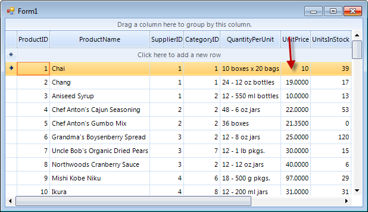
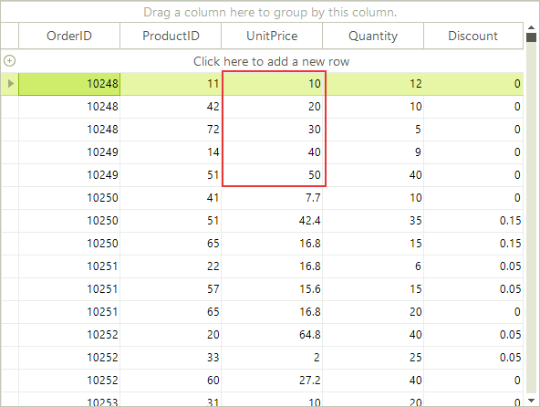

# Accessing Cells

Cells can be accessed by index or via the column __Name__ property.

>RadGridView uses virtualization for its visual elements. This means that only the rows that are currently 
        	visible have a visual element. When the grid is scrolled up and down the visual elements are reused. Because of the virtualization, 
          it is safe to use the __CellElement__ only inside the __CellFormatting__
      		event and only for the current cell.
      	

>When assigning values to several cells subsequently, the RadGridView should be placed between __BeginUpdate()__ and 
    		__EndUpdate()__ method invocations of the desired template. See section "Multiple assignments of cell values" 
    		below for more information.
         	

## Accessing cells by index

The example below modifies the second cell of the first row and sets a value greater than 10 back to 10.

#### __[C#] Accessing cells by index__

{{source=..\SamplesCS\GridView\Cells\AccessingCells.cs region=accessingCellsByIndex}}
	            if ((decimal)radGridView1.Rows[0].Cells[5].Value > 10)
	                radGridView1.Rows[0].Cells[5].Value = 10;
	{{endregion}}

#### __[VB.NET] Accessing cells by index__

{{source=..\SamplesVB\GridView\Cells\AccessingCells.vb region=accessingCellsByIndex}}
	        If DirectCast(RadGridView1.Rows(0).Cells(5).Value, Decimal) > 10 Then
	            RadGridView1.Rows(0).Cells(5).Value = 10
	        End If
	{{endregion}}

## Accessing cells by column Name

In this example we will change a cell value to 10 if it is greater than 10. In this case we assume that 
  			there is a "UnitPrice" column and we modify the cell in its first row.
  	

#### __[C#] Accessing cells by column name__

{{source=..\SamplesCS\GridView\Cells\AccessingCells.cs region=accessingCellsByColumnName}}
	            if ((decimal)radGridView1.Rows[0].Cells["UnitPrice"].Value > 10)
	                radGridView1.Rows[0].Cells["UnitPrice"].Value = 10;
	{{endregion}}

#### __[VB.NET] Accessing cells by column name__

{{source=..\SamplesVB\GridView\Cells\AccessingCells.vb region=accessingCellsByColumnName}}
	        If DirectCast(RadGridView1.Rows(0).Cells("UnitPrice").Value, Decimal) > 10 Then
	            RadGridView1.Rows(0).Cells("UnitPrice").Value = 10
	        End If
	{{endregion}}

Before

After

## Multiple assignments of cell values

When assigning values to several cells subsequently, the RadGridView should be placed between __BeginUpdate()__
      	and __EndUpdate()__ method invocations of the desired template. This way of setting multiple assignments
      	is recommended for performance considerations. For example if you have added a sorting descriptor to RadGridView and you
      	enter/modify five cell values without using these methods, the sorting mechanism will recreate the whole grid five times, 
      	which will slow it down. On the other hand if this is done between the suggested methods, the sorting mechanism will run 
      	only once, right after calling __EndUpdate()__ method. 

#### __[C#] Updating cells__

{{source=..\SamplesCS\GridView\Cells\AccessingCells.cs region=updateCells}}
	            radGridView1.TableElement.BeginUpdate();
	            radGridView1.Rows[0].Cells["UnitPrice"].Value = 10;
	            radGridView1.Rows[1].Cells["UnitPrice"].Value = 20;
	            radGridView1.Rows[2].Cells["UnitPrice"].Value = 30;
	            radGridView1.Rows[3].Cells["UnitPrice"].Value = 40;
	            radGridView1.Rows[4].Cells["UnitPrice"].Value = 50;
	            radGridView1.TableElement.EndUpdate();
	{{endregion}}

#### __[VB.NET] Updating cells__

{{source=..\SamplesVB\GridView\Cells\AccessingCells.vb region=updateCells}}
	        Me.RadGridView1.TableElement.BeginUpdate()
	        RadGridView1.Rows(0).Cells("UnitPrice").Value = 10
	        RadGridView1.Rows(1).Cells("UnitPrice").Value = 20
	        RadGridView1.Rows(2).Cells("UnitPrice").Value = 30
	        RadGridView1.Rows(3).Cells("UnitPrice").Value = 40
	        RadGridView1.Rows(4).Cells("UnitPrice").Value = 50
	        Me.RadGridView1.TableElement.EndUpdate()
	{{endregion}}

To style a cell use [Conditional Formatting]().
