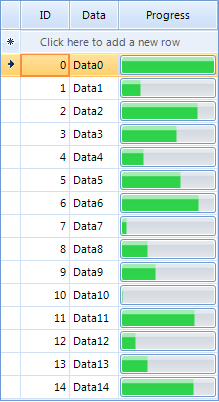
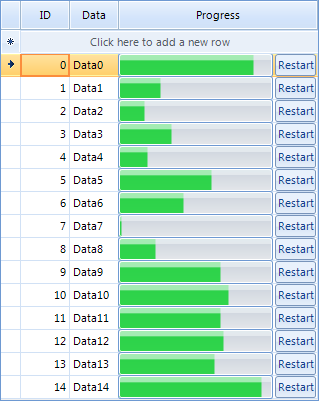
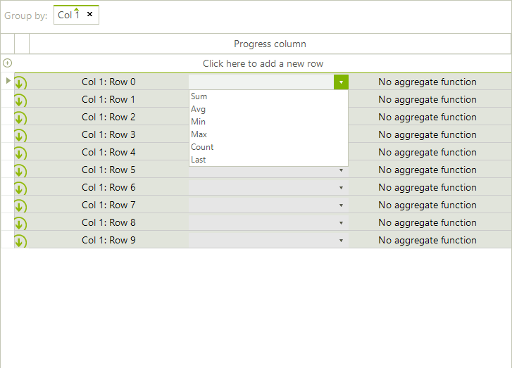

# Creating custom cells


## Custom data cell example

RadGridView provides a variety of visual cells (all inheriting from __GridCellElement__) with different functionality and purpose – header cells, indent cells, command cells, summary cells, group content cells, data cells, etc. All these cover the standard cases of the control usage. In case you need to implement more specific and custom scenario, you can create a custom cell. RadGridView provides powerful and flexible mechanism for creating cell types with custom content elements, functionality and properties.

You can use the following approach to create a custom data cell with a progress bar in it:

1\. Create a class for the cell which derives from __GridDataCellElement__:

{{source=..\SamplesCS\GridView\Cells\CustomCells.cs region=CustomCellDefinition}} 
{{source=..\SamplesVB\GridView\Cells\CustomCells.vb region=CustomCellDefinition}}
````C#
    
public class ProgressBarCellElement : GridDataCellElement

````
````VB.NET
Public Class ProgressBarCellElement
    Inherits GridDataCellElement

```` 

{{endregion}} 

{{source=..\SamplesCS\GridView\Cells\CustomCells.cs region=createDefaultConstructor}} 
{{source=..\SamplesVB\GridView\Cells\CustomCells.vb region=createDefaultConstructor}}

````C#
        
public ProgressBarCellElement(GridViewColumn column, GridRowElement row) : base(column, row)
{
}

````
````VB.NET
Public Sub New(ByVal column As GridViewColumn, ByVal row As GridRowElement)
    MyBase.New(column, row)
End Sub

````

{{endregion}} 

2\. Create the __RadProgressBarElement__ and add it as a child of the custom cell.You can achieve this by overriding the __CreateChildElements__ method:

{{source=..\SamplesCS\GridView\Cells\CustomCells.cs region=CreateChildElements}} 
{{source=..\SamplesVB\GridView\Cells\CustomCells.vb region=CreateChildElements}} 

````C#
    
private RadProgressBarElement radProgressBarElement;
        
protected override void CreateChildElements()
{
    base.CreateChildElements();
        
    radProgressBarElement = new RadProgressBarElement();
    this.Children.Add(radProgressBarElement);
}

````
````VB.NET
Private radProgressBarElement As RadProgressBarElement
Protected Overrides Sub CreateChildElements()
    MyBase.CreateChildElements()
    radProgressBarElement = New RadProgressBarElement()
    Me.Children.Add(radProgressBarElement)
End Sub

````

{{endregion}} 

3\. Override the __SetContentCore__ method to update the progress bar according to the cell value:

{{source=..\SamplesCS\GridView\Cells\CustomCells.cs region=setContentCore}} 
{{source=..\SamplesVB\GridView\Cells\CustomCells.vb region=setContentCore}}

````C#
        
protected override void SetContentCore(object value)
{
    if (this.Value != null && this.Value != DBNull.Value)
    {
        this.radProgressBarElement.Value1 = Convert.ToInt16(this.Value);
    }
}

````
````VB.NET
Protected Overrides Sub SetContentCore(ByVal value As Object)
    If Me.Value IsNot Nothing AndAlso Me.Value IsNot DBNull.Value Then
        Me.radProgressBarElement.Value1 = Convert.ToInt16(Me.Value)
    End If
End Sub

```` 

{{endregion}}

4\. The custom cell will have no styles, because there are no defined styles for its type in the themes. You can apply the __GridDataCellElement’s__ styles to it by defining its __ThemeEffectiveType__:

{{source=..\SamplesCS\GridView\Cells\CustomCells.cs region=themeEffectiveType}} 
{{source=..\SamplesVB\GridView\Cells\CustomCells.vb region=themeEffectiveType}} 

````C#
        
protected override Type ThemeEffectiveType
{
    get
    {
        return typeof(GridDataCellElement);
    }
}

````
````VB.NET
Protected Overrides ReadOnly Property ThemeEffectiveType() As Type
    Get
        Return GetType(GridDataCellElement)
    End Get
End Property

````

{{endregion}}

5\. Thanks to the UI virtualization mechanism, of RadGridView only the currently visible cells are created and they are further reused when needed. A cell element is reused in other rows or columns if it is compatible for them. You can create a custom column and define that the custom cell __IsCompatible__ for that column only. This will prevent the cell from being unintentionally reused by other columns.

{{source=..\SamplesCS\GridView\Cells\CustomCells.cs region=compatibility}} 
{{source=..\SamplesVB\GridView\Cells\CustomCells.vb region=compatibility}}

````C#
        
public override bool IsCompatible(GridViewColumn data, object context)
{
    return data is ProgressBarColumn && context is GridDataRowElement;
}

````
````VB.NET
Public Overrides Function IsCompatible(ByVal data As GridViewColumn, ByVal context As Object) As Boolean
    Return TypeOf data Is ProgressBarColumn AndAlso TypeOf context Is GridDataRowElement
End Function

````

{{endregion}} 

{{source=..\SamplesCS\GridView\Cells\CustomCells.cs region=compatibility1}} 
{{source=..\SamplesVB\GridView\Cells\CustomCells.vb region=compatibility1}}

````C#
    
public class ProgressBarColumn : GridViewDataColumn
{
    public ProgressBarColumn(string fieldName) : base(fieldName)
    {
    }
    
    public override Type GetCellType(GridViewRowInfo row)
    {
        if (row is GridViewDataRowInfo)
        {
            return typeof(ProgressBarCellElement);
        }
        return base.GetCellType(row);
    }
}

````
````VB.NET
Public Class ProgressBarColumn
    Inherits GridViewDataColumn
    Public Sub New(ByVal fieldName As String)
        MyBase.New(fieldName)
    End Sub
    Public Overrides Function GetCellType(ByVal row As GridViewRowInfo) As Type
        If TypeOf row Is GridViewDataRowInfo Then
            Return GetType(ProgressBarCellElement)
        End If
        Return MyBase.GetCellType(row)
    End Function
End Class

````

{{endregion}}  

6\. Lastly, we need to add the custom column to our grid. The following screenshot demonstrates the usage of the custom column in RadGridView:

{{source=..\SamplesCS\GridView\Cells\CustomCells.cs region=addColumn}} 
{{source=..\SamplesVB\GridView\Cells\CustomCells.vb region=addColumn}}

````C#
ProgressBarColumn customColumn = new ProgressBarColumn("Progress column");
this.radGridView1.Columns.Add(customColumn);

````
````VB.NET
Dim customColumn As New ProgressBarColumn("Progress column")
Me.RadGridView1.Columns.Add(customColumn)
'#End Region
End Sub
Private Sub CustomCells_Load(ByVal sender As System.Object, ByVal e As System.EventArgs) Handles MyBase.Load
'TODO: This line of code loads data into the 'NwindDataSet.Products' table. You can move, or remove it, as needed.
Me.ProductsTableAdapter.Fill(Me.NwindDataSet.Products)
Dim dt As New DataTable()
dt.Columns.Add(New DataColumn("Id", GetType(Integer)))
dt.Columns.Add(New DataColumn("Data", GetType(String)))
dt.Columns.Add(New DataColumn("Progress", GetType(Integer)))
Dim rand As New Random()
For i As Integer = 0 To 14
    Dim dr As DataRow = dt.NewRow()
    dr(0) = i
    dr(1) = "Data" & i.ToString()
    dr(2) = rand.[Next](100)
    dt.Rows.Add(dr)
Next
Me.RadGridView1.AutoGenerateColumns = False
Me.RadGridView1.DataSource = dt
Dim columnID As New GridViewDecimalColumn("ID")
Me.RadGridView1.Columns.Add(columnID)
Dim columnData As New GridViewTextBoxColumn("Data")
Me.RadGridView1.Columns.Add(columnData)
Me.gridCustomGroupCell.EnableGrouping = True
End Sub
Private Sub radButton1_Click(ByVal sender As System.Object, ByVal e As System.EventArgs) Handles radButton1.Click
If Me.RadGridView1.Columns.Count = 3 Then
    Me.RadGridView1.Columns.RemoveAt(2)
End If
Dim column As New ProgressBarColumn("Progress")
column.Width = 100
column.[ReadOnly] = True
Me.RadGridView1.Columns.Add(column)
End Sub
Private Sub radButton2_Click(ByVal sender As System.Object, ByVal e As System.EventArgs) Handles radButton2.Click
If Me.RadGridView1.Columns.Count = 3 Then
    Me.RadGridView1.Columns.RemoveAt(2)
End If
Dim column As New CustomColumn("Progress")
column.Width = 200
column.[ReadOnly] = True
Me.RadGridView1.Columns.Add(column)
RadGridView1.AutoSize = True
End Sub
'#Region ReplaceCustomGroupCell
Private Sub gridCustomGroupCell_CreateCell(sender As Object, e As GridViewCreateCellEventArgs) Handles gridCustomGroupCell.CreateCell
If e.CellType = GetType(GridGroupContentCellElement) Then
    e.CellElement = New CustomGridGroupContentCellElement(e.Column, e.Row)
End If
End Sub
'#End Region
'#Region CustomGroupCell
Public Class CustomGridGroupContentCellElement
Inherits GridGroupContentCellElement
Private dropDown As RadDropDownListElement
Private textElement As LightVisualElement
Private aggregateElement As LightVisualElement
Private stack As StackLayoutElement
Public Sub New(column As GridViewColumn, row As GridRowElement)
    MyBase.New(column, row)
End Sub
Protected Overrides ReadOnly Property ThemeEffectiveType() As Type
    Get
        Return GetType(GridGroupContentCellElement)
    End Get
End Property
Protected Overrides Sub CreateChildElements()
    MyBase.CreateChildElements()
    stack = New StackLayoutElement()
    stack.Orientation = Orientation.Horizontal
    stack.StretchHorizontally = True
    stack.Margin = New Padding(0, 2, 5, 0)
    textElement = New LightVisualElement()
    dropDown = New RadDropDownListElement()
    dropDown.DropDownStyle = Telerik.WinControls.RadDropDownStyle.DropDownList
    aggregateElement = New LightVisualElement()
    AddHandler dropDown.SelectedIndexChanged, AddressOf SelectedIndexChanged
    dropDown.Items.AddRange(New List(Of String)(New String() {"Sum", "Avg", "Min", "Max", "Count", "Last"}))
    stack.Children.Add(textElement)
    stack.Children.Add(dropDown)
    stack.Children.Add(aggregateElement)
    Me.Children.Add(stack)
End Sub
Public Overrides Sub SetContent()
    MyBase.SetContent()
    Dim row As GridViewGroupRowInfo = TryCast(Me.RowInfo, GridViewGroupRowInfo)
    If row IsNot Nothing Then
        Me.textElement.Text = row.HeaderText
        If row.Tag IsNot Nothing Then
            RemoveHandler dropDown.SelectedIndexChanged, AddressOf SelectedIndexChanged
            dropDown.SelectedIndex = DirectCast(row.Tag, Integer)
            AddHandler dropDown.SelectedIndexChanged, AddressOf SelectedIndexChanged
        Else
            RemoveHandler dropDown.SelectedIndexChanged, AddressOf SelectedIndexChanged
            dropDown.SelectedIndex = -1
            AddHandler dropDown.SelectedIndexChanged, AddressOf SelectedIndexChanged
        End If
    End If
    Select Case dropDown.Text
        Case "Sum"
            Me.aggregateElement.Text = GetSum(row)
        Case "Avg"
            Me.aggregateElement.Text = GetSum(row) / row.ChildRows.Count
        Case "Min"
            Me.aggregateElement.Text = GetMin(row)
        Case "Max"
            Me.aggregateElement.Text = GetMax(row)
        Case "Count"
            Me.aggregateElement.Text = row.ChildRows.Count
        Case "Last"
            Me.aggregateElement.Text = row.ChildRows.Last().Cells("ProductName").Value.ToString()
        Case Else
            Me.aggregateElement.Text = "No aggregate function"
            Exit Select
    End Select
    Me.Text = String.Empty
End Sub
Private Sub SelectedIndexChanged(sender As Object, e As Data.PositionChangedEventArgs)
    Me.RowInfo.Tag = dropDown.SelectedIndex
End Sub
Private Function GetSum(row As GridViewGroupRowInfo) As Decimal
    Dim sum As Decimal = 0
    For Each childRow As GridViewRowInfo In row.ChildRows
        sum = sum + childRow.Cells("UnitPrice").Value
    Next
    Return sum
End Function
Private Function GetMin(row As GridViewGroupRowInfo) As Decimal
    Dim min As Decimal = Decimal.MaxValue
    For Each childRow As GridViewRowInfo In row.ChildRows
        If childRow.Cells("UnitPrice").Value < min Then
            min = childRow.Cells("UnitPrice").Value
        End If
    Next
    Return min
End Function
Private Function GetMax(row As GridViewGroupRowInfo) As Decimal
    Dim max As Decimal = Decimal.MinValue
    For Each childRow As GridViewRowInfo In row.ChildRows
        If childRow.Cells("UnitPrice").Value > max Then
            max = childRow.Cells("UnitPrice").Value
        End If
    Next
    Return max
End Function
End Class
'#End Region
s
'1
 customCellDefinition
lass ProgressBarCellElement
Inherits GridDataCellElement

```` 

{{endregion}} 



## Extending the custom data cell example

You can extend the custom cell further by adding a button in it and subscribing to its __Click__ event. The button will be used to restart the progress bar by setting the cell value to 0. You can achieve this by using the following approach:

1\. Initialize and add the elements to the cell:

{{source=..\SamplesCS\GridView\Cells\CustomCells.cs region=createChildElementsExample2}} 
{{source=..\SamplesVB\GridView\Cells\CustomCells.vb region=createChildElementsExample2}} 

````C#
    
private RadProgressBarElement radProgressBarElement;
private RadButtonElement radButtonElement;
    
protected override void CreateChildElements()
{
    base.CreateChildElements();
    
    radProgressBarElement = new RadProgressBarElement();
    this.Children.Add(radProgressBarElement);
        
    radButtonElement = new RadButtonElement();
    radButtonElement.Text = "Restart";
    radButtonElement.Margin = new System.Windows.Forms.Padding(0, 1, 3, 1);
    radButtonElement.Click += new EventHandler(radButtonElement_Click);
    this.Children.Add(radButtonElement);
}
    
protected override void DisposeManagedResources()
{
    radButtonElement.Click -= new EventHandler(radButtonElement_Click);
    base.DisposeManagedResources();
}

````
````VB.NET
Private radProgressBarElement As RadProgressBarElement
Private radButtonElement As RadButtonElement
Protected Overrides Sub CreateChildElements()
    MyBase.CreateChildElements()
    radProgressBarElement = New RadProgressBarElement()
    Me.Children.Add(radProgressBarElement)
    radButtonElement = New RadButtonElement()
    radButtonElement.Text = "Restart"
    radButtonElement.Margin = New System.Windows.Forms.Padding(0, 1, 3, 1)
    AddHandler radButtonElement.Click, AddressOf radButtonElement_Click
    Me.Children.Add(radButtonElement)
End Sub
Protected Overrides Sub DisposeManagedResources()
    RemoveHandler radButtonElement.Click, AddressOf radButtonElement_Click
    MyBase.DisposeManagedResources()
End Sub

````

{{endregion}} 


2\. Override the __ArrangeOverride__ method to arrange the children elements of the cell:

{{source=..\SamplesCS\GridView\Cells\CustomCells.cs region=arrangeOverride}} 
{{source=..\SamplesVB\GridView\Cells\CustomCells.vb region=arrangeOverride}} 

````C#
        
protected override SizeF ArrangeOverride(SizeF finalSize)
{
    if (this.Children.Count == 2)
    {
        float progressBarWidth = finalSize.Width - radButtonElement.DesiredSize.Width;
    
        RectangleF progressBarRect = new RectangleF(0, 0, progressBarWidth - 1, finalSize.Height);
        RectangleF buttonRect = new RectangleF(progressBarWidth + 1, 0, radButtonElement.DesiredSize.Width, finalSize.Height);
        
        this.Children[0].Arrange(progressBarRect);
        this.Children[1].Arrange(buttonRect);
    }
    
    return finalSize;
}

````
````VB.NET
Protected Overrides Function ArrangeOverride(ByVal finalSize As SizeF) As SizeF
    If Me.Children.Count = 2 Then
        Dim progressBarWidth As Single = finalSize.Width - radButtonElement.DesiredSize.Width
        Dim progressBarRect As New RectangleF(0, 0, progressBarWidth - 1, finalSize.Height)
        Dim buttonRect As New RectangleF(progressBarWidth + 1, 0, radButtonElement.DesiredSize.Width, finalSize.Height)
        Me.Children(0).Arrange(progressBarRect)
        Me.Children(1).Arrange(buttonRect)
    End If
    Return finalSize
End Function

````

{{endregion}}


3\. Handle the __Click__ event of __RadButtonElement__:

{{source=..\SamplesCS\GridView\Cells\CustomCells.cs region=buttonClickHandler}} 
{{source=..\SamplesVB\GridView\Cells\CustomCells.vb region=buttonClickHandler}} 

````C#
private void radButtonElement_Click(object sender, EventArgs e)
{
    this.Value = 0;
}

````
````VB.NET
Private Sub radButtonElement_Click(ByVal sender As Object, ByVal e As EventArgs)
    Me.Value = 0
End Sub

````

{{endregion}} 

The screen shot below demonstrates the usage of the custom cell in RadGridView:<br>

## Custom group cell example

When the RadGridView.__EnableGrouping__ property is set to *true* the __GroupPanelElement__ is displayed at the top of the grid. Thus, when the user drags a column and drops it onto the panel __GridGroupContentCellElements__ are created for the group rows. The following example demonstrates a sample approach how to customize the __GridGroupContentCellElement__ in order to add a drop-down with aggregate functions next to the group header and calculate the function considering the user selection.<br> 

1\. Create a class that inherits the __GridGroupContentCellElement__. In its __CreateChildElements__ method we will use a __RadDropDownListElement__ which contains the aggregate functions and a __LightVisualElement__ to display the calculated result. In the __SetContent__ method we should display the cell information considering for which row it is currently being used:

{{source=..\SamplesCS\GridView\Cells\CustomCells.cs region=CustomGroupCell}} 
{{source=..\SamplesVB\GridView\Cells\CustomCells.vb region=CustomGroupCell}} 

````C#
public class CustomGridGroupContentCellElement : GridGroupContentCellElement
{
    private RadDropDownListElement dropDown;
    private LightVisualElement textElement;
    private LightVisualElement aggregateElement;
    private StackLayoutElement stack;
    public CustomGridGroupContentCellElement(GridViewColumn column, GridRowElement row) : base(column, row)
    {
    }
    protected override Type ThemeEffectiveType
    {
        get
        {
            return typeof(GridGroupContentCellElement);
        }
    }
    protected override void CreateChildElements()
    {
        base.CreateChildElements();
        stack = new StackLayoutElement();
        stack.Orientation = Orientation.Horizontal;
        stack.StretchHorizontally = true;
        stack.Margin = new Padding(0, 2, 5, 0);
        textElement = new LightVisualElement();
        dropDown = new RadDropDownListElement();
        dropDown.DropDownStyle = Telerik.WinControls.RadDropDownStyle.DropDownList;
        aggregateElement = new LightVisualElement();
        dropDown.SelectedIndexChanged += SelectedIndexChanged;
        dropDown.Items.AddRange(new List<string>(new string[]
        {
            "Sum",
            "Avg",
            "Min",
            "Max",
            "Count",
            "Last"
        }));
        stack.Children.Add(textElement);
        stack.Children.Add(dropDown);
        stack.Children.Add(aggregateElement);
        this.Children.Add(stack);
    }
    public override void SetContent()
    {
        base.SetContent();
        GridViewGroupRowInfo row = this.RowInfo as GridViewGroupRowInfo;
        if (row != null)
        {
            this.textElement.Text = row.HeaderText;
            if (row.Tag != null)
            {
                dropDown.SelectedIndexChanged -= SelectedIndexChanged;
                dropDown.SelectedIndex = (int)row.Tag;
                dropDown.SelectedIndexChanged += SelectedIndexChanged;
            }
            else
            {
                dropDown.SelectedIndexChanged -= SelectedIndexChanged;
                dropDown.SelectedIndex = -1;
                dropDown.SelectedIndexChanged += SelectedIndexChanged;
            }
        }
        switch (dropDown.Text)
        {
            case "Sum":
                this.aggregateElement.Text = GetSum(row).ToString();
                break;
            case "Avg":
                this.aggregateElement.Text = (GetSum(row) / row.ChildRows.Count).ToString();
                break;
            case "Min":
                this.aggregateElement.Text = GetMin(row).ToString();
                break;
            case "Max":
                this.aggregateElement.Text = GetMax(row).ToString();
                break;
            case "Count":
                this.aggregateElement.Text = row.ChildRows.Count.ToString();
                break;
            case "Last":
                this.aggregateElement.Text = row.ChildRows.Last().Cells["ProductName"].Value.ToString();
                break;
            default:
                this.aggregateElement.Text = "No aggregate function";
                break;
        }
        this.Text = string.Empty;
    }
    private void SelectedIndexChanged(object sender, Telerik.WinControls.UI.Data.PositionChangedEventArgs e)
    {
        this.RowInfo.Tag = dropDown.SelectedIndex;
    }
    private decimal GetSum(GridViewGroupRowInfo row)
    {
        decimal sum = 0;
        foreach (GridViewRowInfo childRow in row.ChildRows)
        {
            sum = sum + (decimal)childRow.Cells["UnitPrice"].Value;
        }
        return sum;
    }
    private decimal GetMin(GridViewGroupRowInfo row)
    {
        decimal min = decimal.MaxValue;
        foreach (GridViewRowInfo childRow in row.ChildRows)
        {
            if ((decimal)childRow.Cells["UnitPrice"].Value < min)
            {
                min = (decimal)childRow.Cells["UnitPrice"].Value;
            }
        }
        return min;
    }
    private decimal GetMax(GridViewGroupRowInfo row)
    {
        decimal max = decimal.MinValue;
        foreach (GridViewRowInfo childRow in row.ChildRows)
        {
            if ((decimal)childRow.Cells["UnitPrice"].Value > max)
            {
                max = (decimal)childRow.Cells["UnitPrice"].Value;
            }
        }
        return max;
    }
}

````
````VB.NET
Public Class CustomGridGroupContentCellElement
    Inherits GridGroupContentCellElement
    Private dropDown As RadDropDownListElement
    Private textElement As LightVisualElement
    Private aggregateElement As LightVisualElement
    Private stack As StackLayoutElement
    Public Sub New(column As GridViewColumn, row As GridRowElement)
        MyBase.New(column, row)
    End Sub
    Protected Overrides ReadOnly Property ThemeEffectiveType() As Type
        Get
            Return GetType(GridGroupContentCellElement)
        End Get
    End Property
    Protected Overrides Sub CreateChildElements()
        MyBase.CreateChildElements()
        stack = New StackLayoutElement()
        stack.Orientation = Orientation.Horizontal
        stack.StretchHorizontally = True
        stack.Margin = New Padding(0, 2, 5, 0)
        textElement = New LightVisualElement()
        dropDown = New RadDropDownListElement()
        dropDown.DropDownStyle = Telerik.WinControls.RadDropDownStyle.DropDownList
        aggregateElement = New LightVisualElement()
        AddHandler dropDown.SelectedIndexChanged, AddressOf SelectedIndexChanged
        dropDown.Items.AddRange(New List(Of String)(New String() {"Sum", "Avg", "Min", "Max", "Count", "Last"}))
        stack.Children.Add(textElement)
        stack.Children.Add(dropDown)
        stack.Children.Add(aggregateElement)
        Me.Children.Add(stack)
    End Sub
    Public Overrides Sub SetContent()
        MyBase.SetContent()
        Dim row As GridViewGroupRowInfo = TryCast(Me.RowInfo, GridViewGroupRowInfo)
        If row IsNot Nothing Then
            Me.textElement.Text = row.HeaderText
            If row.Tag IsNot Nothing Then
                RemoveHandler dropDown.SelectedIndexChanged, AddressOf SelectedIndexChanged
                dropDown.SelectedIndex = DirectCast(row.Tag, Integer)
                AddHandler dropDown.SelectedIndexChanged, AddressOf SelectedIndexChanged
            Else
                RemoveHandler dropDown.SelectedIndexChanged, AddressOf SelectedIndexChanged
                dropDown.SelectedIndex = -1
                AddHandler dropDown.SelectedIndexChanged, AddressOf SelectedIndexChanged
            End If
        End If
        Select Case dropDown.Text
            Case "Sum"
                Me.aggregateElement.Text = GetSum(row)
            Case "Avg"
                Me.aggregateElement.Text = GetSum(row) / row.ChildRows.Count
            Case "Min"
                Me.aggregateElement.Text = GetMin(row)
            Case "Max"
                Me.aggregateElement.Text = GetMax(row)
            Case "Count"
                Me.aggregateElement.Text = row.ChildRows.Count
            Case "Last"
                Me.aggregateElement.Text = row.ChildRows.Last().Cells("ProductName").Value.ToString()
            Case Else
                Me.aggregateElement.Text = "No aggregate function"
                Exit Select
        End Select
        Me.Text = String.Empty
    End Sub
    Private Sub SelectedIndexChanged(sender As Object, e As Data.PositionChangedEventArgs)
        Me.RowInfo.Tag = dropDown.SelectedIndex
    End Sub
    Private Function GetSum(row As GridViewGroupRowInfo) As Decimal
        Dim sum As Decimal = 0
        For Each childRow As GridViewRowInfo In row.ChildRows
            sum = sum + childRow.Cells("UnitPrice").Value
        Next
        Return sum
    End Function
    Private Function GetMin(row As GridViewGroupRowInfo) As Decimal
        Dim min As Decimal = Decimal.MaxValue
        For Each childRow As GridViewRowInfo In row.ChildRows
            If childRow.Cells("UnitPrice").Value < min Then
                min = childRow.Cells("UnitPrice").Value
            End If
        Next
        Return min
    End Function
    Private Function GetMax(row As GridViewGroupRowInfo) As Decimal
        Dim max As Decimal = Decimal.MinValue
        For Each childRow As GridViewRowInfo In row.ChildRows
            If childRow.Cells("UnitPrice").Value > max Then
                max = childRow.Cells("UnitPrice").Value
            End If
        Next
        Return max
    End Function
End Class
'#End Region
Class
'1
gion customCellDefinition
ic Class ProgressBarCellElement
Inherits GridDataCellElement

````

{{endregion}} 

2\. Subscribe to the RadGridView.__CreateCell__ event where we should replace the default __GridGroupContentCellElement__ with the custom one:

{{source=..\SamplesCS\GridView\Cells\CustomCells.cs region=ReplaceCustomGroupCell}} 
{{source=..\SamplesVB\GridView\Cells\CustomCells.vb region=ReplaceCustomGroupCell}} 

````C#
        
private void gridCustomGroupCell_CreateCell(object sender, GridViewCreateCellEventArgs e)
{
    if (e.CellType == typeof(GridGroupContentCellElement))
    {
        e.CellElement = new CustomGridGroupContentCellElement(e.Column, e.Row);
    }
}

````
````VB.NET
Private Sub gridCustomGroupCell_CreateCell(sender As Object, e As GridViewCreateCellEventArgs) Handles gridCustomGroupCell.CreateCell
    If e.CellType = GetType(GridGroupContentCellElement) Then
        e.CellElement = New CustomGridGroupContentCellElement(e.Column, e.Row)
    End If
End Sub
'#End Region
'#Region CustomGroupCell
Public Class CustomGridGroupContentCellElement
    Inherits GridGroupContentCellElement
    Private dropDown As RadDropDownListElement
    Private textElement As LightVisualElement
    Private aggregateElement As LightVisualElement
    Private stack As StackLayoutElement
    Public Sub New(column As GridViewColumn, row As GridRowElement)
        MyBase.New(column, row)
    End Sub
    Protected Overrides ReadOnly Property ThemeEffectiveType() As Type
        Get
            Return GetType(GridGroupContentCellElement)
        End Get
    End Property
    Protected Overrides Sub CreateChildElements()
        MyBase.CreateChildElements()
        stack = New StackLayoutElement()
        stack.Orientation = Orientation.Horizontal
        stack.StretchHorizontally = True
        stack.Margin = New Padding(0, 2, 5, 0)
        textElement = New LightVisualElement()
        dropDown = New RadDropDownListElement()
        dropDown.DropDownStyle = Telerik.WinControls.RadDropDownStyle.DropDownList
        aggregateElement = New LightVisualElement()
        AddHandler dropDown.SelectedIndexChanged, AddressOf SelectedIndexChanged
        dropDown.Items.AddRange(New List(Of String)(New String() {"Sum", "Avg", "Min", "Max", "Count", "Last"}))
        stack.Children.Add(textElement)
        stack.Children.Add(dropDown)
        stack.Children.Add(aggregateElement)
        Me.Children.Add(stack)
    End Sub
    Public Overrides Sub SetContent()
        MyBase.SetContent()
        Dim row As GridViewGroupRowInfo = TryCast(Me.RowInfo, GridViewGroupRowInfo)
        If row IsNot Nothing Then
            Me.textElement.Text = row.HeaderText
            If row.Tag IsNot Nothing Then
                RemoveHandler dropDown.SelectedIndexChanged, AddressOf SelectedIndexChanged
                dropDown.SelectedIndex = DirectCast(row.Tag, Integer)
                AddHandler dropDown.SelectedIndexChanged, AddressOf SelectedIndexChanged
            Else
                RemoveHandler dropDown.SelectedIndexChanged, AddressOf SelectedIndexChanged
                dropDown.SelectedIndex = -1
                AddHandler dropDown.SelectedIndexChanged, AddressOf SelectedIndexChanged
            End If
        End If
        Select Case dropDown.Text
            Case "Sum"
                Me.aggregateElement.Text = GetSum(row)
            Case "Avg"
                Me.aggregateElement.Text = GetSum(row) / row.ChildRows.Count
            Case "Min"
                Me.aggregateElement.Text = GetMin(row)
            Case "Max"
                Me.aggregateElement.Text = GetMax(row)
            Case "Count"
                Me.aggregateElement.Text = row.ChildRows.Count
            Case "Last"
                Me.aggregateElement.Text = row.ChildRows.Last().Cells("ProductName").Value.ToString()
            Case Else
                Me.aggregateElement.Text = "No aggregate function"
                Exit Select
        End Select
        Me.Text = String.Empty
    End Sub
    Private Sub SelectedIndexChanged(sender As Object, e As Data.PositionChangedEventArgs)
        Me.RowInfo.Tag = dropDown.SelectedIndex
    End Sub
    Private Function GetSum(row As GridViewGroupRowInfo) As Decimal
        Dim sum As Decimal = 0
        For Each childRow As GridViewRowInfo In row.ChildRows
            sum = sum + childRow.Cells("UnitPrice").Value
        Next
        Return sum
    End Function
    Private Function GetMin(row As GridViewGroupRowInfo) As Decimal
        Dim min As Decimal = Decimal.MaxValue
        For Each childRow As GridViewRowInfo In row.ChildRows
            If childRow.Cells("UnitPrice").Value < min Then
                min = childRow.Cells("UnitPrice").Value
            End If
        Next
        Return min
    End Function
    Private Function GetMax(row As GridViewGroupRowInfo) As Decimal
        Dim max As Decimal = Decimal.MinValue
        For Each childRow As GridViewRowInfo In row.ChildRows
            If childRow.Cells("UnitPrice").Value > max Then
                max = childRow.Cells("UnitPrice").Value
            End If
        Next
        Return max
    End Function
End Class
'#End Region
Class
'1
gion customCellDefinition
ic Class ProgressBarCellElement
Inherits GridDataCellElement

````

{{endregion}}


