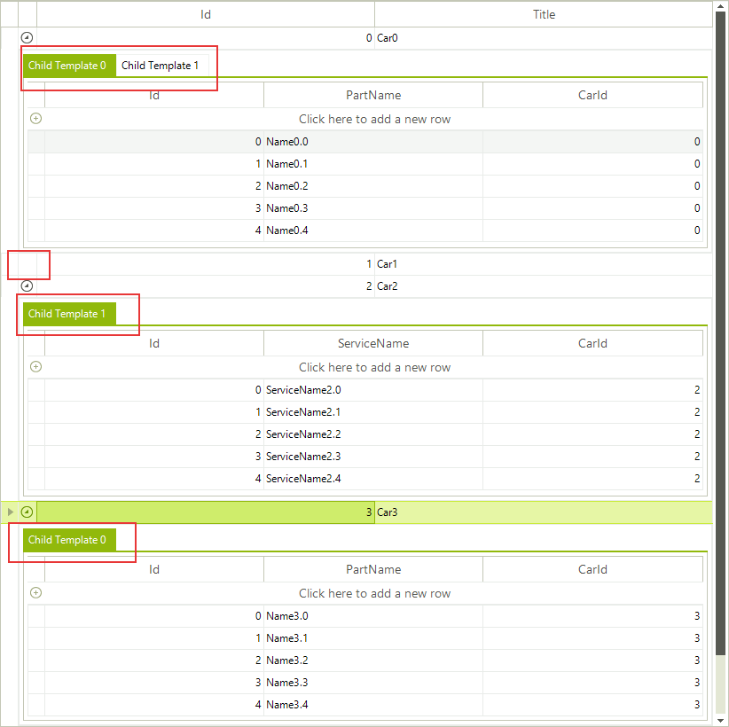

# Hiding child tabs when no data is available

When __RadGridView__ displays hierarchical data, you expand/collapse child levels in the hierarchy with the help of __GridGroupExpanderCellElement__ containing an expand/collapse image. If you have more than one template at a specific child level, these templates are displayed by using the __GridDetailViewCellElement__. Consider the __RadGridView__ has two child templates under the master template. If you expand the parent row, two tabs will be displayed for the respective child level. However, some of the child tabs may not contain any data. This example demonstrates a sample approach how to hide the child tabs if no data is available. If none of the child tabs for a specific parent row contains any data, the expander image will be hidden.

>note In order for a GridDetailViewCellElement to display a page view instead of a single table element, either the template of the row holding it has to have more than one child template, or its __ShowChildViewCaptions__ should be *true* . Once there is a page view, the tabs in it will be visible at all times, except when some of the templates has no rows and __AllowAddNewRow__ for it is *false* – if it does not have any rows and the user cannot add row, it is considered that there is no need from it.

>caption Figure 6: Using formatting event to hide empty tabs.



{{source=..\SamplesCS\GridView\Cells\HideChildTabs.cs region=HideTabs}} 
{{source=..\SamplesVB\GridView\Cells\HideChildTabs.vb region=HideTabs}} 

````C#
private void radGridView1_ViewCellFormatting(object sender, CellFormattingEventArgs e)
{
    GridDetailViewCellElement cell = e.CellElement as GridDetailViewCellElement;
    GridGroupExpanderCellElement expanderCell = e.CellElement as GridGroupExpanderCellElement;
    if (expanderCell != null && e.CellElement.RowElement is GridDataRowElement)
    {
        GridViewHierarchyRowInfo hierarchyRow = (GridViewHierarchyRowInfo)expanderCell.RowInfo;
        if (!IsExpandable(hierarchyRow))
        {
            expanderCell.Expander.Visibility = Telerik.WinControls.ElementVisibility.Hidden;
        }
        else
        {
            expanderCell.Expander.Visibility = Telerik.WinControls.ElementVisibility.Visible;
        }
    }
    else if (cell != null)
    {
        GridViewHierarchyRowInfo hierarchyRow = (GridViewHierarchyRowInfo)((GridViewDetailsRowInfo)cell.RowInfo).Owner;
        for (int i = 0; i < cell.PageViewElement.Items.Count; i++)
        {
            RadPageViewItem item = cell.PageViewElement.Items[i];
            GridViewInfo viewInfo = hierarchyRow.Views[i];
            item.Text = "Child Template " + i;
            if (viewInfo.ChildRows.Count == 0)
            {
                if (i == 0 && i < cell.PageViewElement.Items.Count - 1)
                {
                    cell.PageViewElement.Items[i + 1].IsSelected = true;
                }
                item.Visibility = Telerik.WinControls.ElementVisibility.Collapsed;
            }
            else
            {
                item.Visibility = Telerik.WinControls.ElementVisibility.Visible;
            }
        }
    }
}
private bool IsExpandable(GridViewHierarchyRowInfo hierarchyRow)
{
    foreach (GridViewInfo view in hierarchyRow.Views)
    {
        if (view.ChildRows.Count > 0)
        {
            return true;
        }
    }
    
    return false;
}

````
````VB.NET
Private Sub radGridView1_ViewCellFormatting(sender As Object, e As CellFormattingEventArgs)
    Dim cell As GridDetailViewCellElement = TryCast(e.CellElement, GridDetailViewCellElement)
    Dim expanderCell As GridGroupExpanderCellElement = TryCast(e.CellElement, GridGroupExpanderCellElement)
    If expanderCell IsNot Nothing AndAlso TypeOf e.CellElement.RowElement Is GridDataRowElement Then
        Dim hierarchyRow As GridViewHierarchyRowInfo = DirectCast(expanderCell.RowInfo, GridViewHierarchyRowInfo)
        If Not IsExpandable(hierarchyRow) Then
            expanderCell.Expander.Visibility = Telerik.WinControls.ElementVisibility.Hidden
        Else
            expanderCell.Expander.Visibility = Telerik.WinControls.ElementVisibility.Visible
        End If
    ElseIf cell IsNot Nothing Then
        Dim hierarchyRow As GridViewHierarchyRowInfo = DirectCast(DirectCast(cell.RowInfo, GridViewDetailsRowInfo).Owner, GridViewHierarchyRowInfo)
        For i As Integer = 0 To cell.PageViewElement.Items.Count - 1
            Dim item As RadPageViewItem = cell.PageViewElement.Items(i)
            Dim viewInfo As GridViewInfo = hierarchyRow.Views(i)
            item.Text = "Child Template " & i
            If viewInfo.ChildRows.Count = 0 Then
                If i = 0 AndAlso i < cell.PageViewElement.Items.Count - 1 Then
                    cell.PageViewElement.Items(i + 1).IsSelected = True
                End If
                item.Visibility = Telerik.WinControls.ElementVisibility.Collapsed
            Else
                item.Visibility = Telerik.WinControls.ElementVisibility.Visible
            End If
        Next
    End If
End Sub
Private Function IsExpandable(hierarchyRow As GridViewHierarchyRowInfo) As Boolean
    For Each view As GridViewInfo In hierarchyRow.Views
        If view.ChildRows.Count > 0 Then
            Return True
        End If
    Next
    Return False
End Function

````

{{endregion}} 