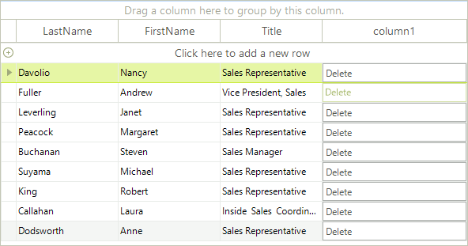

# Change the appearance of the buttons in GridViewCommandColumn  

Sometimes, you may need to change the appearance of the buttons that appear in the cells of the GridViewCommandColumn. These buttons are children of the RadGridView cells, so in order to access them, you should take them from the Children collection of the visual cells. We will demonstrate how this should be done by analyzing the following case.

Let's say that you have a number of employees. Only one employee is Vice President of the company, while the others are managers and sales representatives. In RadGridView you have a GridViewCommandColumn, the buttons of which allow the end-users to edit the details of all records, except the one that belongs to the Vice President. So, depending on the value of the Title cell, you should set the __Enabled__ property of the respective RadButtonElement to *true* or *false*. Here is how we can achieve that:

{{source=..\SamplesCS\GridView\Cells\FormattingCellsButtons.cs region=buttonCell}} 
{{source=..\SamplesVB\GridView\Cells\FormattingCellsButtons.vb region=buttonCell}} 

````C#
void radGridView1_CellFormatting(object sender, CellFormattingEventArgs e)
{
    if (e.CellElement.ColumnInfo is GridViewCommandColumn)
    {
        // This is how we get the RadButtonElement instance from the cell
        RadButtonElement button = (RadButtonElement)e.CellElement.Children[0];
        if (e.CellElement.RowInfo.Cells["Title"].Value != null)
        {
            string title = e.CellElement.RowInfo.Cells["Title"].Value.ToString();
            if (title == "Vice President, Sales")
            {
                button.Enabled = false;
            }
            else
            {
                button.Enabled = true;
            }
        }
    }
}

````
````VB.NET
Private Sub radGridView1_CellFormatting(ByVal sender As Object, ByVal e As CellFormattingEventArgs) Handles RadGridView1.CellFormatting
    If TypeOf e.CellElement.ColumnInfo Is GridViewCommandColumn Then
        'This is how we get the RadButtonElement instance from the cell
        Dim button As RadButtonElement = CType(e.CellElement.Children(0), RadButtonElement)
        If e.CellElement.RowInfo.Cells("Title").Value IsNot Nothing Then
            Dim title As String = e.CellElement.RowInfo.Cells("Title").Value.ToString()
            If title = "Vice President, Sales" Then
                button.Enabled = False
            Else
                button.Enabled = True
            End If
        End If
    End If
End Sub

````

{{endregion}} 

>caption Figure 1: Styling the command cell button. 



# See Also

* [Hiding Child Tabs when no Data is Available]()

* [Formating Group Rows]()

* [Style Property]()

