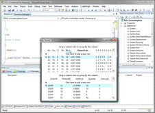
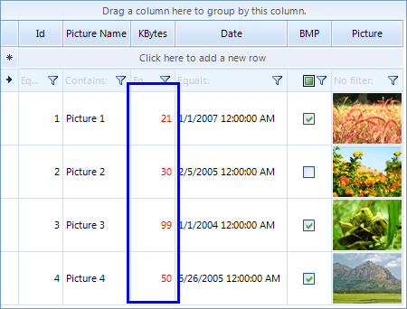
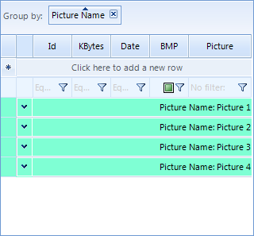
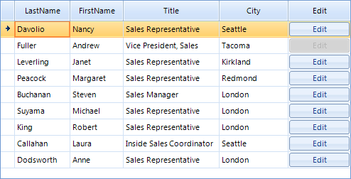
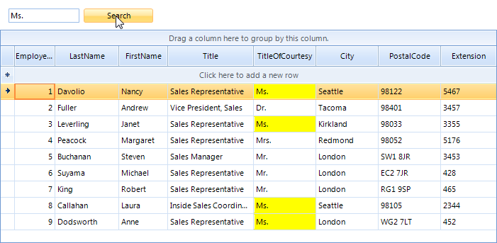
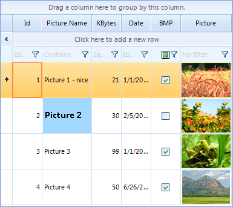

# Formatting Cells


## CellFormatting

## 


| RELATED VIDEOS |  |
| ------ | ------ |
|[Formatting Data In RadGridView for WinForms](http://tv.telerik.com/radtips/radgrid/formatting-data-in-radgridview)<br>In this RadTip, John Kellar demonstrates how you can apply custom formatting to data within a RadGridView for Windows Forms. (Runtime: 09:14)||

__CellFormatting__ event is used to add formatting to grid *data* cells including the *new row cells*. For example, the code sample below changes the ForeColor in all cells in the "KBytes" column to red:

>note Due to the UI virtualization in RadGridView, cell elements are created only for currently visible cells and are being reused during operations like scrolling, filtering, grouping and so on.
>In order to prevent applying the formatting to other columns' cell elements (because of the cell reuse) all customization should be reset for the rest of the cell elements. Please refer to the Fundamentals [topic]() for more information.


## Example: Changing the data cells font color

{{source=..\SamplesCS\GridView\Cells\FormattingCells.cs region=cellFormattingExample1}} 
{{source=..\SamplesVB\GridView\Cells\FormattingCells.vb region=cellFormattingExample1}} 

````C#
void radGridView1_CellFormatting1(object sender, Telerik.WinControls.UI.CellFormattingEventArgs e)
{
    if (e.CellElement.ColumnInfo.Name == "KBytes")
    {
        e.CellElement.ForeColor = Color.Red;
    }
    else
    {
        e.CellElement.ResetValue(LightVisualElement.ForeColorProperty, ValueResetFlags.Local);
    }
}

````
````VB.NET
Private Sub RadGridView1_CellFormatting1(ByVal sender As Object, ByVal e As Telerik.WinControls.UI.CellFormattingEventArgs) Handles RadGridView1.CellFormatting
    If e.CellElement.ColumnInfo.Name = "KBytes" Then
        e.CellElement.ForeColor = Color.Red
    Else
        e.CellElement.ResetValue(LightVisualElement.ForeColorProperty, ValueResetFlags.Local)
    End If
End Sub

````

{{endregion}} 




## Example: Cells background formatting
      

This is an advanced example of using *CellFormatting* event to highlight certain cells in red color based on the values of cells in the same row but *different* column. In the example, the values in the first column are  highlighted if the value in the check box column returns true:


#### Formatting cells 

{{source=..\SamplesCS\GridView\Cells\FormattingCells.cs region=cellFormattingExample2}} 
{{source=..\SamplesVB\GridView\Cells\FormattingCells.vb region=cellFormattingExample2}} 

````C#
void radGridView1_CellFormatting2(object sender, Telerik.WinControls.UI.CellFormattingEventArgs e)
{
    if (e.CellElement.ColumnInfo.HeaderText == "Id")
    {
        if (e.CellElement.RowInfo.Cells["BMP"].Value != null)
        {
            if ((bool)e.CellElement.RowInfo.Cells["BMP"].Value == true)
            {
                e.CellElement.DrawFill = true;
                e.CellElement.ForeColor = Color.Blue;
                e.CellElement.NumberOfColors = 1;
                e.CellElement.BackColor = Color.Aqua;
            }
            else
            {
                e.CellElement.DrawFill = true;
                e.CellElement.ForeColor = Color.Yellow;
                e.CellElement.NumberOfColors = 1;
                e.CellElement.BackColor = Color.Green;
            }
        }
    }
    else
    {
        e.CellElement.ResetValue(LightVisualElement.DrawFillProperty, ValueResetFlags.Local);
        e.CellElement.ResetValue(LightVisualElement.ForeColorProperty, ValueResetFlags.Local);
        e.CellElement.ResetValue(LightVisualElement.NumberOfColorsProperty, ValueResetFlags.Local);
        e.CellElement.ResetValue(LightVisualElement.BackColorProperty, ValueResetFlags.Local);
    }
}

````
````VB.NET
Private Sub RadGridView1_CellFormatting2(ByVal sender As Object, ByVal e As Telerik.WinControls.UI.CellFormattingEventArgs) Handles RadGridView1.CellFormatting
    If e.CellElement.ColumnInfo.HeaderText = "Id" Then
        If e.CellElement.RowInfo.Cells("BMP").Value IsNot Nothing Then
            If CBool(e.CellElement.RowInfo.Cells("BMP").Value) = True Then
                e.CellElement.DrawFill = True
                e.CellElement.ForeColor = Color.Blue
                e.CellElement.NumberOfColors = 1
                e.CellElement.BackColor = Color.Aqua
            Else
                e.CellElement.DrawFill = True
                e.CellElement.ForeColor = Color.Yellow
                e.CellElement.NumberOfColors = 1
                e.CellElement.BackColor = Color.Green
            End If
        End If
    Else
        e.CellElement.ResetValue(LightVisualElement.DrawFillProperty, ValueResetFlags.Local)
        e.CellElement.ResetValue(LightVisualElement.ForeColorProperty, ValueResetFlags.Local)
        e.CellElement.ResetValue(LightVisualElement.NumberOfColorsProperty, ValueResetFlags.Local)
        e.CellElement.ResetValue(LightVisualElement.BackColorProperty, ValueResetFlags.Local)
    End If
End Sub

````

{{endregion}} 


## ViewCellFormatting - formatting non-data cells

While CellFormatting event is fired only for data cells, ViewCellFormatting is fired for all RadGridView cells. So if you want to format the grouping row or the header cells, you should use the ViewCellFormatting event.
        

## Example: Change group and header cells font and removing the default filter operator text
      

For example, to change the font of the header cells and the group cells use the following code:

####  Formatting non-data rows

{{source=..\SamplesCS\GridView\Cells\FormattingCells.cs region=viewCellFormatting1}} 
{{source=..\SamplesVB\GridView\Cells\FormattingCells.vb region=viewCellFormatting1}} 

````C#
Font newFont = new Font("Arial", 12f, FontStyle.Bold);
void radGridView1_ViewCellFormatting1(object sender, CellFormattingEventArgs e)
{
    if (e.CellElement is GridHeaderCellElement || e.CellElement is GridGroupContentCellElement)
    {
        e.CellElement.Font = newFont;
        e.CellElement.ForeColor = Color.Blue;
    }
    else
    {
        e.CellElement.ResetValue(LightVisualElement.FontProperty, ValueResetFlags.Local);
        e.CellElement.ResetValue(LightVisualElement.ForeColorProperty, ValueResetFlags.Local);
    }
    //hiding the text from the filter cells
    GridFilterCellElement filterCell = e.CellElement as GridFilterCellElement;
    if (filterCell != null)
    {
        filterCell.FilterOperatorText.Visibility = Telerik.WinControls.ElementVisibility.Collapsed;
    }
}

````
````VB.NET
Dim newFont = New Font("Arial", 12.0F, FontStyle.Bold)
Private Sub RadGridView1_ViewCellFormatting1(ByVal sender As Object, ByVal e As Telerik.WinControls.UI.CellFormattingEventArgs) Handles RadGridView1.ViewCellFormatting
    If TypeOf e.CellElement Is GridHeaderCellElement OrElse TypeOf e.CellElement Is GridGroupContentCellElement Then
        e.CellElement.Font = newFont
        e.CellElement.ForeColor = Color.Blue
    Else
        e.CellElement.ResetValue(LightVisualElement.FontProperty, ValueResetFlags.Local)
        e.CellElement.ResetValue(LightVisualElement.ForeColorProperty, ValueResetFlags.Local)
    End If
    'hiding the text from the filter cells
    Dim filterCell As GridFilterCellElement = TryCast(e.CellElement, GridFilterCellElement)
    If filterCell IsNot Nothing Then
        filterCell.FilterOperatorText.Visibility = Telerik.WinControls.ElementVisibility.Collapsed
    End If
End Sub

````

{{endregion}} 


## Example 2: Change TextAlignment and BackColor of group rows

To modify the text alignment and the back color in the group rows use the following code snippet:

#### Formatting non-data row 

{{source=..\SamplesCS\GridView\Cells\FormattingCells.cs region=viewCellFormatting2}} 
{{source=..\SamplesVB\GridView\Cells\FormattingCells.vb region=viewCellFormatting2}} 

````C#
void radGridView1_ViewCellFormatting2(object sender, CellFormattingEventArgs e)
{
    if (e.CellElement.RowInfo is GridViewGroupRowInfo)
    {
        e.CellElement.DrawFill = true;
        e.CellElement.BackColor = Color.Aquamarine;
        e.CellElement.TextAlignment = ContentAlignment.MiddleRight;
        e.CellElement.GradientStyle = Telerik.WinControls.GradientStyles.Solid;
    }
    else
    {
        e.CellElement.ResetValue(LightVisualElement.DrawFillProperty, ValueResetFlags.Local);
        e.CellElement.ResetValue(LightVisualElement.BackColorProperty, ValueResetFlags.Local);
        e.CellElement.ResetValue(LightVisualElement.TextAlignmentProperty, ValueResetFlags.Local);
        e.CellElement.ResetValue(LightVisualElement.GradientStyleProperty, ValueResetFlags.Local);
    }
}

````
````VB.NET
Private Sub RadGridView1_ViewCellFormatting2(ByVal sender As Object, ByVal e As Telerik.WinControls.UI.CellFormattingEventArgs) Handles RadGridView1.ViewCellFormatting
    If TypeOf e.CellElement.RowInfo Is GridViewGroupRowInfo Then
        e.CellElement.DrawFill = True
        e.CellElement.BackColor = Color.Aquamarine
        e.CellElement.TextAlignment = ContentAlignment.MiddleRight
        e.CellElement.GradientStyle = Telerik.WinControls.GradientStyles.Solid
    Else
        e.CellElement.ResetValue(LightVisualElement.DrawFillProperty, ValueResetFlags.Local)
        e.CellElement.ResetValue(LightVisualElement.BackColorProperty, ValueResetFlags.Local)
        e.CellElement.ResetValue(LightVisualElement.TextAlignmentProperty, ValueResetFlags.Local)
        e.CellElement.ResetValue(LightVisualElement.GradientStyleProperty, ValueResetFlags.Local)
    End If
End Sub

````

{{endregion}}



>note In certain cases, where a custom layout is needed (for example, when you want to place RadCheckBoxElement in a specific place in a header cell) you should create your own type of cell instead of using ViewCellFormatting. Such an example is demonstrated in [this knowledge base article](http://www.telerik.com/support/kb/winforms/gridview/add-check-uncheck-all-check-box-in-the-header-cell.aspx).
>


## Example 3: Change the appearance of the buttons in GridViewCommandColumn
      

Sometimes, you may need to change the appearance of the buttons that appear in the cells of the GridViewCommandColumn. These buttons are children of the RadGridView cells, so in order to access them, you should take them from the Children collection of the visual cells. We will demonstrate how this should be done by analyzing the following case.

Let's say that you have a number of employees. Only one employee is Vice President of the company, while the others are managers and sales representatives. In RadGridView you have a GridViewCommandColumn, the buttons of which allow the end-users to edit the details of all records, except the one that belongs to the Vice President. So, depending on the value of the Title cell, you should set the __Enabled__ property of the respective RadButtonElement to *true* or *false*. Here is how we can achieve that:

{{source=..\SamplesCS\GridView\Cells\FormattingCellsButtons.cs region=buttonCell}} 
{{source=..\SamplesVB\GridView\Cells\FormattingCellsButtons.vb region=buttonCell}} 

````C#
void radGridView1_CellFormatting(object sender, CellFormattingEventArgs e)
{
    if (e.CellElement.ColumnInfo is GridViewCommandColumn)
    {
        // This is how we get the RadButtonElement instance from the cell
        RadButtonElement button = (RadButtonElement)e.CellElement.Children[0];
        if (e.CellElement.RowInfo.Cells["Title"].Value != null)
        {
            string title = e.CellElement.RowInfo.Cells["Title"].Value.ToString();
            if (title == "Vice President, Sales")
            {
                button.Enabled = false;
            }
            else
            {
                button.Enabled = true;
            }
        }
    }
}

````
````VB.NET
Private Sub radGridView1_CellFormatting(ByVal sender As Object, ByVal e As CellFormattingEventArgs) Handles RadGridView1.CellFormatting
    If TypeOf e.CellElement.ColumnInfo Is GridViewCommandColumn Then
        'This is how we get the RadButtonElement instance from the cell
        Dim button As RadButtonElement = CType(e.CellElement.Children(0), RadButtonElement)
        If e.CellElement.RowInfo.Cells("Title").Value IsNot Nothing Then
            Dim title As String = e.CellElement.RowInfo.Cells("Title").Value.ToString()
            If title = "Vice President, Sales" Then
                button.Enabled = False
            Else
                button.Enabled = True
            End If
        End If
    End If
End Sub

````

{{endregion}} 


And this is how the result looks:<br>

## Example 4: Hiding child tabs when no data is available

When __RadGridView__ displays hierarchical data, you expand/collapse child levels in the hierarchy with the help of __GridGroupExpanderCellElement__ containing an expand/collapse image. If you have more than one template at a specific child level, these templates are displayed by using the __GridDetailViewCellElement__. Consider the __RadGridView__ has two child templates under the master template. If you expand the parent row, two tabs will be displayed for the respective child level. However, some of the child tabs may not contain any data. This example demonstrates a sample approach how to hide the child tabs if no data is available. If none of the child tabs for a specific parent row contains any data, the expander image will be hidden.

>note In order for a GridDetailViewCellElement to display a page view instead of a single table element, either the template of the row holding it has to have more than one child template, or its __ShowChildViewCaptions__ should be *true* . Once there is a page view, the tabs in it will be visible at all times, except when some of the templates has no rows and __AllowAddNewRow__ for it is *false* – if it does not have any rows and the user cannot add row, it is considered that there is no need from it.


{{source=..\SamplesCS\GridView\Cells\HideChildTabs.cs region=HideTabs}} 
{{source=..\SamplesVB\GridView\Cells\HideChildTabs.vb region=HideTabs}} 

````C#
private void radGridView1_ViewCellFormatting(object sender, CellFormattingEventArgs e)
{
    GridDetailViewCellElement cell = e.CellElement as GridDetailViewCellElement;
    GridGroupExpanderCellElement expanderCell = e.CellElement as GridGroupExpanderCellElement;
    if (expanderCell != null && e.CellElement.RowElement is GridDataRowElement)
    {
        GridViewHierarchyRowInfo hierarchyRow = (GridViewHierarchyRowInfo)expanderCell.RowInfo;
        if (!IsExpandable(hierarchyRow))
        {
            expanderCell.Expander.Visibility = Telerik.WinControls.ElementVisibility.Hidden;
        }
        else
        {
            expanderCell.Expander.Visibility = Telerik.WinControls.ElementVisibility.Visible;
        }
    }
    else if (cell != null)
    {
        GridViewHierarchyRowInfo hierarchyRow = (GridViewHierarchyRowInfo)((GridViewDetailsRowInfo)cell.RowInfo).Owner;
        for (int i = 0; i < cell.PageViewElement.Items.Count; i++)
        {
            RadPageViewItem item = cell.PageViewElement.Items[i];
            GridViewInfo viewInfo = hierarchyRow.Views[i];
            item.Text = "Child Template " + i;
            if (viewInfo.ChildRows.Count == 0)
            {
                if (i == 0 && i < cell.PageViewElement.Items.Count - 1)
                {
                    cell.PageViewElement.Items[i + 1].IsSelected = true;
                }
                item.Visibility = Telerik.WinControls.ElementVisibility.Collapsed;
            }
            else
            {
                item.Visibility = Telerik.WinControls.ElementVisibility.Visible;
            }
        }
    }
}
private bool IsExpandable(GridViewHierarchyRowInfo hierarchyRow)
{
    foreach (GridViewInfo view in hierarchyRow.Views)
    {
        if (view.ChildRows.Count > 0)
        {
            return true;
        }
    }
    
    return false;
}

````
````VB.NET
Private Sub radGridView1_ViewCellFormatting(sender As Object, e As CellFormattingEventArgs)
    Dim cell As GridDetailViewCellElement = TryCast(e.CellElement, GridDetailViewCellElement)
    Dim expanderCell As GridGroupExpanderCellElement = TryCast(e.CellElement, GridGroupExpanderCellElement)
    If expanderCell IsNot Nothing AndAlso TypeOf e.CellElement.RowElement Is GridDataRowElement Then
        Dim hierarchyRow As GridViewHierarchyRowInfo = DirectCast(expanderCell.RowInfo, GridViewHierarchyRowInfo)
        If Not IsExpandable(hierarchyRow) Then
            expanderCell.Expander.Visibility = Telerik.WinControls.ElementVisibility.Hidden
        Else
            expanderCell.Expander.Visibility = Telerik.WinControls.ElementVisibility.Visible
        End If
    ElseIf cell IsNot Nothing Then
        Dim hierarchyRow As GridViewHierarchyRowInfo = DirectCast(DirectCast(cell.RowInfo, GridViewDetailsRowInfo).Owner, GridViewHierarchyRowInfo)
        For i As Integer = 0 To cell.PageViewElement.Items.Count - 1
            Dim item As RadPageViewItem = cell.PageViewElement.Items(i)
            Dim viewInfo As GridViewInfo = hierarchyRow.Views(i)
            item.Text = "Child Template " & i
            If viewInfo.ChildRows.Count = 0 Then
                If i = 0 AndAlso i < cell.PageViewElement.Items.Count - 1 Then
                    cell.PageViewElement.Items(i + 1).IsSelected = True
                End If
                item.Visibility = Telerik.WinControls.ElementVisibility.Collapsed
            Else
                item.Visibility = Telerik.WinControls.ElementVisibility.Visible
            End If
        Next
    End If
End Sub
Private Function IsExpandable(hierarchyRow As GridViewHierarchyRowInfo) As Boolean
    For Each view As GridViewInfo In hierarchyRow.Views
        If view.ChildRows.Count > 0 Then
            Return True
        End If
    Next
    Return False
End Function

````

{{endregion}} 


## Formatting cells on demand
      

Sometimes you may need to format the cells on a specific user action, for example, on a button click. Let's take the following scenario: you have a search box (RadTextBox) above RadGridView and a RadButton. When you click the button, RadGridView should highlight the cells that match the text typed in the RadTextBox. Here is how to do it:
        

* First, you should handle the CellFormatting event of RadGridView, setting the back color of those cells that have text that matches the text of RadTextBox
{{source=..\SamplesCS\GridView\Cells\FormattingCellsOnDemand.cs region=cellFormatting}} 
{{source=..\SamplesVB\GridView\Cells\FormattingCellsOnDemand.vb region=cellFormatting}} 

````C#
void radGridView1_CellFormatting(object sender, Telerik.WinControls.UI.CellFormattingEventArgs e)
{
    if (e.CellElement.Text == this.radTextBox1.Text)
    {
        e.CellElement.DrawFill = true;
        e.CellElement.BackColor = Color.Yellow;
        e.CellElement.GradientStyle = Telerik.WinControls.GradientStyles.Solid;
    }
    else
    {
        e.CellElement.ResetValue(LightVisualElement.DrawFillProperty, Telerik.WinControls.ValueResetFlags.Local);
        e.CellElement.ResetValue(VisualElement.BackColorProperty, ValueResetFlags.Local);
        e.CellElement.ResetValue(LightVisualElement.GradientStyleProperty, ValueResetFlags.Local);
    }
}

````
````VB.NET
Private Sub RadGridView1_CellFormatting(ByVal sender As Object, ByVal e As Telerik.WinControls.UI.CellFormattingEventArgs) Handles RadGridView1.CellFormatting
    If e.CellElement.Text = Me.RadTextBox1.Text Then
        e.CellElement.DrawFill = True
        e.CellElement.BackColor = Color.Yellow
        e.CellElement.GradientStyle = Telerik.WinControls.GradientStyles.Solid
    Else
        e.CellElement.ResetValue(LightVisualElement.DrawFillProperty, Telerik.WinControls.ValueResetFlags.Local)
        e.CellElement.ResetValue(VisualElement.BackColorProperty, ValueResetFlags.Local)
        e.CellElement.ResetValue(LightVisualElement.GradientStyleProperty, ValueResetFlags.Local)
    End If
End Sub

````

{{endregion}} 

* Now comes the tricky part. The user types some text, but then we should somehow notify RadGridView that it needs to refresh itself. This is done by calling the Update method of the TableElement, passing the *StateChanged* argument as a parameter.

{{source=..\SamplesCS\GridView\Cells\FormattingCellsOnDemand.cs region=buttonClick}} 
{{source=..\SamplesVB\GridView\Cells\FormattingCellsOnDemand.vb region=buttonClick}} 

````C#
void searchButton_Click(object sender, EventArgs e)
{
    this.radGridView1.TableElement.Update(GridUINotifyAction.StateChanged);
}

````
````VB.NET
Private Sub searchButton_Click(ByVal sender As Object, ByVal e As System.EventArgs) Handles searchButton.Click
    Me.RadGridView1.TableElement.Update(GridUINotifyAction.StateChanged)
End Sub

````

{{endregion}} 


As a result of the Update call, the CellFormatting (and the other formatting events as well) will be fired and you will get the screenshot shown below:<br> 

## Format cell with Style property

The GridViewCellInfo __Style__ property gives direct access to the cell’s visual properties. It makes it possible to set styles to cells in runtime without using events like __CellFormatting__ or the __ConditionalFormattingObject__.

>note This approach lets you customize visual properties which are defined by the theme. All changes set this way will have a greater priority than the theme.
>


The first thing to do for using the cell’s __Style__ is to define what custom visual properties will use this cell. You can define that the cell will:
        

* __CustomizeFill__

* __CustomizeBorder__

Using the __Style__ property allows you to define cell’s style properties:
        

* __Fill__

* __Border__

* __Font__

* __ForeColor__

The example below shows how to customize the __Font__ and __BackColor__ of RadGridView cell.

{{source=..\SamplesCS\GridView\Cells\FormattingCells.cs region=CellStyleMethod}} 
{{source=..\SamplesVB\GridView\Cells\FormattingCells.vb region=CellStyleMethod}} 

````C#
Font myFont = new Font(new FontFamily("Calibri"), 12.0F, FontStyle.Bold);
private void StyleCell(GridViewCellInfo cell)
{
    cell.Style.Font = myFont;
    cell.Style.CustomizeFill = true;
    cell.Style.GradientStyle = GradientStyles.Solid;
    cell.Style.BackColor = Color.FromArgb(162, 215, 255);
}

````
````VB.NET
Private myFont As New Font(New FontFamily("Calibri"), 12.0F, FontStyle.Bold)
Private Sub StyleCell(cell As GridViewCellInfo)
    cell.Style.Font = myFont
    cell.Style.CustomizeFill = True
    cell.Style.GradientStyle = GradientStyles.Solid
    cell.Style.BackColor = Color.FromArgb(162, 215, 255)
End Sub
'#End Region
Private Sub FormattingCells_Load(ByVal sender As System.Object, ByVal e As System.EventArgs) Handles MyBase.Load
    'TODO: This line of code loads data into the 'NwindDataSet.Cars' table. You can move, or remove it, as needed.
    Me.CarsTableAdapter.Fill(Me.NwindDataSet.Cars)
    RadGridView1.Columns("Picture").Width = 80
    RadGridView1.Rows(0).Height = 60
    RadGridView1.Rows(1).Height = 60
    RadGridView1.Rows(2).Height = 60
    RadGridView1.Rows(3).Height = 60
    '#region CellStyleMethodCall
    Me.StyleCell(Me.RadGridView1.Rows(1).Cells(1))

````

{{endregion}} 

Here is how to call this method of a certain cell:

{{source=..\SamplesCS\GridView\Cells\FormattingCells.cs region=CellStyleMethodCall}} 
{{source=..\SamplesVB\GridView\Cells\FormattingCells.vb region=CellStyleMethodCall}} 

````C#
this.StyleCell(this.radGridView1.Rows[1].Cells[1]);

````
````VB.NET
Me.StyleCell(Me.RadGridView1.Rows(1).Cells(1))

````

{{endregion}} 



