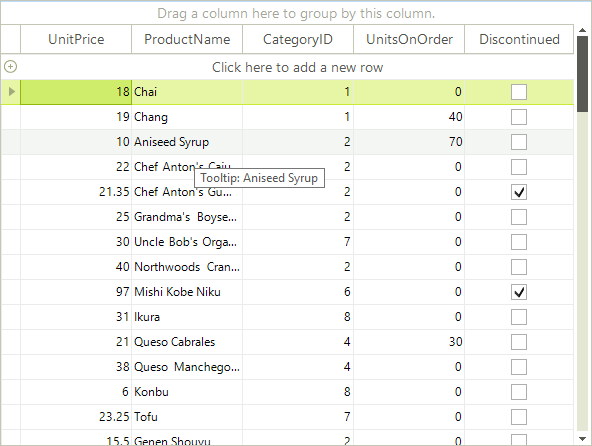
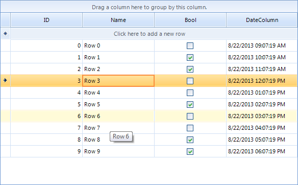

# ToolTips


There are two ways to assign tooltips to cells in RadGridView, namely setting the __ToolTipText__ property of a
        *CellElement* in the __CellFormatting__ event handler, or as in most of the RadControls by using the
        __ToolTipTextNeeded__ event of RadGridView.
      

## Setting tooltips in the CellFormatting event handler

The code snippet below demonstrates how you can assign a tooltip to a data cell in RadGridView.
        #_[C#] _

	


{{source=..\SamplesCS\GridView\Cells\ToolTips1.cs region=CellFormatting}} 
{{source=..\SamplesVB\GridView\Cells\ToolTips1.vb region=CellFormatting}} 

````C#
        void radGridView1_CellFormatting(object sender, Telerik.WinControls.UI.CellFormattingEventArgs e)
        {
            if (e.Row is GridViewDataRowInfo)
            {
                e.CellElement.ToolTipText = "Tooltip: " + e.CellElement.Text;
            }
        }
````
````VB.NET
    Private Sub RadGridView1_CellFormatting(ByVal sender As Object, ByVal e As Telerik.WinControls.UI.CellFormattingEventArgs) Handles RadGridView1.CellFormatting
        If TypeOf e.Row Is GridViewDataRowInfo Then
            e.CellElement.ToolTipText = "Tooltip: " & e.CellElement.Text
        End If
    End Sub
    '
````

{{endregion}} 




## Setting tooltips in the ToolTipTextNeeded event

The code snippet below demonstrates how you can use ToolTipTextNeeded event handler to set ToolTipText for the given CellElement.#_[C#] _

	


{{source=..\SamplesCS\GridView\Cells\ToolTips1.cs region=ToolTipTextNeeded}} 
{{source=..\SamplesVB\GridView\Cells\ToolTips1.vb region=ToolTipTextNeeded}} 

````C#
        private void radGridView1_ToolTipTextNeeded(object sender, Telerik.WinControls.ToolTipTextNeededEventArgs e)
        {
            GridDataCellElement cell = sender as GridDataCellElement;

            if (cell != null && cell.ColumnInfo.Name == "Name")
            {
                e.ToolTipText = cell.Value.ToString();
            }
        }
````
````VB.NET
    Private Sub RadGridView1_ToolTipTextNeeded(sender As Object, e As Telerik.WinControls.ToolTipTextNeededEventArgs) Handles RadGridView1.ToolTipTextNeeded
        Dim cell As GridDataCellElement = TryCast(sender, GridDataCellElement)

        If cell IsNot Nothing AndAlso cell.ColumnInfo.Name = "Name" Then
            e.ToolTipText = cell.Value.ToString()
        End If
    End Sub
    '
````

{{endregion}} 




>note The *ToolTipTextNeeded* event has higher priority and overrides the tooltips set in CellFormatting event handler.
>

