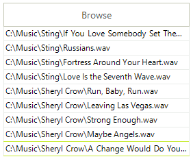

# GridViewBrowseColumn

__GridViewBrowseColumn__ allows __RadGridView__ to edit file paths using
      	__OpenFileDialog__. The default editor of the column is __GridBrowseEditor__.
      

__GridViewBrowseColumn__ is never auto-generated. The following code snippet
			demonstrates how to create and add the column to RadGridView and also add some example data for it:
		

#### __[C#] __

{{source=..\SamplesCS\GridView\Columns\GridViewBrowseColumn1.cs region=addBrowseColumn}}
	            GridViewBrowseColumn column = new GridViewBrowseColumn("Browse column");
	            this.radGridView1.Columns.Add(column);
	
	            this.radGridView1.Rows.Add(@"C:\Music\Sting\If You Love Somebody Set Them Free.wav");
	            this.radGridView1.Rows.Add(@"C:\Music\Sting\Russians.wav");
	            this.radGridView1.Rows.Add(@"C:\Music\Sting\Fortress Around Your Heart.wav");
	            this.radGridView1.Rows.Add(@"C:\Music\Sting\Love Is the Seventh Wave.wav");
	            this.radGridView1.Rows.Add(@"C:\Music\Sheryl Crow\Run, Baby, Run.wav");
	            this.radGridView1.Rows.Add(@"C:\Music\Sheryl Crow\Leaving Las Vegas.wav");
	            this.radGridView1.Rows.Add(@"C:\Music\Sheryl Crow\Strong Enough.wav");
	{{endregion}}

#### __[VB.NET] __

{{source=..\SamplesVB\GridView\Columns\GridViewBrowseColumn1.vb region=addBrowseColumn}}
	        Dim column As New GridViewBrowseColumn("Browse column")
	        Me.radGridView1.Columns.Add(column)
	
	        Me.radGridView1.Rows.Add("C:\Music\Sting\If You Love Somebody Set Them Free.wav")
	        Me.radGridView1.Rows.Add("C:\Music\Sting\Russians.wav")
	        Me.radGridView1.Rows.Add("C:\Music\Sting\Fortress Around Your Heart.wav")
	        Me.radGridView1.Rows.Add("C:\Music\Sting\Love Is the Seventh Wave.wav")
	        Me.radGridView1.Rows.Add("C:\Music\Sheryl Crow\Run, Baby, Run.wav")
	        Me.radGridView1.Rows.Add("C:\Music\Sheryl Crow\Leaving Las Vegas.wav")
	        Me.radGridView1.Rows.Add("C:\Music\Sheryl Crow\Strong Enough.wav")
	{{endregion}}

