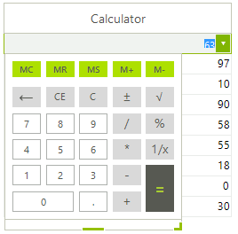

# GridViewCalculatorColumn


__GridViewCalculatorColumn__ allows RadGridView to edit numbers using popup with calculator. The default editor of the column is __RadCalculatorEditor__. <br>

__GridViewCalculatorColumn__ is never auto-generated. The following code snippet demonstrates how to create and add the column to RadGridView and also add some sample data in it:

{{source=..\SamplesCS\GridView\Columns\GridViewCalculatorColumn1.cs region=addCalculatorColumn}} 
{{source=..\SamplesVB\GridView\Columns\GridViewCalculatorColumn1.vb region=addCalculatorColumn}} 

````C#
GridViewCalculatorColumn column = new GridViewCalculatorColumn("Calculator column");
this.radGridView1.Columns.Add(column);
this.radGridView1.Rows.Add(3.14159);
this.radGridView1.Rows.Add(2.71828);
this.radGridView1.Rows.Add(1.41421);
this.radGridView1.Rows.Add(0.57721);
this.radGridView1.Rows.Add(4.66920);
this.radGridView1.Rows.Add(3.27582);
this.radGridView1.Rows.Add(0.56714);

````
````VB.NET
Dim column As New GridViewCalculatorColumn("Calculator column")
Me.radGridView1.Columns.Add(column)
Me.radGridView1.Rows.Add(3.14159)
Me.radGridView1.Rows.Add(2.71828)
Me.radGridView1.Rows.Add(1.41421)
Me.radGridView1.Rows.Add(0.57721)
Me.radGridView1.Rows.Add(4.6692)
Me.radGridView1.Rows.Add(3.27582)
Me.radGridView1.Rows.Add(0.56714)

````

{{endregion}} 


