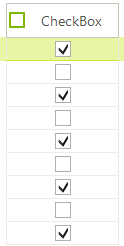
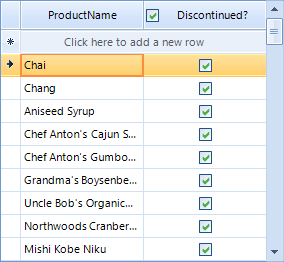

# GridViewCheckBoxColumn


__GridViewCheckBoxColumn__ displays and allows editing of boolean data. The values are shown as check boxes and allow the user to set or clear the check boxes to toggle the underlying boolean data values. __GridViewCheckBoxColumn__ inherits from __GridViewDataColumn.__

#### Create and add GridViewCheckBoxColumn

{{source=..\SamplesCS\GridView\Columns\GridViewCheckBoxColumn1.cs region=addCheckBoxColumn}} 
{{source=..\SamplesVB\GridView\Columns\GridViewCheckBoxColumn1.vb region=addCheckBoxColumn}} 

````C#
GridViewCheckBoxColumn checkBoxColumn = new GridViewCheckBoxColumn();
checkBoxColumn.DataType = typeof(int);
checkBoxColumn.Name = "DiscontinuedColumn";
checkBoxColumn.FieldName = "Discontinued";
checkBoxColumn.HeaderText = "Discontinued?";
radGridView1.MasterTemplate.Columns.Add(checkBoxColumn);

````
````VB.NET
Dim checkBoxColumn As New GridViewCheckBoxColumn()
checkBoxColumn.DataType = GetType(Integer)
checkBoxColumn.Name = "DiscontinuedColumn"
checkBoxColumn.FieldName = "Discontinued"
checkBoxColumn.HeaderText = "Discontinued?"
RadGridView1.MasterTemplate.Columns.Add(checkBoxColumn)

````

{{endregion}} 

The column has also a built-in functionality for checking all check boxes in it, via check box placed in the column header cell. By setting the __EnableHeaderCheckBox__ property to *true* you will enable the embedded in header cell RadCheckBoxElement. 

{{source=..\SamplesCS\GridView\Columns\GridViewCheckBoxColumn1.cs region=EnableHeaderCheckBox}} 
{{source=..\SamplesVB\GridView\Columns\GridViewCheckBoxColumn1.vb region=EnableHeaderCheckBox}} 

````C#
checkBoxColumn.EnableHeaderCheckBox = true;

````
````VB.NET
checkBoxColumn.EnableHeaderCheckBox = True
'#End Region
'#Region "EditMode"
checkBoxColumn.EditMode = EditMode.OnValueChange
'#End Region
AddHandler RadGridView1.HeaderCellToggleStateChanged, AddressOf radGridView1_HeaderCellToggleStateChanged
End Sub
"HeaderCellToggleStateChanged"
Private Sub radGridView1_HeaderCellToggleStateChanged(sender As Object, e As GridViewHeaderCellEventArgs)
Console.WriteLine(e.Column.Name)
Console.WriteLine(e.State)
End Sub
ion
'#region valueChanged
Private Sub RadGridView1_ValueChanged(ByVal sender As Object, ByVal e As System.EventArgs) Handles RadGridView1.ValueChanged
If TypeOf Me.RadGridView1.ActiveEditor Is RadCheckBoxEditor Then
    Console.WriteLine(Me.RadGridView1.CurrentCell.RowIndex)
    Console.WriteLine(Me.RadGridView1.ActiveEditor.Value)
End If
End Sub

````

{{endregion}} 


## ValueChanged event

__ValueChanged__ event can be used in particular about check box state change. You have to check the active editor type as in the example below:

{{source=..\SamplesCS\GridView\Columns\GridViewCheckBoxColumn1.cs region=valueChanged}} 
{{source=..\SamplesVB\GridView\Columns\GridViewCheckBoxColumn1.vb region=valueChanged}} 

````C#
void radGridView1_ValueChanged(object sender, EventArgs e)
{
    if (this.radGridView1.ActiveEditor is RadCheckBoxEditor)
    {
        Console.WriteLine(this.radGridView1.CurrentCell.RowIndex);
        Console.WriteLine(this.radGridView1.ActiveEditor.Value);
    }
}

````
````VB.NET
Private Sub RadGridView1_ValueChanged(ByVal sender As Object, ByVal e As System.EventArgs) Handles RadGridView1.ValueChanged
    If TypeOf Me.RadGridView1.ActiveEditor Is RadCheckBoxEditor Then
        Console.WriteLine(Me.RadGridView1.CurrentCell.RowIndex)
        Console.WriteLine(Me.RadGridView1.ActiveEditor.Value)
    End If
End Sub

````

{{endregion}} 


## HeaderCellToggleStateChanged event

To handle the toggle state change of the embedded check box in the header cell you should use the __HeaderCellToggleStateChanged__ event of RadGridView.

{{source=..\SamplesCS\GridView\Columns\GridViewCheckBoxColumn1.cs region=HeaderCellToggleStateChanged}} 
{{source=..\SamplesVB\GridView\Columns\GridViewCheckBoxColumn1.vb region=HeaderCellToggleStateChanged}} 

````C#
void radGridView1_HeaderCellToggleStateChanged(object sender, GridViewHeaderCellEventArgs e)
{
    Console.WriteLine(e.Column.Name);
    Console.WriteLine(e.State);
}

````
````VB.NET
Private Sub radGridView1_HeaderCellToggleStateChanged(sender As Object, e As GridViewHeaderCellEventArgs)
    Console.WriteLine(e.Column.Name)
    Console.WriteLine(e.State)
End Sub
 Region
'#region valueChanged
Private Sub RadGridView1_ValueChanged(ByVal sender As Object, ByVal e As System.EventArgs) Handles RadGridView1.ValueChanged
    If TypeOf Me.RadGridView1.ActiveEditor Is RadCheckBoxEditor Then
        Console.WriteLine(Me.RadGridView1.CurrentCell.RowIndex)
        Console.WriteLine(Me.RadGridView1.ActiveEditor.Value)
    End If
End Sub

````

{{endregion}} 


## EditMode

The __EditMode__ property controls when the value of the editor will be submitted to the cell. By default, the current behavior is kept (OnValidate) and the value will  be submitted only when the current cell changes or the grid looses focus. The new value (OnValueChange) will submit the value immediately after the editor value changes.

{{source=..\SamplesCS\GridView\Columns\GridViewCheckBoxColumn1.cs region=EditMode}} 
{{source=..\SamplesVB\GridView\Columns\GridViewCheckBoxColumn1.vb region=EditMode}} 

````C#
checkBoxColumn.EditMode = EditMode.OnValueChange;

````
````VB.NET
checkBoxColumn.EditMode = EditMode.OnValueChange
'#End Region
AddHandler RadGridView1.HeaderCellToggleStateChanged, AddressOf radGridView1_HeaderCellToggleStateChanged
End Sub
"HeaderCellToggleStateChanged"
Private Sub radGridView1_HeaderCellToggleStateChanged(sender As Object, e As GridViewHeaderCellEventArgs)
Console.WriteLine(e.Column.Name)
Console.WriteLine(e.State)
End Sub
ion
'#region valueChanged
Private Sub RadGridView1_ValueChanged(ByVal sender As Object, ByVal e As System.EventArgs) Handles RadGridView1.ValueChanged
If TypeOf Me.RadGridView1.ActiveEditor Is RadCheckBoxEditor Then
    Console.WriteLine(Me.RadGridView1.CurrentCell.RowIndex)
    Console.WriteLine(Me.RadGridView1.ActiveEditor.Value)
End If
End Sub

````

{{endregion}} 


