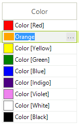

# GridViewColorColumn

__GridViewColorColumn__ allows RadGridView to edit colors using __RadColorDialog__. 
   		  The default editor of the column is __GridColorPickerEditor__.
      

__GridViewColorColumn__ is auto-generated for __Color fields__ in the RadGridView DataSource.
			The following code snippet demonstrates how to create manually and add the column to RadGridView and also add some sample data in it:
		

#### __[C#] __

{{region addColorColumn}}
	            GridViewColorColumn column = new GridViewColorColumn("Color column");
	            this.radGridView1.Columns.Add(column);
	
	            this.radGridView1.Rows.Add("Red");
	            this.radGridView1.Rows.Add("Orange");
	            this.radGridView1.Rows.Add("Yellow");
	            this.radGridView1.Rows.Add("Green");
	            this.radGridView1.Rows.Add("Blue");
	            this.radGridView1.Rows.Add("Indigo");
	            this.radGridView1.Rows.Add("Violet");
	{{endregion}}

#### __[VB.NET] __

{{region addColorColumn}}
	        Dim column As New GridViewColorColumn("Color column")
	        Me.radGridView1.Columns.Add(column)
	
	        Me.radGridView1.Rows.Add("Red")
	        Me.radGridView1.Rows.Add("Orange")
	        Me.radGridView1.Rows.Add("Yellow")
	        Me.radGridView1.Rows.Add("Green")
	        Me.radGridView1.Rows.Add("Blue")
	        Me.radGridView1.Rows.Add("Indigo")
	        Me.radGridView1.Rows.Add("Violet")
	{{endregion}}

