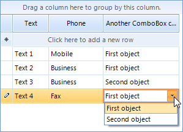
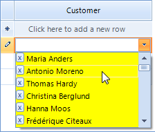

# GridViewComboBoxColumn

__GridViewComboBoxColumn__ displays a set of predefined candidate text values in a drop down list. This column type is typically used to provide a lookup into some set of relatively static values. To use __GridViewComboBoxColumn:__

* Set the __DataSource__ property to the data source that contains possible values to choose from.

* Set the __DisplayMember__ property to the column of the __DataSource__ that should be displayed in the drop down list.

* Set the __ValueMember__ property to the column of the __DataSource__ that should be used to update the cell within the grid represented by the __FieldName__ property.

>note Values will display in the column only if the value in __FieldName__ is within he range of values provided by the __ValueMember__ field values.
>

Other important properties for __GridViewComboBoxColumn__ are:

* __FilterMode__ - has two values __DisplayMember__ and determine whether the column will be filtered according to the __DisplayMember__ or the __ValueMember__.
			  		

* __DisplayMemberSort__ - this property will determine whether the column will be sorted by the column's __DisplayMember__ or __ValueMember__. Setting it to *true* will sort by __DisplayMember__, otherwise the sorting will be executed according to the __ValueMember__

>note By default, when sorting is executed on GridViewComboBoxColumn it is sorted according to its __ValueMember__ setting. However, if you need to perform the sorting according to the DisplayMember instead, you should set the __DisplayMemberSort__ property of the column.
>


__GridViewComboBoxColumn__ inherits from __GridViewDataColumn.__ <br>

#### Adding and binding GridViewComboBoxColumn

{{source=..\SamplesCS\GridView\Columns\GridViewComboBoxColumn1.cs region=addComboBoxColumn}} 
{{source=..\SamplesVB\GridView\Columns\GridViewComboBoxColumn1.vb region=addComboBoxColumn}} 

````C#
GridViewComboBoxColumn supplierColumn = new GridViewComboBoxColumn();
supplierColumn.Name = "SupplierColumn";
supplierColumn.HeaderText = "Supplier";
supplierColumn.DataSource = this.suppliersBindingSource;
supplierColumn.ValueMember = "SupplierID";
supplierColumn.DisplayMember = "ContactName";
supplierColumn.FieldName = "SupplierID";
supplierColumn.Width = 200;
this.radGridView1.Columns.Add(supplierColumn);

````
````VB.NET
Dim supplierColumn As GridViewComboBoxColumn = New GridViewComboBoxColumn
supplierColumn.Name = "SupplierColumn"
supplierColumn.HeaderText = "Supplier"
supplierColumn.DataSource = Me.SuppliersBindingSource
supplierColumn.ValueMember = "SupplierID"
supplierColumn.DisplayMember = "ContactName"
supplierColumn.FieldName = "SupplierID"
supplierColumn.Width = 200
Me.RadGridView1.Columns.Add(supplierColumn)

````

{{endregion}} 


If you want to set initial values, you should match the __GridViewComboBoxColumn__ to a column which has appropriate values in it. To do this, you should set the __FieldName__ of the __GridViewComboBoxColumn__ to be the same as the name of the existing column.

The displayed text in a cell can be retrieved by calling the __GetLookupValue__ on the __GridViewComboBoxColumn__. 

#### Get Cell Text

{{source=..\SamplesCS\GridView\Columns\GridViewComboBoxColumn1.cs region=GetLookupValue}} 
{{source=..\SamplesVB\GridView\Columns\GridViewComboBoxColumn1.vb region=GetLookupValue}}````C#
GridViewComboBoxColumn comboBoxColumn = this.radGridView1.Columns["column"] as GridViewComboBoxColumn;
object value = this.radGridView1.Rows[0].Cells["SupplierColumn"].Value;
string text = (string)comboBoxColumn.GetLookupValue(value);

````
````VB.NET
Dim comboBoxColumn As GridViewComboBoxColumn = TryCast(Me.radGridView1.Columns("column"), GridViewComboBoxColumn)
Dim value As Object = Me.radGridView1.Rows(0).Cells("SupplierColumn").Value
Dim text As String = DirectCast(comboBoxColumn.GetLookupValue(value), String)

```` 

{{endregion}} 

In order to access the __RadDropDownListEditor__, you should subscribe to the __CellEditorInitialized__ event of __RadGridView__. This event is fired when the initialization of an editor is done. The __EditorElement__ property of the __RadDropDownListEditor__ gives you access to the __RadDropDownListEditorElement__ which allows you to apply various customizations to the editor's element:

#### Modify the DropDownList editor

{{source=..\SamplesCS\GridView\Columns\GridViewComboBoxColumn1.cs region=modifyTheComboBoxEditor}} 
{{source=..\SamplesVB\GridView\Columns\GridViewComboBoxColumn1.vb region=modifyTheComboBoxEditor}} 

````C#
void radGridView1_CellEditorInitialized(object sender, GridViewCellEventArgs e)
{
    RadDropDownListEditor editor = this.radGridView1.ActiveEditor as RadDropDownListEditor;
    if (editor != null)
    {
        ((RadDropDownListEditorElement)((RadDropDownListEditor)this.radGridView1.ActiveEditor).EditorElement).RightToLeft = true;
    }
}

````
````VB.NET
Private Sub RadGridView1_CellEditorInitialized(ByVal sender As Object, ByVal e As Telerik.WinControls.UI.GridViewCellEventArgs) Handles RadGridView1.CellEditorInitialized
    Dim editor As RadDropDownListEditor = TryCast(Me.RadGridView1.ActiveEditor, RadDropDownListEditor)
    If Not editor Is Nothing Then
        CType((CType(Me.RadGridView1.ActiveEditor, RadDropDownListEditor)).EditorElement, RadDropDownListEditorElement).RightToLeft = True
    End If
End Sub

````

{{endregion}} 


## Binding to array of strings

The following example demonstrates a case where the combo box is bound to a column with string values in the data source. In this case the __DisplayMember__ and __ValueMember__ are the same, an you need just an array of strings as a datasource to the ComboBoxColumn (those strings should be equal to the possible values in the data source):

#### Bind to array of string

{{source=..\SamplesCS\GridView\Columns\GridViewComboBoxColumn1.cs region=BindToArray}} 
{{source=..\SamplesVB\GridView\Columns\GridViewComboBoxColumn1.vb region=BindToArray}} 

````C#
//Create the data source and fill some data
DataTable table = new DataTable();
table.Columns.Add("Phone", typeof(string));
table.Rows.Add("Mobile");
table.Rows.Add("Business");
table.Rows.Add("Business");
table.Rows.Add("Fax");
table.Rows.Add("Fax");
table.Rows.Add("Fax");
//allow the grid to genetate its columns
this.radGridView1.MasterTemplate.AutoGenerateColumns = false;
//set the grid data source
this.radGridView1.DataSource = table;
            
//create the combo box column
GridViewComboBoxColumn comboColumn = new GridViewComboBoxColumn("Phone");
//set the column data source - the possible column values
comboColumn.DataSource = new String[] { "Mobile", "Business", "Fax" };
//set the FieldName - the column will retrieve the value from "Phone" column in the data table
comboColumn.FieldName = "Phone";
//add the column to the grid
radGridView1.Columns.Add(comboColumn);

````
````VB.NET
'Create the data source and fill some data
Dim table As New DataTable()
table.Columns.Add("Phone", GetType(String))
table.Rows.Add("Mobile")
table.Rows.Add("Business")
table.Rows.Add("Business")
table.Rows.Add("Fax")
table.Rows.Add("Fax")
table.Rows.Add("Fax")
'allow the grid to genetate its columns
Me.RadGridView1.MasterTemplate.AutoGenerateColumns = False
'set the grid data source
Me.RadGridView1.DataSource = table
'create the combo box column
Dim comboColumn As New GridViewComboBoxColumn("Phone")
'set the column data source - the possible column values
comboColumn.DataSource = New [String]() {"Mobile", "Business", "Fax"}
'set the FieldName - the column will retrieve the value from "Phone" column in the data table
comboColumn.FieldName = "Phone"
'add the column to the grid
RadGridView1.Columns.Add(comboColumn)

````

{{endregion}} 


## Binding to collection of custom object

The example below extends the previous sample, where we bound the combo column to array of strings, by adding a text box column and another combo column, this time bound to a collection of custom object. The first step is to define your grid data source, fill in some data, and set column auto-generation to __false__ so that the grid does not generate its columns from the data source. Next, the grid columns are created and mapped to the data base columns. Note that you have to define a __separate__ data source for each of your combo box columns different form the one of your grid. This separate data sources have helper function, the actual data for your combobox columns is still in your grid data source as it is for any other type of column (e.g. decimal column). The data source for the first combo column is a string array (from the previous example) and for the second combo column is a __BindingList__. The BindingList consists of objects having properties for your value member and display member. In the sample code below, __Id__ is the ValueMember and __MyString__ the DisplayMember. The *"Another ComboBox column"* in the grid data source is of type __int__ and our custom object has a property of type __int__. So in order to link the data source field to our custom object integer field, we have set the __ValueMember__ to __"Id"__. You may use a DataTable in the same way like the BindingList.

#### Binding to collection of custom object

{{source=..\SamplesCS\GridView\Columns\GridViewComboBoxColumn2.cs region=BindToObject}} 
{{source=..\SamplesVB\GridView\Columns\GridViewComboBoxColumn2.vb region=BindToObject}} 

````C#
public partial class GridViewComboBoxColumn2 : Form
{
    public GridViewComboBoxColumn2()
    {
        InitializeComponent();
        DataTable table = new DataTable();
        table.Columns.Add("Text", typeof(string));
        table.Columns.Add("Phone", typeof(string));
        table.Columns.Add("Another ComboBox column", typeof(int));
        table.Rows.Add("Text 1", "Mobile", 1);
        table.Rows.Add("Text 2", "Business", 1);
        table.Rows.Add("Text 3", "Business", 2);
        table.Rows.Add("Text 4", "Fax", 1);
        this.radGridView1.MasterTemplate.AutoGenerateColumns = false;
        radGridView1.Columns.Add(new GridViewTextBoxColumn("Text"));
        GridViewComboBoxColumn comboCol = new GridViewComboBoxColumn("Phone");
        comboCol.DataSource = new String[] { "Mobile", "Business", "Fax" };
        comboCol.FieldName = "Phone";
        radGridView1.Columns.Add(comboCol);
        GridViewComboBoxColumn colboCol2 = new GridViewComboBoxColumn("Another ComboBox column");
        colboCol2.FieldName = "Another ComboBox column";
        colboCol2.ValueMember = "Id";
        colboCol2.DisplayMember = "MyString";
        BindingList<ComboBoxDataSourceObject> list = new BindingList<ComboBoxDataSourceObject>();
        ComboBoxDataSourceObject object1 = new ComboBoxDataSourceObject();
        object1.Id = 1;
        object1.MyString = "First object";
        list.Add(object1);
        ComboBoxDataSourceObject object2 = new ComboBoxDataSourceObject();
        object2.Id = 2;
        object2.MyString = "Second object";
        list.Add(object2);
        colboCol2.DataSource = list;
        radGridView1.Columns.Add(colboCol2);
        this.radGridView1.DataSource = table;
    }
}
public class ComboBoxDataSourceObject
{
    private string myString;
    public string MyString
    {
        get { return myString; }
        set { myString = value; }
    }
    private int id;
    public int Id
    {
        get { return id; }
        set { id = value; }
    }
}

````
````VB.NET
Public Class GridViewComboBoxColumn2
    Public Sub New()
        InitializeComponent()
        Dim table As New DataTable()
        table.Columns.Add("Text", GetType(String))
        table.Columns.Add("Phone", GetType(String))
        table.Columns.Add("Another ComboBox column", GetType(Integer))
        table.Rows.Add("Text 1", "Mobile", 1)
        table.Rows.Add("Text 2", "Business", 1)
        table.Rows.Add("Text 3", "Business", 2)
        table.Rows.Add("Text 4", "Fax", 1)
        Me.RadGridView1.MasterTemplate.AutoGenerateColumns = False
        RadGridView1.Columns.Add(New GridViewTextBoxColumn("Text"))
        Dim comboCol As New GridViewComboBoxColumn("Phone")
        comboCol.DataSource = New [String]() {"Mobile", "Business", "Fax"}
        comboCol.FieldName = "Phone"
        RadGridView1.Columns.Add(comboCol)
        Dim colboCol2 As New GridViewComboBoxColumn("Another ComboBox column")
        colboCol2.FieldName = "Another ComboBox column"
        colboCol2.ValueMember = "Id"
        colboCol2.DisplayMember = "MyString"
        Dim list As New BindingList(Of ComboBoxDataSourceObject)()
        Dim object1 As New ComboBoxDataSourceObject()
        object1.Id = 1
        object1.MyString = "First object"
        list.Add(object1)
        Dim object2 As New ComboBoxDataSourceObject()
        object2.Id = 2
        object2.MyString = "Second object"
        list.Add(object2)
        colboCol2.DataSource = list
        RadGridView1.Columns.Add(colboCol2)
        Me.RadGridView1.DataSource = table
    End Sub
End Class
Public Class ComboBoxDataSourceObject
    Private myString_ As String
    Public Property MyString() As String
        Get
            Return myString_
        End Get
        Set(value As String)
            myString_ = value
        End Set
    End Property
    Private m_id As Integer
    Public Property Id() As Integer
        Get
            Return m_id
        End Get
        Set(value As Integer)
            m_id = value
        End Set
    End Property
End Class

````

{{endregion}} 




##  Customizing DropDownList editors in RadGridView

You have to handle the EditorRequired event. This event is fired every time when an editor needs to be shown. A sample code demonstrating this technique:

####  Customizing DropDownList editors in RadGridView

{{source=..\SamplesCS\GridView\Columns\GridViewComboBoxColumn3.cs region=customizeDropDownListEditor}} 
{{source=..\SamplesVB\GridView\Columns\GridViewComboBoxColumn3.vb region=customizeDropDownListEditor}} 

````C#
public GridViewComboBoxColumn3()
{
    InitializeComponent();
    GridViewComboBoxColumn customerColumn = new GridViewComboBoxColumn();
    customerColumn.Name = "CustomerColumn";
    customerColumn.HeaderText = "Customer";
    customerColumn.DataSource = this.customersBindingSource;
    customerColumn.ValueMember = "CustomerID";
    customerColumn.DisplayMember = "ContactName";
    customerColumn.FieldName = "CustomerID";
    customerColumn.Width = 200;
    this.radGridView1.Columns.Add(customerColumn);
    radGridView1.EditorRequired += new EditorRequiredEventHandler(radGridView1_EditorRequired);
}
MyDropDownListEditor myComboEditor = new MyDropDownListEditor();
void radGridView1_EditorRequired(object sender, EditorRequiredEventArgs e)
{
    if (e.EditorType == typeof(RadDropDownListEditor))
    {
        e.Editor = new MyDropDownListEditor();
    }
}
private void GridViewComboBoxColumn3_Load(object sender, EventArgs e)
{
    // TODO: This line of code loads data into the 'nwindDataSet.Customers' table. You can move, or remove it, as needed.
    this.customersTableAdapter.Fill(this.nwindDataSet.Customers);
}
    }
public class MyDropDownListEditor : RadDropDownListEditor
    {
protected override RadElement CreateEditorElement()
{
    return new MyDropDownListEditorElement();
}
    }
public class MyDropDownListEditorElement : RadDropDownListEditorElement
    {
protected override void OnLoaded()
{
    base.OnLoaded();
    this.ListElement.CreatingVisualItem += new CreatingVisualListItemEventHandler(ListElement_CreatingVisualItem);
    
}
private void ListElement_CreatingVisualItem(object sender, CreatingVisualListItemEventArgs args)
{
    // add button element
    RadListVisualItem visualItem = new RadListVisualItem();
    visualItem.Padding = new Padding(12, 0, 0, 0);
    visualItem.NumberOfColors = 1;
    visualItem.BackColor = Color.Yellow;
    RadButtonElement button = new RadButtonElement();
    button.MinSize = new Size(12, 12);
    button.MaxSize = button.MinSize;
    button.Text = "x";
    button.TextAlignment = ContentAlignment.MiddleLeft;
    button.Click += new EventHandler(button_Click);
    visualItem.Children.Add(button);
    args.VisualItem = visualItem;
    
}
private void button_Click(object sender, EventArgs e)
{
    BindingSource source = (BindingSource)this.DataSource;
    source.Remove(source.Current);
    this.SelectedIndex = -1;
}
    }

````
````VB.NET
Public Class GridViewComboBoxColumn3
    Public Sub New()
        InitializeComponent()
        Dim customerColumn As GridViewComboBoxColumn = New GridViewComboBoxColumn
        customerColumn.Name = "CustomerColumn"
        customerColumn.HeaderText = "Customer"
        customerColumn.DataSource = Me.CustomersBindingSource
        customerColumn.ValueMember = "CustomerID"
        customerColumn.DisplayMember = "ContactName"
        customerColumn.FieldName = "CustomerID"
        customerColumn.Width = 200
        Me.RadGridView1.Columns.Add(customerColumn)
    End Sub
    Private Sub GridViewComboBoxColumn3_Load(ByVal sender As System.Object, ByVal e As System.EventArgs) Handles MyBase.Load
        'TODO: This line of code loads data into the 'NwindDataSet.Customers' table. You can move, or remove it, as needed.
        Me.CustomersTableAdapter.Fill(Me.NwindDataSet.Customers)
    End Sub
    Private Sub RadGridView1_EditorRequired(ByVal sender As Object, ByVal e As Telerik.WinControls.UI.EditorRequiredEventArgs) Handles RadGridView1.EditorRequired
        If e.EditorType Is GetType(RadDropDownListEditor) Then
            e.Editor = New MyDropDownListEditor()
        End If
    End Sub
End Class
Public Class MyDropDownListEditor
    Inherits RadDropDownListEditor
    Protected Overrides Function CreateEditorElement() As RadElement
        Return New MyDropDownListEditorElement()
    End Function
End Class

Public Class MyDropDownListEditorElement
    Inherits RadDropDownListEditorElement
    Protected Overrides Sub OnLoaded()
        MyBase.OnLoaded()
        AddHandler Me.ListElement.CreatingVisualItem, AddressOf ListElement_CreatingVisualItem
    End Sub

    Private Sub ListElement_CreatingVisualItem(ByVal sender As Object, ByVal args As CreatingVisualListItemEventArgs)
        ' add button element
        Dim visualItem As New RadListVisualItem()
        visualItem.Padding = New Padding(12, 0, 0, 0)
        visualItem.NumberOfColors = 1
        visualItem.BackColor = Color.Yellow

        Dim button As New RadButtonElement()
        button.MinSize = New Size(12, 12)
        button.MaxSize = button.MinSize
        button.Text = "x"
        button.TextAlignment = ContentAlignment.MiddleLeft
        AddHandler button.Click, AddressOf button_Click
        visualItem.Children.Add(button)
        args.VisualItem = visualItem

    End Sub

    Private Sub button_Click(ByVal sender As Object, ByVal e As EventArgs)
        ' Remove the item from the DataSource collection
        Dim source = DirectCast(Me.DataSource, BindingSource)
        source.Remove(source.Current)
        Me.SelectedIndex = -1
    End Sub
End Class

````

{{endregion}} 



