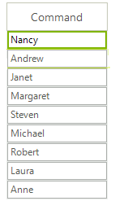

# GridViewCommandColumn

__GridViewCommandColumn__ displays a button element that responds to user input mouse clicks and keyboard key presses. Either mouse click or keyboard input fires the __CommandCommandCellClick__ event. The button text can be supplied through the column __FieldName__ property values or by the column __DefaultText__ property. To display the same button text for every cell, set the __UseDefaultText__ property to *true* and the __DefaultText__ property to the value you want displayed in the button. __UseDefaultText__ is *false* by default.

__GridViewCommandColumn__ inherits from __GridViewDataColumn.__

The example below creates two __GridViewCommandColumns__. The first has __UseDefaultText__ set to __False__ and so displays the __FieldName__ value for "ProductName" in the button text. The second has the __UseDefaultText__ property set to *true* and the __DefaultText__ property set to "Order". In both cases the RadGridView __CommandCellClick__ reacts to a mouse click, casts "sender" to be __GridCommandCellElement__ and makes use of the __Value__ property.



{{source=..\SamplesCS\GridView\Columns\GridViewCommandColumn1.cs region=addCommandColumn}} 
{{source=..\SamplesVB\GridView\Columns\GridViewCommandColumn1.vb region=addCommandColumn}} 

````C#
public GridViewCommandColumn1()
{
    InitializeComponent();
    GridViewCommandColumn commandColumn = new GridViewCommandColumn();
    commandColumn.Name = "CommandColumn";
    commandColumn.UseDefaultText = false;
    commandColumn.FieldName = "ProductName";
    commandColumn.HeaderText = "Order";
    radGridView1.MasterTemplate.Columns.Add(commandColumn);
    GridViewCommandColumn commandColumn2 = new GridViewCommandColumn();
    commandColumn2.Name = "CommandColumn2";
    commandColumn2.UseDefaultText = true;
    commandColumn2.DefaultText = "Order";
    commandColumn2.FieldName = "ProductName";
    commandColumn2.HeaderText = "Order";
    radGridView1.MasterTemplate.Columns.Add(commandColumn2);
    radGridView1.CommandCellClick += new CommandCellClickEventHandler(radGridView1_CommandCellClick);
}
void radGridView1_CommandCellClick(object sender, EventArgs e)
{
    MessageBox.Show("You ordered " + ((sender as GridCommandCellElement)).Value);
}

````
````VB.NET
Public Sub New()
    InitializeComponent()
    Dim commandColumn As New GridViewCommandColumn()
    commandColumn.Name = "CommandColumn"
    commandColumn.UseDefaultText = False
    commandColumn.FieldName = "ProductName"
    commandColumn.HeaderText = "Order"
    RadGridView1.MasterTemplate.Columns.Add(commandColumn)
    Dim commandColumn2 As New GridViewCommandColumn()
    commandColumn2.Name = "CommandColumn2"
    commandColumn2.UseDefaultText = True
    commandColumn2.DefaultText = "Order"
    commandColumn2.FieldName = "ProductName"
    commandColumn2.HeaderText = "Order"
    RadGridView1.MasterTemplate.Columns.Add(commandColumn2)
    AddHandler RadGridView1.CommandCellClick, AddressOf radGridView1_CommandCellClick
End Sub
Sub radGridView1_CommandCellClick(ByVal sender As Object, ByVal e As EventArgs)
    MessageBox.Show("You ordered " + ((TryCast(sender, GridCommandCellElement))).Value)
End Sub

````

{{endregion}} 


