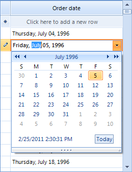
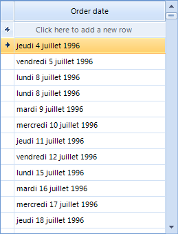

# GridViewDateTimeColumn

__GridViewDateTimeColumn__ provides date entry and formatting for
        DateTime data types. You may enter the date and time directly into the editor or drop down
        the calendar to choose a date. The __FormatString__ property sets the
        format of the date when the date is not currently being edited.
        The __CustomFormat__ property is used to format the date once the user
        clicks on the cell to invoke the editor.
      

#### __[C#] Instantiate GridViewDateTimeColumn__

{{region addDateTimeColumn}}
	            GridViewDateTimeColumn dateTimeColumn = new GridViewDateTimeColumn();
	            dateTimeColumn.Name = "DateTimeColumn";
	            dateTimeColumn.HeaderText = "Order date";
	            dateTimeColumn.FieldName = "OrderDate";
	            dateTimeColumn.FormatString = "{0:D}";
	{{endregion}}

#### __[VB.NET] Instantiate GridViewDateTimeColumn__

{{region addDateTimeColumn}}
	        Dim dateTimeColumn As New GridViewDateTimeColumn()
	        dateTimeColumn.Name = "DateTimeColumn"
	        dateTimeColumn.HeaderText = "Order date"
	        dateTimeColumn.FieldName = "OrderDate"
	        dateTimeColumn.FormatString = "{0:D}"
	{{endregion}}

The formatting for date and time values also responds to globalization settings as
        demonstrated in the example below where CultureInfo is set to French-Belgium.
      

#### __[C#] Set the CurrentCulture__

{{region settingCurrentCulture}}
	            System.Threading.Thread.CurrentThread.CurrentCulture = new System.Globalization.CultureInfo("fr-BE");
	            GridViewDateTimeColumn dateTimeColumn = new GridViewDateTimeColumn();
	            dateTimeColumn.Name = "DateTimeColumn";
	            dateTimeColumn.HeaderText = "Order date";
	            dateTimeColumn.FieldName = "OrderDate";
	            dateTimeColumn.FormatString = "{0:D}";
	            radGridView1.MasterTemplate.Columns.Add(dateTimeColumn);
	{{endregion}}

#### __[VB.NET] Set the CurrentCulture__

{{region settingCurrentCulture}}
	        System.Threading.Thread.CurrentThread.CurrentCulture = New System.Globalization.CultureInfo("fr-BE")
	        Dim dateTimeColumn As New GridViewDateTimeColumn()
	        dateTimeColumn.Name = "DateTimeColumn"
	        dateTimeColumn.HeaderText = "Order date"
	        dateTimeColumn.FieldName = "OrderDate"
	        dateTimeColumn.FormatString = "{0:D}"
	        RadGridView1.MasterTemplate.Columns.Add(dateTimeColumn)
	{{endregion}}

The code below demonstrates how to change date formatting in edit mode (while the cell is
        being edited). There are two ways to achieve that - by setting the __Format__ property of the column to *Custom*
        and the __CustomFormat__ property of the column to a desired format, or by setting the same properties of the editor itself.
        Please note that we are using the
        __CellEditorInitialized__ event which is fired when the initialization
        of an editor is done in order to access the editor:
      

#### __[C#] Change the editor date format__

{{region changeEditorDateFormat}}
	            GridViewDateTimeColumn dateTimeColumn1 = new GridViewDateTimeColumn();
	            dateTimeColumn1.Name = "DateTimeColumn";
	            dateTimeColumn1.HeaderText = "Order date";
	            dateTimeColumn1.FieldName = "OrderDate";
	            dateTimeColumn1.Format = DateTimePickerFormat.Custom;
	            dateTimeColumn1.CustomFormat = "t";
	{{endregion}}

#### __[VB.NET] Change the editor date format__

{{region changeEditorDateFormat}}
	        Dim dateTimeColumn1 As New GridViewDateTimeColumn()
	        dateTimeColumn1.Name = "DateTimeColumn"
	        dateTimeColumn1.HeaderText = "Order date"
	        dateTimeColumn1.FieldName = "OrderDate"
	        dateTimeColumn1.Format = DateTimePickerFormat.Custom
	        dateTimeColumn1.CustomFormat = "t"
	{{endregion}}

#### __[C#] Change the editor format__

{{region changeEditorDateFormat1}}
	        void radGridView1_CellEditorInitialized(object sender, GridViewCellEventArgs e)
	        {
	            RadDateTimeEditor editor = this.radGridView1.ActiveEditor as RadDateTimeEditor;
	            if (editor != null)
	            {   
	                //Pick up one of the default formats
	                ((RadDateTimeEditorElement)((RadDateTimeEditor)this.radGridView1.ActiveEditor).EditorElement).Format = DateTimePickerFormat.Short;
	                
	                //Or set a custom date format
	                ((RadDateTimeEditorElement)((RadDateTimeEditor)this.radGridView1.ActiveEditor).EditorElement).CustomFormat = "t";
	            }
	        }
	{{endregion}}

#### __[VB.NET] Change the editor format__

{{region changeEditorDateFormat1}}
	    Private Sub radGridView1_CellEditorInitialized(ByVal sender As Object, ByVal e As GridViewCellEventArgs)
	        Dim editor As RadDateTimeEditor = TryCast(Me.RadGridView1.ActiveEditor, RadDateTimeEditor)
	        If editor IsNot Nothing Then
	            'Pick up one of the default formats
	            DirectCast(DirectCast(Me.RadGridView1.ActiveEditor, RadDateTimeEditor).EditorElement, RadDateTimeEditorElement).Format = DateTimePickerFormat.[Short]
	
	            'Or set a custom date format
	            DirectCast(DirectCast(Me.RadGridView1.ActiveEditor, RadDateTimeEditor).EditorElement, RadDateTimeEditorElement).CustomFormat = "t"
	        End If
	    End Sub
	{{endregion}}

If we do not use the CellEditorInitialized, but CellBeginEdit (CellBeginEdit is fired before CellEditorInitialized), our Format setting will be overridden by the initialization of the editor. 

You can also change the way the dates in the column are filtered. This is how the column can be adjusted to filter only by __Dates__.
      

#### __[C#] Change the filtering mode__

{{region changeFilteringMode}}
	            dateTimeColumn1.FilteringMode = GridViewTimeFilteringMode.Date;
	{{endregion}}

#### __[VB.NET] Change the filtering mode__

{{region changeFilteringMode}}
	        dateTimeColumn1.FilteringMode = GridViewTimeFilteringMode.Date
	{{endregion}}

## DateTimeKind property

This property allows you to transform the date/time values from database to the local time. By default __RadGridView__ supposes that
          the date/time values are stored in UTC in database.
        
<table><th><tr><td>

Member Name</td><td>

Description</td></tr></th><tr><td>

Local</td><td>

If Local is assigned to a column, in this mode, its values will first converted into Local time. </td></tr><tr><td>

Unspecified</td><td>

Value will not converted.</td></tr><tr><td>

Utc</td><td>

Value will not converted.</td></tr></table>

## EditorType

The __EditorType__ property allows you to easily change the editor type. It could be set to three values:       
        

* __DateTimePicker__ - this is the default value and the editor will be a standard RadDateTimePicker.

* __DateTimePicker__ - the editor will be a RadTimePicker.
            

* __DateTimePickerSpinMode__ - this type of editor shows up/down buttons instead of a drop down with a calendar.
            
