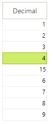

# GridViewDecimalColumn

__GridViewDecimalColumn__ allows decimal data to be displayed and edited. __GridViewDecimalColumn__ can be bound to fields of any numeric type.
      

#### __[C#] Adding GridViewDecimalColumn__

{{region addingDecimalColumn}}
	            GridViewDecimalColumn decimalColumn = new GridViewDecimalColumn();
	            decimalColumn.Name = "DecimalColumn";
	            decimalColumn.HeaderText = "Unit Price";
	            decimalColumn.FieldName = "UnitPrice";
	            decimalColumn.DecimalPlaces = 3;
	            radGridView1.MasterTemplate.Columns.Add(decimalColumn);
	{{endregion}}

#### __[VB.NET] Adding GridViewDecimalColumn__

{{region addingDecimalColumn}}
	        Dim decimalColumn As New GridViewDecimalColumn()
	        decimalColumn.Name = "DecimalColumn"
	        decimalColumn.HeaderText = "Unit Price"
	        decimalColumn.FieldName = "UnitPrice"
	        decimalColumn.DecimalPlaces = 3
	        RadGridView1.MasterTemplate.Columns.Add(decimalColumn)
	{{endregion}}

## Setting a default value for empty cells

You may provide a default value using the following code:

#### __[C#] Setting the default value for empty cells__

{{region settingTheDefaultValue}}
	        void radGridView1_CellEditorInitialized(object sender, GridViewCellEventArgs e)
	        {
	            GridSpinEditor spinEditor = this.radGridView1.ActiveEditor as GridSpinEditor;
	            if (spinEditor != null)
	            {
	                if (spinEditor.Value == null)
	                {
	                    spinEditor.Value = 0.0;
	                }
	            }
	        }
	{{endregion}}

#### __[VB.NET] Setting the default value for empty cells__

{{region settingTheDefaultValue}}
	    Private Sub RadGridView1_CellEditorInitialized(ByVal sender As Object, ByVal e As Telerik.WinControls.UI.GridViewCellEventArgs)
	        Dim spinEditor As GridSpinEditor = TryCast(Me.RadGridView1.ActiveEditor, GridSpinEditor)
	
	        If spinEditor IsNot Nothing Then
	            spinEditor.Value = 0
	        End If
	    End Sub
	{{endregion}}

##  Disable the up and down buttons of the spin editor

The code below demonstrates how you can disable the up and down arrow buttons. Using the commented code you can completely hide them.

#### __[C#] Disable up and down arrow buttons__

{{region ShowUpDownButtons}}
	        void radGridView1_CellEditorInitialized1(object sender, GridViewCellEventArgs e)
	        {
	            GridSpinEditor spinEditor = this.radGridView1.ActiveEditor as GridSpinEditor;
	
	            ((GridSpinEditorElement)spinEditor.EditorElement).ShowUpDownButtons = false;
	        }
	{{endregion}}

#### __[VB.NET] Disable up and down arrow buttons__

{{region ShowUpDownButtons}}
	    Private Sub RadGridView1_CellEditorInitialized1(ByVal sender As Object, ByVal e As Telerik.WinControls.UI.GridViewCellEventArgs)
	        Dim spinEditor As GridSpinEditor = TryCast(Me.RadGridView1.ActiveEditor, GridSpinEditor)
	        If spinEditor IsNot Nothing Then
	            Dim element As GridSpinEditorElement = spinEditor.EditorElement
	            element.ShowUpDownButtons = False
	        End If
	    End Sub
	{{endregion}}

## Setting decimal places

The rich API of RadGridView allows you to define one value for the decimal places
          that should be shown in the spin editor of the column and another value for the cells of the column.
          

__Setting decimal places to the spin editor__

You can define how many places after the decimal point the value in the spin editor should have
            by setting the DecimalPlaces property of GridViewDecimalColumn:
             

#### __[C#]__

{{region decimalPlacesEditor}}
	            decimalColumn.DecimalPlaces = 3;
	{{endregion}}

#### __[VB.NET]__

{{region decimalPlacesEditor}}
	        decimalColumn.DecimalPlaces = 3
	{{endregion}}

__Setting decimal places to the column cells__

In order to define how the values should be displayed by the cells
            of the GridViewDecimalColumn in the sense of their decimal places,
            we should set the FormatString property of the column:
          

#### __[C#]__

{{region decimalPlacesCell}}
	            decimalColumn.FormatString = "{0:N2}";
	{{endregion}}

#### __[VB.NET]__

{{region decimalPlacesCell}}
	        decimalColumn.FormatString = "{0:N2}"
	{{endregion}}

Here is the result of setting the DecimalPlaces property to 3 and the FormatString property to {0:N2}:
            

>For a list of the standard numeric format strings, see 
  [Standard Numeric Format Strings](http://msdn.microsoft.com/en-us/library/dwhawy9k.aspx)
