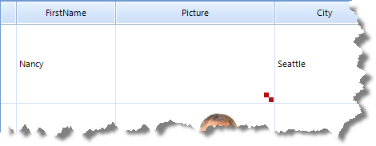
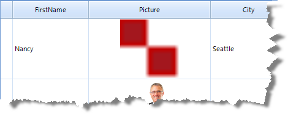

# GridViewImageColumn


__GridViewImageColumn__ displays *read-only* images for database columns of image data (OLE container or BLOB). 

>note RadGridView tries to convert data columns that contain unspecified binary data to an image.
>


>note Some databases such as Access use OLE image container. RadGridView automatically recognizes that and skips the added header.
>


Supported image formats are those supported by the Image class of .net framework. 


#_[C#] Adding GridViewImageColumn_

	


{{source=..\SamplesCS\GridView\Columns\GridViewImageColumn1.cs region=addImageColumn}} 
{{source=..\SamplesVB\GridView\Columns\GridViewImageColumn1.vb region=addImageColumn}} 

````C#
            GridViewImageColumn imageColumn = new GridViewImageColumn();
            imageColumn.Name = "ImageColumn";
            imageColumn.FieldName = "Photo";
            imageColumn.HeaderText = "Picture";
            imageColumn.ImageLayout = ImageLayout.Zoom;           
            radGridView1.MasterTemplate.Columns.Insert(4, imageColumn);
````
````VB.NET
        Dim imageColumn As New GridViewImageColumn
        imageColumn.Name = "ImageColumn"
        imageColumn.FieldName = "Photo"
        imageColumn.HeaderText = "Picture"
        imageColumn.ImageLayout = ImageLayout.Zoom
        RadGridView1.MasterTemplate.Columns.Add(imageColumn)
        '
````

{{endregion}} 


## Image Layout

GridViewImageColumn also implements resizing functionality where sizing is controlled by the __ImageLayout__ property. __ImageLayout__can be set to one of the following: None, Tile, Center, Stretch and Zoom:

* __None__ - Image is positioned at the upper left corner of the cell. This value can be used in a combination
  with the value of the ImageAlignment property to specify the position of an image in a cell:
  
  #_[C#]_

	


{{source=..\SamplesCS\GridView\Columns\GridViewImageColumn1.cs region=none}} 
{{source=..\SamplesVB\GridView\Columns\GridViewImageColumn1.vb region=none}} 

````C#
            imageColumn.ImageLayout = ImageLayout.None;
            imageColumn.ImageAlignment = ContentAlignment.BottomRight;
````
````VB.NET
        imageColumn.ImageLayout = ImageLayout.None
        imageColumn.ImageAlignment = ContentAlignment.BottomRight
        '
````

{{endregion}} 


* __Tile__ - Image is repeated:
 #_[C#]_

	


{{source=..\SamplesCS\GridView\Columns\GridViewImageColumn1.cs region=tile}} 
{{source=..\SamplesVB\GridView\Columns\GridViewImageColumn1.vb region=tile}} 

````C#
            imageColumn.ImageLayout = ImageLayout.Tile;
````
````VB.NET
        imageColumn.ImageLayout = ImageLayout.Tile
        '
````

{{endregion}} 


* __Center__ - Image is positioned at the cell center regardless of the ImageAlignment value:
    #_[C#]_

	


{{source=..\SamplesCS\GridView\Columns\GridViewImageColumn1.cs region=center}} 
{{source=..\SamplesVB\GridView\Columns\GridViewImageColumn1.vb region=center}} 

````C#
            imageColumn.ImageLayout = ImageLayout.Center;
````
````VB.NET
        imageColumn.ImageLayout = ImageLayout.Center
        '
````

{{endregion}} 


* __Stretch__ - Image is stretched in the cell:
  #_[C#]_

	


{{source=..\SamplesCS\GridView\Columns\GridViewImageColumn1.cs region=stretch}} 
{{source=..\SamplesVB\GridView\Columns\GridViewImageColumn1.vb region=stretch}} 

````C#
            imageColumn.ImageLayout = ImageLayout.Stretch;
````
````VB.NET
        imageColumn.ImageLayout = ImageLayout.Stretch
        '
````

{{endregion}} 


* __Zoom__ - Image is zoomed but the aspect ratio is preserved:
    #_[C#]_

	


{{source=..\SamplesCS\GridView\Columns\GridViewImageColumn1.cs region=zoom}} 
{{source=..\SamplesVB\GridView\Columns\GridViewImageColumn1.vb region=zoom}} 

````C#
            imageColumn.ImageLayout = ImageLayout.Zoom;
````
````VB.NET
        imageColumn.ImageLayout = ImageLayout.Zoom
        '
````

{{endregion}} 


