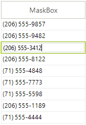

# GridViewMaskBoxColumn


## 

__GridViewMaskBoxColumn__ allows *restricted* editing of text data. Each cell in __GridViewMaskBoxColumn__ column displays the text of the cell __Value__ property according to the settings of the __TextAlignment__ (default is __ContentAlignment.MiddleLeft__), __WrapText__ (default is *false*) and __FormatString__ properties. <br>

You can set a *mask* to GridViewMaskBoxColumn using its __Mask__ and __MaskType__ properties. You can find further information about the possible values for these properties in RadMaskEditBox documentation section.

>caution You can use *FormatString* property to format the values of GridViewMaskBoxColumn cells not currently opened for editing.

{{source=..\SamplesCS\GridView\Columns\GridViewMaskBoxColumn1.cs region=addMaskBoxColumn}} 
{{source=..\SamplesVB\GridView\Columns\GridViewMaskBoxColumn1.vb region=addMaskBoxColumn}} 

````C#
GridViewMaskBoxColumn maskBoxColumn = new GridViewMaskBoxColumn();
maskBoxColumn.Name = "Price";
maskBoxColumn.FieldName = "UnitPrice";
maskBoxColumn.HeaderText = "Unit Price";
maskBoxColumn.MaskType = MaskType.Numeric;
maskBoxColumn.Mask = "C";
maskBoxColumn.TextAlignment = ContentAlignment.BottomRight;
maskBoxColumn.FormatString = "{0:C}";
maskBoxColumn.DataType = typeof(decimal);
radGridView1.MasterTemplate.Columns.Add(maskBoxColumn);

````
````VB.NET
Dim maskBoxColumn As New GridViewMaskBoxColumn()
maskBoxColumn.Name = "Price"
maskBoxColumn.FieldName = "UnitPrice"
maskBoxColumn.HeaderText = "Unit Price"
maskBoxColumn.MaskType = MaskType.Numeric
maskBoxColumn.Mask = "C"
maskBoxColumn.TextAlignment = ContentAlignment.BottomRight
maskBoxColumn.FormatString = "{0:C}"
maskBoxColumn.DataType = GetType(Decimal)
RadGridView1.MasterTemplate.Columns.Add(maskBoxColumn)

````

{{endregion}} 


