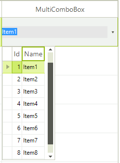

# GridViewMultiComboBoxColumn


## 

This column has __RadMultiColumnComboBoxElement__ as an editor. It covers the features that the RadMultiColumnComboBox control has.
      	

The following example demonstrates how to [manually generate columns for RadGridView]() in the dropdown and then make the dropdown autosize itself according to the width of the RadGridView columns.

First of all, we should bind the GridViewMultiComboBoxColumn:

{{source=..\SamplesCS\GridView\Columns\GridViewMultiComboBoxColumn1.cs region=addColumn}} 
{{source=..\SamplesVB\GridView\Columns\GridViewMultiComboBoxColumn1.vb region=addColumn}} 

````C#
GridViewMultiComboBoxColumn col = new GridViewMultiComboBoxColumn();
col.DataSource = orderDetailsBindingSource;
col.DisplayMember = "Quantity";
col.ValueMember = "OrderID";
col.FieldName = "OrderID";
col.HeaderText = "Custom";
this.radGridView1.Columns.Add(col);
this.radGridView1.CellBeginEdit += new GridViewCellCancelEventHandler(radGridView1_CellBeginEdit);

````
````VB.NET
Dim col As GridViewMultiComboBoxColumn = New GridViewMultiComboBoxColumn()
col.DataSource = orderDetailsBindingSource
col.DisplayMember = "Quantity"
col.ValueMember = "OrderID"
col.FieldName = "OrderID"
col.HeaderText = "Custom"
Me.RadGridView1.Columns.Add(col)
AddHandler RadGridView1.CellBeginEdit, AddressOf radGridView1_CellBeginEdit

````

{{endregion}} 


Then, we make the necessary implementation in the CellBeginEdit event handler:#_[C#] Setup the editor_

	


{{source=..\SamplesCS\GridView\Columns\GridViewMultiComboBoxColumn1.cs region=setupTheEditor}} 
{{source=..\SamplesVB\GridView\Columns\GridViewMultiComboBoxColumn1.vb region=setupTheEditor}} 

````C#
bool isColumnAdded;
void radGridView1_CellBeginEdit(object sender, GridViewCellCancelEventArgs e)
{
    if (this.radGridView1.CurrentColumn is GridViewMultiComboBoxColumn)
    {
        if (!isColumnAdded)
        {
            isColumnAdded = true;
            RadMultiColumnComboBoxElement editor = (RadMultiColumnComboBoxElement)this.radGridView1.ActiveEditor;
            editor.EditorControl.MasterTemplate.AutoGenerateColumns = false;
            editor.EditorControl.Columns.Add(new GridViewTextBoxColumn("OrderID"));
            editor.EditorControl.Columns.Add(new GridViewTextBoxColumn("Quantity"));
            editor.AutoSizeDropDownToBestFit = true;
        }
    }
}

````
````VB.NET
Private isColumnAdded As Boolean
Private Sub radGridView1_CellBeginEdit(ByVal sender As Object, ByVal e As GridViewCellCancelEventArgs)
    If TypeOf Me.radGridView1.CurrentColumn Is GridViewMultiComboBoxColumn Then
        If (Not isColumnAdded) Then
            isColumnAdded = True
            Dim editor As RadMultiColumnComboBoxElement = CType(Me.radGridView1.ActiveEditor, RadMultiColumnComboBoxElement)
            editor.EditorControl.MasterTemplate.AutoGenerateColumns = False
            editor.EditorControl.Columns.Add(New GridViewTextBoxColumn("OrderID"))
            editor.EditorControl.Columns.Add(New GridViewTextBoxColumn("Quantity"))
            editor.AutoSizeDropDownToBestFit = True
        End If
    End If
End Sub

````

{{endregion}} 


Please note that we have a 'dirty' flag, because the editors in RadGridView are reused. If we do not have such a flag, new OrderID and Quantity columns will be added each time a RadMultiColumnComboBoxElement editor is opened. <br>

Other important properties for __GridViewMultiComboBoxColumn__ are:
        

* __FilterMode__ - has two values __DisplayMember__ and __ValueMember__, and as the name of the property speaks this setting will determine whether the column will be filtered according to the __DisplayMember__ or the __ValueMember__.
			  		

* __DisplayMemberSort__ - this property will determine whether the column will be sorted by the column's __DisplayMember__ or __ValueMember__.  Setting it to *true* will sort by __DisplayMember__, otherwise the sorting will be executed according to the __ValueMember__.
