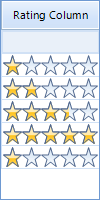

# GridViewRatingColumn

This article describes how setup and use GridViewRatingColumn in RadGridView.

GridViewRatingColumn allows you to represent and edit numeric value as rating elements. Each cell in GridViewRatingColumn contains permanent editor from type RadRatingElement.
      

The following code snippet demonstrates how to create and add GridViewRatingColumn to RadGridView and also add some sample data in it:
      #__

	

#__

	

## Properties

GridViewRatingColumn exposes properties that allow the user
          to control the behavior of the embedded RadRatingElements. The following list represents the most important of them:
        

* __Minimum__ – defines the minimum value that each cell in the column can hold.
            

* __Maximum__- defines the maximum value that each cell in the column can hold.
            

* __SelectionMode__ – defines the selection mode of the cells. There are three available modes: __Precise, FullItem and HalfItem__.
            

* __Direction__ – this property defines the direction of the fill.
            

* __ReadOnly__ – when this property has value true the users are not able to change the values of the cells into the column by mouse or keyboard.
            
