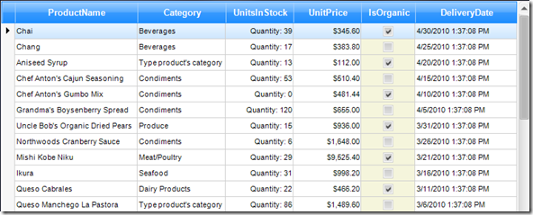

# Converting Data Types


## Overview

The GridViewDataColumn provides a unified way of converting incompatible value types to a type supported by the column instance. The standard 
      	 	[.NET Framework TypeConverter subclasses](http://msdn.microsoft.com/en-us/library/system.componentmodel.typeconverter.aspx)
      	 are used to convert values between data types.
      	

For instance, instead of using 
      		[GridViewTextBoxColumn]()
    		 to display char fields you want to use a 
    		[GridViewCheckBoxColumn](),
      		implement a custom Type Converter class which to determine how RadGridView recognizes this type. For more information, see.
      		[How to: Implement a Type Converter in MSDN.](http://msdn.microsoft.com/en-us/library/ayybcxe5.aspx)

As a quick example, let’s say that we want to convert char values Y and N to ToggleState values ToggleState.On and 
      		ToggleState.Off. To do this we will need to implement the ToggelStateConverter class that converts these values:
      	#_[C#] ToggleState converter_

	


{{source=..\SamplesCS\GridView\Columns\ConvertingDataTypes.cs region=convertTypes}} 
{{source=..\SamplesVB\GridView\Columns\ConvertingDataTypes.vb region=convertTypes}} 

````C#
    
public class ToggleStateConverter : TypeConverter
{
    public override bool CanConvertTo(ITypeDescriptorContext context, Type destinationType)
    {
        return destinationType == typeof(ToggleState);
    }
    public override object ConvertTo(ITypeDescriptorContext context, CultureInfo culture, object value, Type destinationType)
    {
        char charValue = (char)value;
                
        switch (charValue)
        {
            case 'Y':
                return ToggleState.On;
            case 'N':
                return ToggleState.Off;
            case 'M':
                return ToggleState.Indeterminate;
        }
    
        return base.ConvertTo(context, culture, value, destinationType);
    }
    
    public override bool CanConvertFrom(ITypeDescriptorContext context, Type sourceType)
    {
        return sourceType == typeof(ToggleState);
    }
    public override object ConvertFrom(ITypeDescriptorContext context, CultureInfo culture, object value)
    {
        ToggleState state = (ToggleState)value;
                
        switch (state)
        {
            case ToggleState.On:
                return 'Y';
            case ToggleState.Off:
                return 'N';
            case ToggleState.Indeterminate:
                return 'M';
        }
        return base.ConvertFrom(context, culture, value);
    }
}

````
````VB.NET
Public Class ToggleStateConverter
    Inherits TypeConverter
    Public Overrides Function CanConvertTo(ByVal context As ITypeDescriptorContext, ByVal destinationType As Type) As Boolean
        Return destinationType.Equals(GetType(ToggleState))
    End Function
    Public Overrides Function ConvertTo(ByVal context As ITypeDescriptorContext, ByVal culture As CultureInfo, ByVal value As Object, ByVal destinationType As Type) As Object
        Dim charValue As Char = CChar(value)
        Select Case charValue
            Case "Y"
                Return ToggleState.[On]
            Case "N"
                Return ToggleState.Off
            Case "M"
                Return ToggleState.Indeterminate
        End Select
        Return MyBase.ConvertTo(context, culture, value, destinationType)
    End Function
    Public Overrides Function CanConvertFrom(ByVal context As ITypeDescriptorContext, ByVal sourceType As Type) As Boolean
        Return sourceType.Equals(GetType(ToggleState))
    End Function
    Public Overrides Function ConvertFrom(ByVal context As ITypeDescriptorContext, ByVal culture As CultureInfo, ByVal value As Object) As Object
        Dim state As ToggleState = DirectCast(value, ToggleState)
        Select Case state
            Case ToggleState.[On]
                Return "Y"
            Case ToggleState.Off
                Return "N"
            Case ToggleState.Indeterminate
                Return "M"
        End Select
        Return MyBase.ConvertFrom(context, culture, value)
    End Function
End Class

````

{{endregion}} 


## Applying Type Converters

There are two ways to apply converters to the RadGridView conversion layer:

__Setting the DataTypeConverter property of the column__

The first approach to apply type converters is to create the desired column and assign its DataTypeConverter property. This approach is handy when you using non-business objects (such as  DataTable) or your business objects’ properties  do not have TypeConverterAttribute applied.#_[C#] Applying TypeConverter_

	


{{source=..\SamplesCS\GridView\Columns\ConvertingDataTypes.cs region=applyingTypeConverters}} 
{{source=..\SamplesVB\GridView\Columns\ConvertingDataTypes.vb region=applyingTypeConverters}} 

````C#
    
private void ConvertingDataTypes_Load(object sender, EventArgs e)
{
    GridViewCheckBoxColumn checkBox = new GridViewCheckBoxColumn("Organic", "IsOrganic");
    checkBox.DataTypeConverter = new ToggleStateConverter();
    this.radGridView1.Columns.Add(checkBox);
}

````
````VB.NET
Private Sub ConvertingDataTypes_Load(ByVal sender As Object, ByVal e As EventArgs) Handles Me.Load
    Dim checkBox As New GridViewCheckBoxColumn("Organic", "IsOrganic")
    checkBox.DataTypeConverter = New ToggleStateConverter()
    Me.RadGridView1.Columns.Add(checkBox)
End Sub

````

{{endregion}} 


__Applying System.ComponentModel.TypeConverterAttribute to the incompatible property of the business object used as a data source__

The second way to add type converters is to use the TypeConverterAttribute, which allows you to specify the TypeConverter for any property in your business object. When you set it as a data source for RadGridView, you create GridViewCheckBoxColumn instead of GridViewTextBoxColumn.  . This approach is handy when you are creating your own business objects with TypeConverter attribute applied.#_[C#] Custom class with TypeConverter attribute_

	


{{source=..\SamplesCS\GridView\Columns\ConvertingDataTypes.cs region=classProduct}} 
{{source=..\SamplesVB\GridView\Columns\ConvertingDataTypes.vb region=classProduct}} 

````C#
    
public class Product
{
    public int ProductID { get; set; }
    
    public string ProductName { get; set; }
    
    public string Category { get; set; }
    
    public int UnitsInStock { get; set; }
    public double UnitPrice { get; set; }
        
    [TypeConverter(typeof(ToggleStateConverter))]
    public char IsOrganic { get; set; }
    public double DeliveryDate { get; set; }
}

````
````VB.NET
Public Class Product
    Public Property ProductID() As Integer
        Get
            Return m_ProductID
        End Get
        Set(ByVal value As Integer)
            m_ProductID = Value
        End Set
    End Property
    Private m_ProductID As Integer
    Public Property ProductName() As String
        Get
            Return m_ProductName
        End Get
        Set(ByVal value As String)
            m_ProductName = Value
        End Set
    End Property
    Private m_ProductName As String
    Public Property Category() As String
        Get
            Return m_Category
        End Get
        Set(ByVal value As String)
            m_Category = Value
        End Set
    End Property
    Private m_Category As String
    Public Property UnitsInStock() As Integer
        Get
            Return m_UnitsInStock
        End Get
        Set(ByVal value As Integer)
            m_UnitsInStock = Value
        End Set
    End Property
    Private m_UnitsInStock As Integer
    Public Property UnitPrice() As Double
        Get
            Return m_UnitPrice
        End Get
        Set(ByVal value As Double)
            m_UnitPrice = Value
        End Set
    End Property
    Private m_UnitPrice As Double
    <TypeConverter(GetType(ToggleStateConverter))> _
    Public Property IsOrganic() As Char
        Get
            Return m_IsOrganic
        End Get
        Set(ByVal value As Char)
            m_IsOrganic = Value
        End Set
    End Property
    Private m_IsOrganic As Char
    Public Property DeliveryDate() As Double
        Get
            Return m_DeliveryDate
        End Get
        Set(ByVal value As Double)
            m_DeliveryDate = Value
        End Set
    End Property
    Private m_DeliveryDate As Double
End Class

````

{{endregion}} 


The following screenshot shows the result:

## Handling Null Values

The RadGridView’s conversation layer can handle null values. You can specify the default value that is committed to the source if the
      cell value is changed to null. GridViewDataColumn’s __DataSourceNullValue__ property can be set using the following code snippet:
    #_[C#] Handling null values_

	


{{source=..\SamplesCS\GridView\Columns\ConvertingDataTypes.cs region=handlingNullValues}} 
{{source=..\SamplesVB\GridView\Columns\ConvertingDataTypes.vb region=handlingNullValues}} 

````C#
            
this.radGridView1.Columns["ProductName"].DataSourceNullValue = "ENTER PRODUCT NAME";

````
````VB.NET
Me.RadGridView1.Columns("ProductName").DataSourceNullValue = "ENTER PRODUCT NAME"

````

{{endregion}} 


