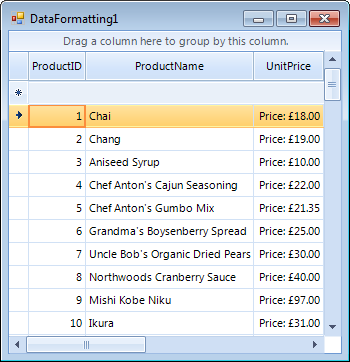

# Data Formatting

## 
<table><tr><td>
              RELATED VIDEOS
            </td></tr><tr><td>[Formatting Data In RadGridView for WinForms. ](http://tv.telerik.com/radtips/radgrid/formatting-data-in-radgridview)

In this RadTip, John Kellar demonstrates how you can apply custom formatting to data within a RadGridView for Windows Forms. (Runtime: 09:14)</td></tr></table>

The [this documentation section]()
          allows you to format the data displayed in it. You can control that by setting the __FormatString__,
          __FormatInfo__ and __NullValue__ properties of the column.
        

The __FormatString__ property determines how the cell values are formatted as strings. The property is applicable
          with Microsoft Formatting Syntax. For more information, see the
          [Formatting Overview chapter in MSDN.](http://msdn.microsoft.com/en-us/library/26etazsy.aspx)

The __FormatInfo__ property provides the culture in which the string formatting is applied.
        

By setting the __NullValue__ property, you determine the value that appears if the cell value is null.
        

Here is a sample covering these properties:

#### __[C#] Formatting data__

{{region dataFormatting}}
	            GridViewDecimalColumn unitPriceColumn = this.radGridView1.Columns["UnitPrice"] as GridViewDecimalColumn;
	            unitPriceColumn.FormatString = "Price: {0:C}";
	            unitPriceColumn.FormatInfo = CultureInfo.CreateSpecificCulture("en-GB");
	            unitPriceColumn.NullValue = 0;
	{{endregion}}

#### __[VB.NET] Formatting data__

{{region dataFormatting}}
	        Dim unitPriceColumn As GridViewDecimalColumn = TryCast(Me.RadGridView1.Columns("UnitPrice"), GridViewDecimalColumn)
	        unitPriceColumn.FormatString = "Price: {0:C}"
	        unitPriceColumn.FormatInfo = CultureInfo.CreateSpecificCulture("en-GB")
	        unitPriceColumn.NullValue = 0
	{{endregion}}

>Note that the value of the NullValue property should be the same as its column data type.

The __WrapText__ property wraps text if the text is wider than the column width.
        

The __TextAlignment__ property defines the text alignment for the column.
        

#### __[C#] Using the column text properties__

{{region textProperties}}
	            GridViewDataColumn productNameColumn = this.radGridView1.Columns["ProductName"];
	            productNameColumn.WrapText = true;
	            productNameColumn.TextAlignment = ContentAlignment.BottomRight;
	{{endregion}}

#### __[VB.NET] Using the column text properties__

{{region textProperties}}
	        Dim productNameColumn = Me.RadGridView1.Columns("ProductName")
	        productNameColumn.WrapText = True
	        productNameColumn.TextAlignment = ContentAlignment.BottomRight
	{{endregion}}

