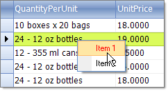

# Custom Context Menus

## 

__RadGridView__ provides a straightforward way to use custom context menus, instead of the default one. This context menu will appear every time the user right-clicks the __RadGridView__, regardless of the element of the control they click.

Start by creating the context menu, initializing its items, and subscribing for the events that you want to handle to achieve the desired behavior. Note: You will need Telerik.WinControls.UI namespace added to your "Using" (C#) or "Imports" (VB).

#### __[C#] Creating the custom context menu__

{{region creatingContextMenu}}
	        private RadContextMenu contextMenu;
	        private void Form1_Load(object sender, EventArgs e)
	        {
	            contextMenu = new RadContextMenu();
	            RadMenuItem menuItem1 = new RadMenuItem("Item 1");
	            menuItem1.ForeColor = Color.Red;
	            menuItem1.Click += new EventHandler(menuItem1_Click);
	            RadMenuItem menuItem2 = new RadMenuItem("Item 2");
	            menuItem2.Click += new EventHandler(menuItem2_Click);
	            contextMenu.Items.Add(menuItem1);
	            contextMenu.Items.Add(menuItem2);
	        } 
	{{endregion}}

#### __[VB.NET] Creating the custom context menu__

{{region creatingContextMenu}}
	    Private contextMenu1 As RadContextMenu
	    Private Sub Form1_Load(ByVal sender As System.Object, ByVal e As System.EventArgs) Handles MyBase.Load
	        contextMenu1 = New RadContextMenu()
	        Dim menuItem1 As New RadMenuItem("Item 1")
	        menuItem1.ForeColor = Color.Red
	        AddHandler menuItem1.Click, AddressOf rmi1_Click
	        Dim menuItem2 As New RadMenuItem("Item 2")
	        AddHandler menuItem2.Click, AddressOf rmi2_Click
	        contextMenu1.Items.Add(menuItem1)
	        contextMenu1.Items.Add(menuItem2)
	    End Sub
	{{endregion}}

Once the menu object has been initialized and populated with menu items, it is ready to be attached to the __RadGridView__. To do that, subscribe to the __ContextMenuOpening__event and set the context menu to be displayed:

#### __[C#] Changing the default context menu__

{{region changeTheContextMenu}}
	        void radGridView1_ContextMenuOpening(object sender, ContextMenuOpeningEventArgs e)
	        {
	            e.ContextMenu = contextMenu.DropDown;
	        } 
	{{endregion}}

#### __[VB.NET] Changing the default context menu__

{{region changeTheContextMenu}}
	    Private Sub RadGridView1_ContextMenuOpening(ByVal sender As Object, ByVal e As Telerik.WinControls.UI.ContextMenuOpeningEventArgs) Handles RadGridView1.ContextMenuOpening
	        e.ContextMenu = contextMenu1.DropDown
	    End Sub
	{{endregion}}

