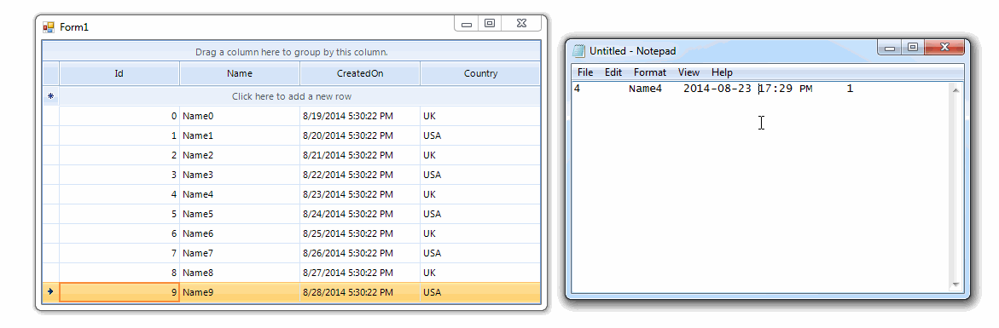

# Copy/Paste


__RadGridView__ supports built-in Copy/Paste functionality, which allows you to store text
        in the Clipboard and then paste it in a different location. Using "Copy" and "Paste" gets quite useful when 
        you want to enter the same content repeatedly.
      

## Copying

The copying functionality in __RadGridView__ is controlled via the 
        __ClipboardCopyModeClipboardCopyModehttp://www.telerik.com/help/winforms/p_telerik_wincontrols_ui_radgridview_clipboardcopymode.html__ 
          property. It has three possible values:

* *Disable* – copying will not be permitted
            

* *EnableWithoutHeaderText* – will copy the cells content, skipping any header cells data
            

* *EnableAlwaysIncludeHeaderText* – will copy the cells content including the header cells data

Copying is a pretty simple operation. After cell/row is selected, right click over the data cell/row opens a context menu where the copy option exists.
          After selecting it, you can paste the content anywhere you need to (in Notepad or Excel for example).
        

__RadGridView__ introduces __Copying__ event which occurs when the grid has prepared 
        appropriate data formats that represent the copy selection. This event is fired once for each supported format: DataFormats.*Text*, 
        DataFormats.*HTML*, DataFormats.*CommaSeparatedValue*. You can cancel this event if the data is not allowed
        to be stored to Clipboard in a specific format, e.g. HTML format:#_[C#]_

	


{{source=..\SamplesCS\GridView\CopyPasteBehavior\CopyPasteForm.cs region=Copying}} 
{{source=..\SamplesVB\GridView\CopyPasteBehavior\CopyPasteForm.vb region=Copying}} 

````C#
        
        private void radGridView1_Copying(object sender, GridViewClipboardEventArgs e)
        {
            if (e.Format == DataFormats.Html)
            {
                e.Cancel = true;
            }
        }
````
````VB.NET

    Private Sub radGridView1_Copying(sender As Object, e As GridViewClipboardEventArgs)
        If e.Format = DataFormats.Html Then
            e.Cancel = True
        End If
    End Sub
````

{{endregion}} 


>note Additionally, you can use the __RadGridView__ . __Copy__ method in order to perform programmatically
            copy functionality.
>


## Pasting

The pasting functionality in __RadGridView__ is controlled via the
          __ClipboardPasteModeClipboardPasteModehttp://www.telerik.com/help/winforms/p_telerik_wincontrols_ui_radgridview_clipboardpastemode.html__ property. It has three possible modes:
        

* *Disable* – pasting is disabled
            

* *Enable* – pasting is enabled
            

* *EnableWithNotifications* – pasting is enabled, and the respective cell events will be triggered upon paste operation
            

The default context menu for data cells offers paste possibility, except when the __RadGridView__ is read-only, disabled or the 
        __ClipboardPasteMode__ property is set to GridViewClipboardPasteMode.*Disable*.

RadGridView.__Pasting__ event is appropriate for modifying the Clipboard data before pasting it in the grid.

The following example demonstrates how to capitalize the copied string before inserting it in the grid:#_[C#]_

	


{{source=..\SamplesCS\GridView\CopyPasteBehavior\CopyPasteForm.cs region=Pasting}} 
{{source=..\SamplesVB\GridView\CopyPasteBehavior\CopyPasteForm.vb region=Pasting}} 

````C#
        
        private void radGridView1_Pasting(object sender, GridViewClipboardEventArgs e)
        {
            if (Clipboard.ContainsData(DataFormats.Text))
            {
                string data = Clipboard.GetData(DataFormats.Text).ToString();
                if (data != string.Empty)
                {
                    Clipboard.SetData(DataFormats.Text, data.ToUpper());
                }
            }
        }
````
````VB.NET

    Private Sub radGridView1_Pasting(sender As Object, e As GridViewClipboardEventArgs)
        If Clipboard.ContainsData(DataFormats.Text) Then
            Dim data As String = Clipboard.GetData(DataFormats.Text).ToString()
            If data <> String.Empty Then
                Clipboard.SetData(DataFormats.Text, data.ToUpper())
            End If
        End If
    End Sub
````

{{endregion}} 


You can cancel this event as well in order to prevent pasting data in some cases.

*Ctrl+C* and *Ctrl+V* are the keys combinations, replacing Copy and Paste behavior. 
          If the RadGridView.__MultiSelect__ property is set to *true*, it is possible to select all
          the cells by pressing *Ctrl+A*. Afterwards, pressing *Ctrl+C* will copy all the cells’ content and it is ready to be pasted.

>note Additionally, you can use the __RadGridView__ . __Paste__ method in order to perform programmatically 
          paste functionality.
>

