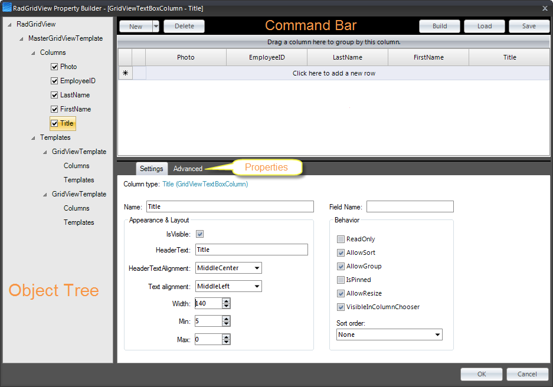
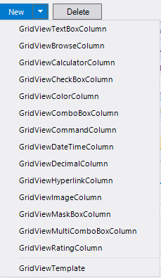

# Property Builder

## 

To quickly create and arrange node structure and appearance invoke the RadGridView Property Builder from the context menu or the [Smart Tag](). The figure below diagrams the general layout and functions of RadGridView Property Builder: 

__Command Bar__

The command bar shows the main Property Builder commands:

* *Build* will build [hierarchy](), depending on the __DataSource__ (should be a dataset) and __DataMemeber__ properties. The build command will find the relations automatically and will build the hierarchy;

* *Save* and *Load* will save/load the current GridView layout into XML format. This allows for fine-grained control over which settings you want to include/exclude from the generated xml file. Thus, if you are using multiple grids, you can use the same settings over and over again which saves time. See [Save/Load layout buttons in the Property Grid]() for more information;

* *New* gives you the ability to add a custom unbound column or a new template to the GridView. The command will change its visibility based on selection in object tree. It is not visible when RadGridView is selected from the *Object Tree:*   ****

* *Delete* will delete the currently selected item in the *Object Tree*. The command will change its visibility based on selection in object tree. It is not visible when RadGridView is selected from the *Object Tree*.

__Preview__

This section shows a preview of the GridView and how it will look on your form at run time. Data is not shown for performance reasons. All GridView operations (grouping, sorting, column reorder, etc.) are allowed and will be persisted on the form once the Property Builder is closed. The *Preview* also shows in real time all changes made through the *Properties and Settings* section, *Object Tree* section, and the *Command bar*.

__Properties and Settings__

In this section you can edit properties and settings of any item, selected in the object tree. The Properties and Settings are contextual, depending on the object selected. The *Settings* tab shows the most widely used commands, where as the *Advanced* tab contains all properties of the currently selected item.

__Object Tree__

The object tree displays the structure of the GridView according to its data source. It has three types of editable objects, which once selected can be edited through the contextual *Properties and Settings* section:

* RadGridView 

* GridViewTemplate

* GridViewDataColumn and all of its columns

The tree allows for the following operations:

* *Show/hide columns* by clicking on the column's checkbox (this updates the column's __Visibility__ property). All changes are shown in the *Preview* section;

* *Column reordering* via drag and drop in the same template. This action will change the object order of the grid. All changes are shown in the *Preview* section; 

* *Column moving* via drag and drop from one template to another template. This action will change the object order of the grid. All changes are shown in the *Preview* section; 

* *Template reordering* via drag and drop. All changes are shown in the *Preview* section;

* *Delete existing columns/templates* by selecting the needed item, and hitting *Delete* in the command bar.
